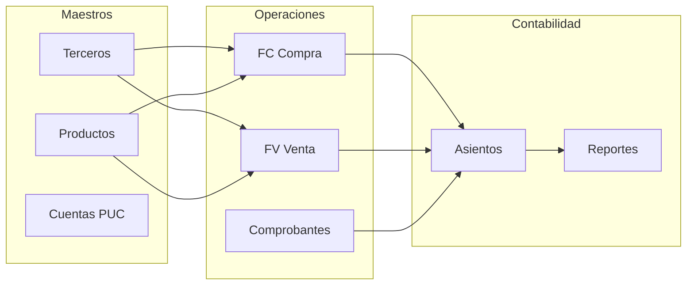

# Documentación general del proyecto SIGCON

| Campo | Valor |
|-------|--------|
| **Identificación** | SIGCON-DOC-000 |
| **Título** | Documentación general del proyecto |
| **Producto** | SIGCON — Sistema de Gestión Contable y Financiera |
| **Institución** | Universidad Surcolombiana (USCO) — Ingeniería de Sistemas |
| **Curso / periodo** | Proyecto Integrador 4 — 2026-1 |
| **Versión del documento** | 1.0 |
| **Versión del producto** | 0.0.1-SNAPSHOT |
| **Fecha** | 2026-05-28 |
| **Estándares de referencia** | IEEE Std 1058-1998, IEEE Std 1016-2009, IEEE Std 1063-2001 |

---

## Historial de revisiones

| Versión | Fecha | Descripción |
|---------|--------|-------------|
| 1.0 | 2026-05-28 | Documentación general inicial del monorepo |
| 1.1 | 2026-06-04 | Referencia a manual técnico y SDD v1.2 verificado |

---

## Tabla de contenidos

1. [Resumen ejecutivo](#1-resumen-ejecutivo)
2. [Objetivos del proyecto](#2-objetivos-del-proyecto)
3. [Alcance funcional](#3-alcance-funcional)
4. [Público objetivo y roles](#4-público-objetivo-y-roles)
5. [Visión del sistema](#5-visión-del-sistema)
6. [Arquitectura y stack tecnológico](#6-arquitectura-y-stack-tecnológico)
7. [Estructura del repositorio](#7-estructura-del-repositorio)
8. [Módulos del sistema](#8-módulos-del-sistema)
9. [Flujos de negocio principales](#9-flujos-de-negocio-principales)
10. [Instalación y ejecución](#10-instalación-y-ejecución)
11. [Configuración y variables de entorno](#11-configuración-y-variables-de-entorno)
12. [Seguridad y permisos](#12-seguridad-y-permisos)
13. [Base de datos y migraciones](#13-base-de-datos-y-migraciones)
14. [Pruebas y calidad](#14-pruebas-y-calidad)
15. [Índice de documentación](#15-índice-de-documentación)
16. [Contribución y mantenimiento](#16-contribución-y-mantenimiento)
17. [Referencias](#17-referencias)

---

## 1. Resumen ejecutivo

**SIGCON** es una aplicación web orientada a la **gestión contable, financiera y operativa** de empresas. Centraliza parametrización, catálogo contable (PUC), terceros, facturación (compras y ventas), comprobantes con asiento contable, tesorería, activos fijos, inventario de productos, reportes y un dashboard con indicadores.

El proyecto se desarrolla como **monorepo** con:

- **Backend:** API REST en Java 17 / Spring Boot 3.5, arquitectura hexagonal.
- **Frontend:** SPA en React 18 / Vite, menú dinámico según permisos.
- **Base de datos:** PostgreSQL 14.

Está pensado para uso **académico e institucional** (Proyecto Integrador USCO) y puede evolucionar hacia despliegues controlados en entornos de prueba o producción.

---

## 2. Objetivos del proyecto

### 2.1 Objetivo general

Diseñar e implementar un sistema integrado que permita registrar, consultar y controlar operaciones contables y financieras de una empresa, con trazabilidad, seguridad por roles y coherencia con el Plan Único de Cuentas (PUC) colombiano.

### 2.2 Objetivos específicos

| ID | Objetivo |
|----|----------|
| OBJ-01 | Gestionar usuarios, roles, permisos y multi-empresa |
| OBJ-02 | Mantener catálogo PUC y cuentas auxiliares por empresa |
| OBJ-03 | Registrar facturas de compra (FC), venta (FV) y órdenes (OC) |
| OBJ-04 | Controlar inventario (stock, precios de compra y venta) |
| OBJ-05 | Emitir comprobantes contables con asiento automático o manual |
| OBJ-06 | Administrar tesorería (cajas, bancos, cheques, conciliación) |
| OBJ-07 | Gestionar activos fijos y depreciación |
| OBJ-08 | Generar reportes contables y dashboard de indicadores |
| OBJ-09 | Ofrecer asistente con IA contextualizado (opcional) |

---

## 3. Alcance funcional

### 3.1 Dentro del alcance

- Autenticación JWT y autorización granular por permisos.
- CRUD de maestros (terceros, productos, cuentas, bancos).
- Facturación FC/FV/OC con líneas, totales e impuestos.
- Pagos de factura con asiento contable automático.
- Comprobantes standalone (nómina, servicios) con líneas débito/crédito.
- Vista e impresión/PDF de facturas.
- Reportes contables básicos (libro diario, mayor, balance de comprobación).
- Asistente IA con contexto de sesión (si hay API key configurada).

### 3.2 Fuera del alcance (fase actual)

- Facturación electrónica DIAN (FE) en producción.
- Nómina completa con prestaciones y seguridad social.
- Integración bancaria automática (Open Banking).
- App móvil nativa.
- Multi-idioma completo en interfaz.

---

## 4. Público objetivo y roles

### 4.1 Usuarios del sistema

| Perfil | Necesidad |
|--------|-----------|
| Contador / auxiliar | Facturas, comprobantes, reportes |
| Tesorero | Cajas, bancos, cheques, pagos |
| Administrador de activos | Activos, depreciación, productos |
| Administrador del sistema | Usuarios, roles, menús, empresas |
| Superadministrador | Vista global multi-empresa |

### 4.2 Audiencia de la documentación

| Audiencia | Documento recomendado |
|-----------|----------------------|
| Usuario final | [MANUAL_USUARIO.md](MANUAL_USUARIO.md) |
| Desarrollador / arquitecto | [MANUAL_DESARROLLADOR.md](MANUAL_DESARROLLADOR.md) |
| DevOps / instalación | Este documento + [README](../README.md) |
| Docente / evaluador | Este documento + manuales IEEE |

---

## 5. Visión del sistema

### 5.1 Diagrama de contexto

```
                         ┌──────────────────┐
                         │  Administrador   │
                         │  Usuario operativo│
                         └────────┬─────────┘
                                  │ HTTPS
                         ┌────────▼─────────┐
                         │  SIGCON Web      │
                         │  (React + Vite)  │
                         └────────┬─────────┘
                                  │ REST / JWT
                         ┌────────▼─────────┐
                         │  SIGCON API      │
                         │  (Spring Boot)   │
                         └────────┬─────────┘
              ┌───────────────────┼───────────────────┐
              │                   │                   │
       ┌──────▼──────┐    ┌───────▼───────┐   ┌──────▼──────┐
       │ PostgreSQL  │    │ OpenAI (opt.) │   │ SMTP (opt.) │
       └─────────────┘    └───────────────┘   └─────────────┘
```

### 5.2 Principios de diseño

1. **Separación por dominios** — cada módulo de negocio en su paquete/carpeta.
2. **Seguridad por defecto** — endpoints protegidos; Swagger solo en `dev`.
3. **Multi-empresa** — datos filtrados por empresa del usuario.
4. **Partida doble** — asientos con débito = crédito.
5. **Menú dinámico** — visibilidad según rol sin redeploy del frontend.

---

## 6. Arquitectura y stack tecnológico

### 6.1 Capas lógicas

| Capa | Backend | Frontend |
|------|---------|----------|
| Presentación | `@RestController` | Páginas React, templates |
| Aplicación | DTOs, requests/responses | Redux, fetchHelper |
| Dominio | Services, reglas de negocio | voucherUtils, validaciones |
| Infraestructura | JPA, clients externos | Select2, DataTables |

### 6.2 Stack

| Componente | Tecnología | Versión referencia |
|------------|------------|-------------------|
| Lenguaje backend | Java | 17 |
| Framework backend | Spring Boot | 3.5.8 |
| ORM | Spring Data JPA / Hibernate | — |
| BD | PostgreSQL | 14 |
| Seguridad | Spring Security + JWT | — |
| API docs | Springdoc OpenAPI | Swagger UI |
| Frontend | React | 18 |
| Build frontend | Vite | — |
| Estado | Redux | — |
| UI | Bootstrap (Sneat) | — |
| Contenedores | Docker / Compose | — |

---

## 7. Estructura del repositorio

```
dev/                              # Raíz del monorepo
├── README.md                     # Inicio rápido e índice
├── docker-compose.local.yml      # Orquestación local (API + BD + FE)
├── docs/
│   ├── DOCUMENTACION_GENERAL.md  # Este documento
│   ├── MANUAL_USUARIO.md         # SIGCON-MUD-001
│   └── MANUAL_DESARROLLADOR.md   # SIGCON-SDD-001
├── backend/
│   ├── src/main/java/com/sigcon/backend/
│   │   ├── parametrization/      # Usuarios, roles, menús
│   │   ├── lists_accounting/     # PUC, cuentas, impuestos
│   │   ├── third_parties/        # Terceros
│   │   ├── invoices/             # FC, FV, OC
│   │   ├── vouchers/             # Comprobantes
│   │   ├── products/             # Productos e inventario
│   │   ├── banks/                # Tesorería
│   │   ├── assets/               # Activos fijos
│   │   ├── books/                # Libros contables
│   │   ├── dashboard/            # KPIs
│   │   └── assistant/            # IA
│   ├── src/main/resources/
│   │   ├── application*.properties
│   │   ├── db/seeds/             # Datos iniciales
│   │   └── db/migration/         # Migraciones Flyway (V*.sql)
│   ├── pom.xml
│   ├── .env                      # Variables (no commitear secretos)
│   └── readme.md
└── Frontend/
    ├── src/
    │   ├── pages/                # Pantallas por módulo
    │   ├── components/           # UI reutilizable
    │   ├── utils/                # map_menu, fetch, functions
    │   └── routes/               # Rutas dinámicas
    ├── package.json
    └── README.md
```

> **Nota:** En algunos entornos Windows el compose local referencia la carpeta como `frontend` (minúsculas). Verifique que coincida con el nombre real (`Frontend`) en su máquina.

---

## 8. Módulos del sistema

| # | Módulo | Backend (paquete) | Frontend (pages) | Descripción breve |
|---|--------|-------------------|------------------|-------------------|
| 1 | Parametrización | `parametrization` | `parametrizacion/` | Usuarios, roles, empresas, menús |
| 2 | Listas contables | `lists_accounting` | `list_accounts/` | PUC, cuentas, impuestos, tasas |
| 3 | Terceros | `third_parties` | `third-party/` | Clientes, proveedores, empleados |
| 4 | Facturas | `invoices` | `invoices/FC`, `FV`, `OC` | Compras, ventas, órdenes |
| 5 | Comprobantes | `vouchers` | `vouchers/` | Nómina, servicios, pagos |
| 6 | Tesorería | `banks`, `cash` | `cash-and-banks/` | Bancos, caja, cheques |
| 7 | Activos | `assets` | `assets/` | Activos fijos, depreciación |
| 8 | Productos | `products` | `assets/products/` | Catálogo, stock, precios |
| 9 | Contabilidad | `books`, `accounting_entry` | — | Asientos, periodos |
| 10 | Reportes | `reports` (según implementación) | `reports/` | Libros y estados |
| 11 | Dashboard | `dashboard` | `home/` | Indicadores |
| 12 | Asistente | `assistant` | `AssistantChat` | Chat IA |

---

## 9. Flujos de negocio principales

### 9.1 Factura de compra (FC) + inventario

```
Proveedor → Crear FC → Líneas producto → Guardar
    → Stock ↑  |  Precio compra actualizado
    → (Opcional) Pago → Asiento automático (22xx / 11xx-12xx)
```

### 9.2 Factura de venta (FV) + inventario

```
Cliente → Crear FV → Líneas (valida stock) → Guardar
    → Stock ↓  |  Precio venta actualizado
```

### 9.3 Comprobante standalone (nómina / servicios)

```
Tipo comprobante → Monto → Método pago (caja/banco)
    → Líneas manuales (D/C, sin 11/12) → Neto = monto
    → Guardar → Línea tesorería automática + asiento
```

### 9.4 Diagrama de módulos (relación)



---

## 10. Instalación y ejecución

### 10.1 Requisitos

- Git
- Docker y Docker Compose (recomendado)
- Java 17 + Maven (opcional, backend sin Docker)
- Node.js 18+ (opcional, frontend sin Docker)

### 10.2 Inicio rápido (Docker, raíz del proyecto)

```bash
git clone <URL_REPOSITORIO>
cd dev
# Configurar backend/.env (ver sección 11)
docker compose -f docker-compose.local.yml --env-file backend/.env up --build -d
```

### 10.3 URLs por defecto (desarrollo)

| Servicio | URL |
|----------|-----|
| Frontend | http://localhost:5173 |
| API | http://localhost:8080 |
| Swagger | http://localhost:8080/swagger-ui.html |
| Adminer (BD) | http://localhost:8081 |

### 10.4 Desarrollo sin Docker

**Backend (PowerShell):**

```powershell
cd backend
$env:SPRING_PROFILES_ACTIVE = "dev"
.\mvnw.cmd spring-boot:run
```

**Frontend:**

```bash
cd Frontend
npm install
npm run dev
```

### 10.5 Credenciales de desarrollo

Tras el seed inicial (solo entorno dev):

| Campo | Valor |
|-------|--------|
| Email | `superadmin@gmail.com` |
| Contraseña | `123456` |
| Rol | SUPERADMIN |

> No usar en producción.

---

## 11. Configuración y variables de entorno

Archivo principal: `backend/.env`

| Variable | Descripción |
|----------|-------------|
| `SPRING_PROFILES_ACTIVE` | Perfil Spring (`dev` habilita Swagger) |
| `backend_host` | Host PostgreSQL |
| `backend_port_db_dev` | Puerto PostgreSQL |
| `backend_user` / `backend_password` / `backend_database` | Credenciales BD |
| `backend_port_api` | Puerto del API |
| `backend_port_adminer` | Puerto Adminer |
| `FRONTEND_URL` | URL frontend (CORS, correos) |
| `CORS_ALLOWED_ORIGINS` | Orígenes CORS permitidos |
| `SPRING_SECURITY_JWT_SECRET` | Secreto JWT |
| `OPENAI_API_KEY` | *(Opcional)* Asistente IA |
| `OPENAI_MODEL` | Modelo OpenAI (ej. `gpt-4o-mini`) |

Frontend: configurar URL del API en variables Vite (`.env` del frontend, p. ej. `VITE_API_URL`).

---

## 12. Seguridad y permisos

### 12.1 Autenticación

- Login: `POST /auth/login`
- Token JWT en header `Authorization: Bearer <token>`
- Sesión almacenada en `localStorage` (frontend)

### 12.2 Autorización

- Permisos en BD: código `CREATE_VOUCHER`, `VIEW_INVOICE_FV`, etc.
- Spring Security: authority `PERM_<CODIGO>`
- Menús: tabla `menu_permissions` por rol

### 12.3 Buenas prácticas

- No commitear `.env` con secretos reales.
- Deshabilitar Swagger en producción.
- Rotar `SPRING_SECURITY_JWT_SECRET` en despliegues serios.
- Asignar roles mínimos necesarios (principio de menor privilegio).

---

## 13. Base de datos y migraciones

### 13.1 Inicialización

- **Seeds:** `backend/src/main/resources/db/seeds/` — menús, permisos, PUC base, tipos de factura/comprobante.
- **Migraciones:** `backend/src/main/resources/db/migration/V*.sql` — cambios incrementales.

Ejemplos recientes:

| Migración | Contenido |
|-----------|-----------|
| V15 | `sale_price`, `stock` en productos; estado FV |
| V16 | Menú y permisos facturas de venta |

### 13.2 Herramientas

- **Adminer:** consulta y administración visual en desarrollo.
- **Hibernate:** `ddl-auto=update` en dev (ajustar en producción).

---

## 14. Pruebas y calidad

| Tipo | Comando / método |
|------|------------------|
| Tests unitarios backend | `cd backend && .\mvnw.cmd test` |
| Lint frontend | `cd Frontend && npm run lint` |
| Build frontend | `cd Frontend && npm run build` |
| Prueba manual API | Swagger UI (perfil `dev`) |
| Casos de negocio | Ver manual desarrollador (TC-V-01, TC-FV-01, etc.) |

---

## 15. Índice de documentación

| Documento | ID | Contenido |
|-----------|-----|-----------|
| **Documentación general** | SIGCON-DOC-000 | Este archivo — visión, alcance, instalación |
| [README](../README.md) | — | Inicio rápido del repositorio |
| [Manual de usuario](MANUAL_USUARIO.md) | SIGCON-MUD-001 | Procedimientos operativos (IEEE 1063) |
| [Manual de desarrollador](MANUAL_DESARROLLADOR.md) | SIGCON-SDD-001 | Diseño, API, V&V (IEEE 1016) |
| [Manual técnico](MANUAL_TECNICO.md) | SIGCON-MT-001 | Arquitectura, BD, API, despliegue, mantenimiento |
| [Backend readme](../backend/readme.md) | — | Swagger, tests, Docker backend |
| [Frontend README](../Frontend/README.md) | — | Docker frontend |

### Mapa de lectura recomendado

```
Evaluador / docente     → DOCUMENTACION_GENERAL → MANUAL_USUARIO + MANUAL_DESARROLLADOR
Usuario operativo       → MANUAL_USUARIO
Nuevo desarrollador     → README → MANUAL_DESARROLLADOR → backend/readme
DevOps                  → README → DOCUMENTACION_GENERAL §10-11
```

---

## 16. Contribución y mantenimiento

### 16.1 Flujo de trabajo Git

1. Rama desde `main` o `develop`.
2. Cambios acotados por módulo.
3. Tests backend antes del PR.
4. PR con descripción del módulo afectado.

### 16.2 Agregar funcionalidad

1. Backend: servicio + controller + permisos + migración/seed.
2. Frontend: página + `COMPONENT_MAP` + menú en BD.
3. Actualizar manual de usuario (procedimiento) y manual desarrollador (diseño).
4. Registrar en historial de revisiones de este documento si cambia alcance.

### 16.3 Repositorios relacionados (histórico)

| Componente | URL |
|------------|-----|
| Backend | https://github.com/WilliamsBD8/sigcon-backend |
| Frontend | https://github.com/WilliamsBD8/sigcon-frontend |

El monorepo actual integra ambos en `dev/`.

---

## 17. Referencias

### 17.1 Normas IEEE citadas

| Estándar | Uso en SIGCON |
|----------|---------------|
| IEEE 1058 | Planificación y documentación general del proyecto |
| IEEE 1016 | Descripción de diseño (manual desarrollador) |
| IEEE 1063 | Manual de usuario |
| IEEE 26512 | Elaboración de información para usuarios |
| IEEE 1012 | Verificación y validación |
| IEEE 29148 | Trazabilidad de requisitos (SDD) |

### 17.2 Referencias de negocio

- Decreto 2420 de 2015 — Plan Único de Cuentas (Colombia).

### 17.3 Enlaces técnicos

- [Spring Boot Documentation](https://docs.spring.io/spring-boot/docs/current/reference/html/)
- [React Documentation](https://react.dev/)
- [PostgreSQL Documentation](https://www.postgresql.org/docs/)

---

## Licencia y uso

Proyecto de **uso académico e institucional**. Consulte con el equipo docente antes de redistribuir o desplegar en producción sin autorización.

---

**Proyecto Integrador 4 — Ingeniería de Sistemas — Universidad Surcolombiana — 2026-1**

*Fin del documento SIGCON-DOC-000.*
