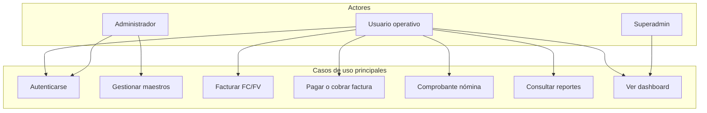

# Especificación de requerimientos de software (SRS) — SIGCON

| Campo | Valor |
|-------|--------|
| **Identificación** | SIGCON-SRS-001 |
| **Título** | Especificación de requerimientos de software |
| **Producto** | SIGCON — Sistema de Gestión Contable y Financiera |
| **Institución** | Universidad Surcolombiana (USCO) — Ingeniería de Sistemas |
| **Curso / periodo** | Proyecto Integrador 4 — 2026-1 |
| **Versión del documento** | 1.1 |
| **Versión del producto** | 0.0.1-SNAPSHOT |
| **Fecha** | 2026-06-04 |
| **Estándar** | IEEE Std 29148-2018 |

---

## Historial de revisiones

| Versión | Fecha | Descripción |
|---------|--------|-------------|
| 1.0 | 2026-06-04 | SRS inicial derivado del código y documentación del monorepo |
| 1.1 | 2026-06-04 | Entradas detalladas, catálogo de errores (ERR-*) y RF ampliados |

---

## Tabla de contenidos

1. [Introducción](#1-introducción)
2. [Descripción general](#2-descripción-general)
3. [Requerimientos del sistema (transversales)](#3-requerimientos-del-sistema-transversales)
4. [Requerimientos por módulo](#4-requerimientos-por-módulo)
5. [Casos de uso](#5-casos-de-uso)
6. [Criterios de aceptación globales](#6-criterios-de-aceptación-globales)
7. [Matriz de trazabilidad](#7-matriz-de-trazabilidad)
8. [Referencias](#8-referencias)
- [Apéndice A — Convención y plantilla de RF](#apéndice-a--convención-y-plantilla-de-rf)
- [Apéndice B — Catálogo de errores (ERR)](#apéndice-b--catálogo-de-errores-err)
- [Apéndice C — RF detallados (entradas/salidas/errores)](#apéndice-c--rf-detallados-entradassalidaerrores)

---

# 1. Introducción

## 1.1 Propósito

Este documento especifica los **requerimientos funcionales y no funcionales** de SIGCON, derivados del análisis del código fuente (`backend/`, `Frontend/`), seeds/migraciones y manuales del proyecto. Sirve como base para diseño, pruebas, aceptación y trazabilidad académica (IEEE 29148).

## 1.2 Alcance

| Dentro del alcance | Fuera del alcance (fase actual) |
|--------------------|----------------------------------|
| Multi-empresa, usuarios, roles, permisos, menú dinámico | Facturación electrónica DIAN en producción |
| PUC, cuentas auxiliares, terceros, productos | Nómina legal completa (prestaciones, PILA) |
| Facturas FC, FV, OC; pagos/cobros con comprobante | Open Banking / integración bancaria automática |
| Comprobantes con asiento; periodos contables | App móvil nativa |
| Tesorería (cajas, bancos, cheques) | Multi-idioma total de UI |
| Activos, depreciación, reportes PDF, dashboard | |
| Asistente IA opcional (OpenAI) | |

## 1.3 Definiciones y acrónimos

| Término | Definición |
|---------|------------|
| RF | Requerimiento funcional |
| RNF | Requerimiento no funcional |
| CU | Caso de uso |
| FC / FV / OC | Factura compra / venta / orden de compra |
| PUC | Plan Único de Cuentas (Colombia) |
| Comprobante standalone | Comprobante sin `invoiceId` (nómina, servicios) |
| Periodo OPEN/CLOSED | Ventana contable que permite o bloquea movimientos |

## 1.4 Referencias

| ID | Documento |
|----|-----------|
| DOC-000 | [DOCUMENTACION_GENERAL.md](DOCUMENTACION_GENERAL.md) |
| DOC-SDD | [MANUAL_DESARROLLADOR.md](MANUAL_DESARROLLADOR.md) |
| DOC-MUD | [MANUAL_USUARIO.md](MANUAL_USUARIO.md) |
| DOC-MT | [MANUAL_TECNICO.md](MANUAL_TECNICO.md) |

---

# 2. Descripción general

## 2.1 Perspectiva del producto

SIGCON es una aplicación web cliente-servidor: SPA React consume API REST Spring Boot; persistencia en PostgreSQL 14. Integraciones opcionales: OpenAI (asistente), SMTP (recuperación de contraseña).

## 2.2 Actores del sistema

| Actor | Descripción | Módulos principales |
|-------|-------------|---------------------|
| **Usuario operativo** | Contador, auxiliar, tesorero | Facturas, comprobantes, reportes |
| **Administrador de sistema** | Gestiona usuarios, roles, menús | Parametrización |
| **Superadministrador** | Vista global multi-empresa | Dashboard, empresas |
| **Administrador de activos** | Activos, depreciación, productos | Assets, products |
| **Sistema externo OpenAI** | Proveedor de chat (opcional) | Assistant |
| **Sistema de correo** | Envío de reset password (opcional) | Auth |

## 2.3 Restricciones y supuestos

- Cada usuario operativo pertenece a una **empresa**; los datos se filtran por empresa.
- Las operaciones contables requieren **periodo contable abierto**.
- Los asientos cumplen **partida doble** (Σ débitos = Σ créditos).
- El catálogo PUC sigue referencia normativa colombiana (Decreto 2420 de 2015).

---

# 3. Requerimientos del sistema (transversales)

> **Especificación ampliada:** entradas campo a campo, salidas y errores (`ERR-*`) en [Apéndice B](#apéndice-b--catálogo-de-errores-err) y [Apéndice C](#apéndice-c--rf-detallados-entradassalidaerrores). El capítulo 4 mantiene el resumen por módulo.

## 3.0 Convención de respuestas HTTP

| Situación | HTTP típico | Cuerpo |
|-----------|-------------|--------|
| Éxito operación | 200 / 201 | `SuccessRespondJson` con `message` y `data` |
| Validación Bean Validation | 400 | Errores de campo (`@NotNull`, etc.) |
| Regla de negocio (`IllegalArgumentException`) | 400 / 500* | `message` en español |
| No autorizado (JWT inválido/ausente) | 401 | — |
| Sin permiso (`@PreAuthorize`) | 403 | — |
| No encontrado (`RuntimeException` "no existe") | 500* | Mensaje texto |

\*Depende del manejador global configurado; en pruebas validar comportamiento real.

## 3.1 Requerimientos funcionales transversales

### RF-SIS-001 — Autenticación

| Campo | Valor |
|-------|--------|
| **Descripción** | Autenticar usuario y emitir JWT. |
| **Endpoint** | `POST /auth/login` |
| **Fuente** | `AuthService.login`, `AuthController` |

**Entradas (`AuthRequest`):**

| Campo | Tipo | Obligatorio | Validación |
|-------|------|-------------|------------|
| `usernameOrEmail` | String | Sí | Credencial registrada |
| `password` | String | Sí | Coincide con hash almacenado |

**Salidas exitosas (200):**

| Campo | Tipo | Descripción |
|-------|------|-------------|
| `token` | String | JWT firmado |
| `user` | UserDTO | Id, nombre, email, empresa, roles, permisos |

**Errores posibles:**

| ID | Condición | Mensaje / comportamiento |
|----|-----------|--------------------------|
| ERR-SIS-001 | Credenciales incorrectas | Fallo `AuthenticationManager` → respuesta error login |
| ERR-SIS-002 | Usuario inactivo o inexistente | No emite token |
| ERR-SIS-003 | Token en blacklist (logout previo) | 401 en requests posteriores |

**Reglas de negocio:** usuario ACTIVE; JWT con expiración configurada; logout registra token en `BlackListedToken`.

---

### RF-SIS-002 — Autorización por permisos

| Campo | Valor |
|-------|--------|
| **Descripción** | Restringir endpoints por permiso granular. |
| **Entradas** | Header `Authorization: Bearer {JWT}` |
| **Fuente** | `@PreAuthorize`, `PermissionRepository` |

**Errores posibles:**

| ID | Condición | HTTP |
|----|-----------|------|
| ERR-SIS-010 | Sin token o token inválido | 401 |
| ERR-SIS-011 | Token válido sin `PERM_{code}` ni SUPERADMIN | 403 |

**Reglas:** código BD `CREATE_VOUCHER` → authority `PERM_CREATE_VOUCHER`.

---

### RF-SIS-003 — Aislamiento multi-empresa

| Campo | Valor |
|-------|--------|
| **Descripción** | Filtrar datos por empresa del usuario. |
| **Entradas** | Usuario autenticado (`User.company.id`) |
| **Fuente** | `UserUtil`, servicios de dominio |

**Errores posibles:**

| ID | Condición | Mensaje |
|----|-----------|---------|
| ERR-SIS-020 | Consulta comprobante de otra empresa | `No tiene permisos para consultar este comprobante.` |

**Excepción:** `DashboardService` con rol SUPERADMIN → `scope: GLOBAL`.

---

### RF-SIS-004 — Menú dinámico

| Campo | Valor |
|-------|--------|
| **Descripción** | Menú lateral según rol. |
| **Endpoint** | `GET /api/modules/menu` |
| **Entradas** | JWT; permiso `PERM_VIEW_MODULES_MENU` o SUPERADMIN |
| **Salidas** | `List<ModuleDTO>` con `menus[]` (path, icon, component, label) |

**Errores posibles:**

| ID | Condición | HTTP |
|----|-----------|------|
| ERR-SIS-011 | Sin permiso menú | 403 |

---

### RF-SIS-005 — Periodo contable

| Campo | Valor |
|-------|--------|
| **Descripción** | Bloquear movimientos en periodo cerrado. |
| **Entradas** | `paymentDate` / fecha operación, `company` |
| **Fuente** | `AccountingPeriodService`, `VoucherService`, `InvoiceService` |

**Errores posibles:**

| ID | Condición | Mensaje exacto (código) |
|----|-----------|-------------------------|
| ERR-SIS-030 | Periodo CLOSED | `El periodo contable no está abierto` |

**Aplica a:** crear/editar/eliminar comprobante; crear/editar factura (según flujo).

---

### RF-SIS-006 — Partida doble

| Campo | Valor |
|-------|--------|
| **Descripción** | Validar balance del asiento. |
| **Entradas** | `AccountingEntryRequest.lines[]` |
| **Fuente** | `AccountingEntryService` |

**Entradas por línea (`AccountingEntryLineRequest`):**

| Campo | Tipo | Obligatorio | Validación |
|-------|------|-------------|------------|
| `accountingAccountCode` | String | Sí | Cuenta existe en empresa |
| `type` | DEBIT / CREDIT | Sí | `@NotNull` |
| `amount` | BigDecimal | Sí | `> 0`; `@NotNull` |

**Errores posibles:**

| ID | Condición | Mensaje |
|----|-----------|---------|
| ERR-SIS-040 | Σ débitos ≠ Σ créditos | Validación en servicio / `El total débito debe ser igual al total crédito.` (flujos que lo validan explícitamente) |
| ERR-SIS-041 | Tipo línea inválido | `El tipo de línea no es válido` |

---

### RF-SIS-007 — Listados paginados (DataTable)

| Campo | Valor |
|-------|--------|
| **Descripción** | Contrato común de búsqueda/paginación. |
| **Entradas** | `DataTableRequest` |
| **Salidas** | `DataTableResponse` (recordsTotal, data, draw) |

**Entradas (`DataTableRequest`):**

| Campo | Tipo | Obligatorio | Uso |
|-------|------|-------------|-----|
| `draw` | int | Sí | Correlación UI DataTables |
| `start` | int | Sí | Offset (0-based) |
| `length` | int | Sí | Tamaño página; `-1` = sin paginar |
| `columns[]` | lista | No | Filtro/orden por columna |
| `search.value` | String | No | Búsqueda global |
| `standaloneOnly` | Boolean | No | Solo comprobantes sin factura (vouchers) |
| `receivedDateFrom/To` | LocalDate | No | Filtros fecha según pantalla |

**Errores posibles:**

| ID | Condición | Mensaje |
|----|-----------|---------|
| ERR-SIS-050 | Parámetro búsqueda inválido | `Parámetro de búsqueda no válido` / `Entrada de busqueda inválida` |

## 3.2 Requerimientos no funcionales transversales

| ID | Descripción | Métrica / criterio |
|----|-------------|-------------------|
| **RNF-SIS-001** | Seguridad | Autenticación JWT stateless; secretos en variables de entorno |
| **RNF-SIS-002** | Disponibilidad | Despliegue en Docker; BD PostgreSQL con healthcheck |
| **RNF-SIS-003** | Mantenibilidad | Arquitectura hexagonal por módulo (`interfaces`, `domain`, `application`) |
| **RNF-SIS-004** | Usabilidad | UI web responsive; menú lateral por rol; mensajes de error en español |
| **RNF-SIS-005** | Interoperabilidad | API REST JSON; prefijo `/api/v1` |
| **RNF-SIS-006** | Documentación API | Swagger en perfil `dev` únicamente |
| **RNF-SIS-007** | Rendimiento listados | Paginación DataTable; máximo 100 registros por página |
| **RNF-SIS-008** | Trazabilidad | Soft delete (`deletedAt`); usuario en comprobantes; numeración consecutiva |

---

# 4. Requerimientos por módulo

Resumen por bounded context. Para **entradas completas, salidas y catálogo de errores** de los RF críticos, ver [Apéndice C](#apéndice-c--rf-detallados-entradassalidaerrores). Para el listado consolidado de mensajes, ver [Apéndice B](#apéndice-b--catálogo-de-errores-err).

| Módulo | RF (rango) | Errores (rango ERR) |
|--------|------------|---------------------|
| Parametrización | RF-PAR-001…008 | ERR-PAR-* |
| Facturación | RF-FAC-001…011 | ERR-FAC-* |
| Comprobantes | RF-VCH-001…015 | ERR-VCH-* |
| Contabilidad | RF-CON-001…006 | ERR-CON-* |
| Productos | RF-PRD-001…004 | ERR-PRD-* |
| Asistente | RF-IAS-001…003 | ERR-IAS-* |

---

## Módulo: Parametrización (`parametrization`)

### Module Overview

Gestión de empresas, usuarios, roles, permisos, módulos, menús, parámetros y catálogos transversales (métodos de pago).

### Actors

- Administrador de sistema
- Superadministrador

### Functional Requirements

| ID | Descripción | Entradas | Salidas | Reglas de negocio |
|----|-------------|----------|---------|-------------------|
| **RF-PAR-001** | CRUD de usuarios con empresa y roles | UserDTO | Usuario persistido | Email único; permiso `CREATE_USER` / `UPDATE_USER` |
| **RF-PAR-002** | CRUD de roles y asignación de permisos | RoleDTO, permisos[] | Rol actualizado | Permisos tipo READ/CREATE/UPDATE/DELETE |
| **RF-PAR-003** | CRUD de empresas (NIT, moneda, fiscal) | CompanyDTO | Empresa ACTIVE | NIT y datos fiscales obligatorios |
| **RF-PAR-004** | CRUD de módulos y menús | ModuleDTO, MenuDTO | Menú con `component` para FE | `component` mapeado en `map_menu.jsx` |
| **RF-PAR-005** | Asignar permisos de menú por rol | menu_permissions | Visibilidad en `GET /api/modules/menu` | Menú ACTIVE |
| **RF-PAR-006** | Login y logout con blacklist de token | AuthRequest | JWT / revocación | `BlackListedToken` en logout |
| **RF-PAR-007** | Recuperación de contraseña por correo | Email | Enlace reset (SMTP) | Token `PasswordResetToken` temporal |
| **RF-PAR-008** | Catálogo métodos y formas de pago | DataTableRequest | Listado paginado | Usado por facturas y comprobantes |

### Non-Functional Requirements

| ID | Descripción |
|----|-------------|
| **RNF-PAR-001** | Contraseñas no almacenadas en texto plano (Spring Security) |

### Use Cases

| ID | Nombre | Actor |
|----|--------|-------|
| **CU-PAR-01** | Iniciar sesión | Usuario |
| **CU-PAR-02** | Configurar menú para un rol | Administrador |
| **CU-PAR-03** | Registrar empresa | Administrador |

### Acceptance Criteria

- **AC-RF-PAR-006:** Dado credenciales válidas, al login se retorna token y menú acorde al rol.
- **AC-RF-PAR-004:** Dado un `component` inexistente en `COMPONENT_MAP`, el ítem de menú no renderiza pantalla (validación manual FE).

### Traceability Matrix (módulo)

| Requirement | Source Code |
|-------------|-------------|
| RF-PAR-001 | `UserService`, `UserController` |
| RF-PAR-006 | `AuthService`, `AuthController` |
| RF-PAR-004 | `ModuleService`, `MenuService`, `ModuleController` |
| RF-PAR-005 | `MenuPermissionsService` |

---

## Módulo: Listas contables (`lists_accounting`)

### Module Overview

Mantenimiento del PUC, cuentas auxiliares por empresa, centros de costo, reglas tributarias, monedas y tasas de cambio.

### Actors

- Contador / administrador contable

### Functional Requirements

| ID | Descripción | Entradas | Salidas | Reglas de negocio |
|----|-------------|----------|---------|-------------------|
| **RF-LAC-001** | CRUD catálogo PUC | ChartOfAccountDTO | Cuenta PUC jerárquica | Códigos únicos |
| **RF-LAC-002** | CRUD cuentas auxiliares por empresa | AccountingAccountDTO | Cuenta vinculada a PUC | Una cuenta por código y empresa |
| **RF-LAC-003** | CRUD centros de costo | CostCenterDTO | Centro activo | Asociado a empresa |
| **RF-LAC-004** | CRUD reglas tributarias | RuleTaxDTO | Regla persistida | Usada en líneas de factura |
| **RF-LAC-005** | CRUD tipos de moneda y tasas | CurrencyType, ExchangeRate | Catálogos | COP por defecto en seeds |
| **RF-LAC-006** | CRUD reglas de depreciación | DepretationRuleDTO | Regla para activos | Vinculada a módulo assets |

### Use Cases

| ID | Nombre |
|----|--------|
| **CU-LAC-01** | Configurar plan de cuentas de la empresa |
| **CU-LAC-02** | Crear cuenta auxiliar de gasto/ingreso |

### Acceptance Criteria

- **AC-RF-LAC-002:** Cuenta auxiliar aparece en filtros de comprobante cuando el tipo y línea D/C lo permiten.

### Traceability Matrix (módulo)

| Requirement | Source Code |
|-------------|-------------|
| RF-LAC-001 | `ChartOfAccountService`, `ChartOfAccountController` |
| RF-LAC-002 | `AccountingAccountService`, `AccountingAccountController` |
| RF-LAC-003 | `CostCenterService`, `CostCenterController` |

---

## Módulo: Terceros (`third_parties`)

### Module Overview

Registro de clientes, proveedores y empleados con datos comerciales y segmentación.

### Actors

- Usuario operativo (compras/ventas/tesorería)

### Functional Requirements

| ID | Descripción | Entradas | Salidas | Reglas de negocio |
|----|-------------|----------|---------|-------------------|
| **RF-TER-001** | CRUD terceros con roles múltiples | ThirdPartyDTO | Tercero ACTIVE | Roles: CLIENTE, PROVEEDOR, EMPLEADO |
| **RF-TER-002** | Carga masiva de terceros | BulkThirdPartyUploadRequest | Resultado por fila | Validación de documento |
| **RF-TER-003** | Consulta paginada DataTable | DataTableRequest | Lista filtrada | `deletedAt` nulo |
| **RF-TER-004** | Catálogo de roles y estados | — | Listas enum | Para formularios |
| **RF-TER-005** | Listar terceros por rol para comprobantes | `role` query param | Opciones voucher | Rol obligatorio; solo activos |

### Use Cases

| ID | Nombre |
|----|--------|
| **CU-TER-01** | Registrar proveedor para FC |
| **CU-TER-02** | Registrar empleado para nómina |

### Acceptance Criteria

- **AC-RF-TER-005:** Con `role=EMPLEADO` solo retorna terceros con rol empleado activo.

### Traceability Matrix (módulo)

| Requirement | Source Code |
|-------------|-------------|
| RF-TER-001 | `ThirdPartyService`, `ThirdPartyController` |
| RF-TER-005 | `VoucherService.listThirdPartiesByRole`, `VouchersController` |

---

## Módulo: Facturación (`invoices`)

### Module Overview

Órdenes de compra, facturas FC/FV, líneas, totales, impuestos, estados, PDF e integración con inventario.

### Actors

- Usuario operativo (compras/ventas)

### Functional Requirements

| ID | Descripción | Entradas | Salidas | Reglas de negocio |
|----|-------------|----------|---------|-------------------|
| **RF-FAC-001** | Crear factura de compra (FC) | InvoiceRequest | Invoice BILLED | Estado `FC` + `BILLED` |
| **RF-FAC-002** | Crear factura de venta (FV) | InvoiceRequest | Invoice BILLED | Estado `FV` + `BILLED` |
| **RF-FAC-003** | Crear orden de compra (OC) | InvoiceRequest | OC registrada | Flujo previo a FC |
| **RF-FAC-004** | Líneas con totales e impuestos | LineInvoiceRequest[] | Totales calculados | `LineInvoiceService.calculateTotal` |
| **RF-FAC-005** | Actualizar stock en FC (+) | productId, cantidad | stock incrementado | Solo tipo FC |
| **RF-FAC-006** | Actualizar stock en FV (−) | productId, cantidad | stock decrementado | Error si stock &lt; 0 |
| **RF-FAC-007** | Sincronizar precios en catálogo | línea factura | price / salePrice | FC→compra, FV→venta |
| **RF-FAC-008** | Listar facturas DataTable | DataTableRequest | Página de facturas | Filtro por empresa |
| **RF-FAC-009** | Actualizar factura y estado | id, InvoiceRequest | Invoice actualizada | Validación de estado |
| **RF-FAC-010** | Generar PDF de factura | invoice id | Archivo PDF | `InvoicePdfService` |
| **RF-FAC-011** | Estados PENDING / PAID | — | Enum factura | Bloqueo pagos si PAID |

> **Detalle ampliado:** [RF-FAC-001/002](#rf-fac-001--002--crear-factura-apéndice-c), [RF-FAC-006](#rf-fac-006--inventario-fv-apéndice-c), [Apéndice B ERR-FAC](#err-fac--facturación).

### Use Cases

| ID | Nombre |
|----|--------|
| **CU-FAC-01** | Registrar compra a proveedor (FC) |
| **CU-FAC-02** | Registrar venta a cliente (FV) |
| **CU-FAC-03** | Consultar PDF de factura |

### Acceptance Criteria

- **AC-RF-FAC-006:** Dado stock 5, al FV con cantidad 6 el sistema rechaza con mensaje de stock insuficiente.
- **AC-RF-FAC-005:** Dado FC con 10 unidades, el stock del producto aumenta en 10.

### Traceability Matrix (módulo)

| Requirement | Source Code |
|-------------|-------------|
| RF-FAC-001 | `InvoiceFCController`, `InvoiceService` |
| RF-FAC-002 | `InvoiceFVController`, `InvoiceService` |
| RF-FAC-005/006 | `ProductInventoryService` |
| RF-FAC-004 | `LineInvoiceService` |
| RF-FAC-010 | `InvoicePdfService`, `InvoicesController` |

---

## Módulo: Comprobantes (`vouchers`)

### Module Overview

Comprobantes de tesorería con numeración, origen de fondos, asiento contable automático o manual, adjuntos.

### Actors

- Tesorero, contador

### Functional Requirements

| ID | Descripción | Entradas | Salidas | Reglas de negocio |
|----|-------------|----------|---------|-------------------|
| **RF-VCH-001** | Crear comprobante | Transaction, voucherTypeId | VouchersEntity | Periodo OPEN; monto &gt; 0 |
| **RF-VCH-002** | Pago vinculado a FC | Transaction + invoiceId | PAYMENT | Asiento 22xx + tesorería CR |
| **RF-VCH-003** | Recibo vinculado a FV/OC | Transaction + invoiceId | RECEIPT | Asiento 1305xx + tesorería DB |
| **RF-VCH-004** | Comprobante nómina standalone | Transaction, thirdParty EMPLEADO | PAYROLL | Contrapartida 2505 + tesorería |
| **RF-VCH-005** | Pago servicios standalone | líneas manuales 51* | SERVICE_PAYMENT | Neto D−C = monto |
| **RF-VCH-006** | Recibo servicios standalone | líneas manuales 41* | SERVICE_RECEIPT | Neto C−D = monto |
| **RF-VCH-007** | Validar líneas sin cuentas 11/12 manuales | lines[] | Error o OK | Tesorería vía método de pago |
| **RF-VCH-008** | Filtrar cuentas permitidas por tipo | filter request | Lista cuentas | `VoucherAccountingAccountFilterService` |
| **RF-VCH-009** | Numeración consecutiva por tipo y empresa | voucherTypeId | número único | `generateVoucherNumber` |
| **RF-VCH-010** | Validar tope pagos vs factura | invoiceId, monto | Error si excede | Suma vouchers ≤ total; no PAID |
| **RF-VCH-011** | Actualizar saldos banco/caja | origen pago | Saldo actualizado | Tras create/update/delete |
| **RF-VCH-012** | Gestionar cheques (emitido/cobrado) | check data | Check COBRADO | Valor cheque = monto comprobante |
| **RF-VCH-013** | Adjuntar soporte en comprobante | file base64 | Archivo en `uploads/vouchers/` | UUID en nombre |
| **RF-VCH-014** | Listar comprobantes DataTable | DataTableRequest | Página | `standaloneOnly` opcional |
| **RF-VCH-015** | CRUD comprobante en periodo abierto | id, Transaction | Update/delete | Revierte saldos y cheque |

> **Detalle ampliado:** [RF-VCH-001](#rf-vch-001--crear-comprobante-apéndice-c), [RF-VCH-007](#rf-vch-007--líneas-manuales-standalone-apéndice-c), [Apéndice B ERR-VCH](#err-vch--comprobantes).

### Use Cases

| ID | Nombre |
|----|--------|
| **CU-VCH-01** | Pagar factura de compra |
| **CU-VCH-02** | Registrar nómina |
| **CU-VCH-03** | Filtrar cuentas al digitar líneas |

### Acceptance Criteria

- **AC-RF-VCH-007:** Línea manual con cuenta 1105 es rechazada en standalone.
- **AC-RF-VCH-005:** Dos líneas débito 51* y crédito que cuadren con monto 1.000.000 permiten guardar SERVICE_PAYMENT.

### Traceability Matrix (módulo)

| Requirement | Source Code |
|-------------|-------------|
| RF-VCH-001 | `VoucherService.createVoucher`, `VouchersController` |
| RF-VCH-008 | `VoucherAccountingAccountFilterService` |
| RF-VCH-002–006 | `VoucherService.createAccountingEntry` (switch por código) |
| RF-VCH-011 | `BankAccountService`, `CashService` |
| Seeds tipos | `db/seeds/6__facturas.sql` (`voucher_types`) |

---

## Módulo: Contabilidad (`accounting_entry`, `books`)

### Module Overview

Asientos contables, libro diario, periodos contables y mayor.

### Actors

- Contador

### Functional Requirements

| ID | Descripción | Entradas | Salidas | Reglas de negocio |
|----|-------------|----------|---------|-------------------|
| **RF-CON-001** | Crear asiento con líneas | AccountingEntryRequest | AccountingEntry | RF-SIS-006 |
| **RF-CON-002** | Vincular asiento a comprobante | voucherId | Relación 1:1 opcional | Desde VoucherService |
| **RF-CON-003** | Asegurar periodo para fecha | Company, LocalDate | AccountingPeriod | `ensurePeriodContainingDate` |
| **RF-CON-004** | Cerrar periodo contable | period id | Status CLOSED | Bloquea movimientos |
| **RF-CON-005** | Registrar en libro diario | GeneralLedger | DiaryBook | `DiaryBookService` |
| **RF-CON-006** | Consultar periodos paginados | DataTableRequest | Lista periodos | OPEN/CLOSED visible |

### Traceability Matrix (módulo)

| Requirement | Source Code |
|-------------|-------------|
| RF-CON-001 | `AccountingEntryService` |
| RF-CON-004 | `AccountingPeriodService` |
| RF-CON-005 | `DiaryBookService` |

---

## Módulo: Tesorería (`banks`)

### Module Overview

Bancos, sucursales, cuentas, cajas, chequeras, cheques, movimientos, conciliación y proyección de flujo.

### Actors

- Tesorero

### Functional Requirements

| ID | Descripción | Entradas | Salidas | Reglas de negocio |
|----|-------------|----------|---------|-------------------|
| **RF-TES-001** | CRUD catálogo de bancos y sucursales | BankDTO, BranchDTO | Maestros | — |
| **RF-TES-002** | CRUD cuentas bancarias con saldo | BankAccountDTO | Cuenta ACTIVE | Cuenta contable asociada |
| **RF-TES-003** | CRUD cajas | CashDTO | Caja ACTIVE | Tipos y estados enum |
| **RF-TES-004** | CRUD chequeras y cheques | CheckbookDTO, CheckDTO | Cheque EMITIDO/COBRADO | Valor al cobrar = comprobante |
| **RF-TES-005** | Actualizar saldo tras movimiento | account/cash id | Saldo coherente | Invocado desde VoucherService |
| **RF-TES-006** | Conciliación bancaria | sesión conciliación | Partidas emparejadas | `BankReconciliationSessionService` |
| **RF-TES-007** | Proyecciones flujo de caja | CashFlowProjectionDTO | Proyección | `/api/v1/bnk/projections` |

### Traceability Matrix (módulo)

| Requirement | Source Code |
|-------------|-------------|
| RF-TES-002 | `BankAccountService`, `BankAccountController` |
| RF-TES-003 | `CashService`, `CashController` |
| RF-TES-004 | `CheckService`, `CheckbookService` |
| RF-TES-006 | `banks/reconciliation` |

---

## Módulo: Productos (`products`)

### Module Overview

Catálogo de productos con precios y stock por empresa.

### Actors

- Administrador de inventario, compras, ventas

### Functional Requirements

| ID | Descripción | Entradas | Salidas | Reglas de negocio |
|----|-------------|----------|---------|-------------------|
| **RF-PRD-001** | CRUD producto | ProductDTO | ProductEntity | Empresa del usuario |
| **RF-PRD-002** | Campos price, salePrice, stock | valores numéricos | Persistidos | V15 migration |
| **RF-PRD-003** | Movimiento inventario desde factura | productId, delta, tipo FC/FV | stock actualizado | Delegado a RF-FAC-005/006 |
| **RF-PRD-004** | Cuentas contables por producto | ProductAccounting | Config opcional | `ProductAccountingService` |

### Traceability Matrix (módulo)

| Requirement | Source Code |
|-------------|-------------|
| RF-PRD-001 | `ProductService`, `ProductController` |
| RF-PRD-003 | `ProductInventoryService` |

---

## Módulo: Activos fijos (`assets`)

### Module Overview

Registro de activos, depreciación, bajas, kardex, alertas NIIF.

### Actors

- Administrador de activos, contador

### Functional Requirements

| ID | Descripción | Entradas | Salidas | Reglas de negocio |
|----|-------------|----------|---------|-------------------|
| **RF-ACT-001** | CRUD activos fijos | AssetsDTO | Activo registrado | Cuenta y vida útil |
| **RF-ACT-002** | Calcular depreciación periodo | periodo, activo | Asiento/histórico | `DepreciationCalculationService` |
| **RF-ACT-003** | Historial depreciación | asset id | Lista movimientos | `AssetDepreciationHistoryService` |
| **RF-ACT-004** | Alertas y corrección NIIF | — | Alertas | `NiifAlertsService` |
| **RF-ACT-005** | Generación informes activos | filtros | Reporte | FE `asset-report-generation` |

### Traceability Matrix (módulo)

| Requirement | Source Code |
|-------------|-------------|
| RF-ACT-001 | `AssetsService`, `AssetsController` |
| RF-ACT-002 | `DepreciationCalculationService` |

---

## Módulo: Reportes (`reports`)

### Module Overview

Generación de plantillas y reportes PDF contables.

### Actors

- Contador, auditor interno

### Functional Requirements

| ID | Descripción | Entradas | Salidas | Reglas de negocio |
|----|-------------|----------|---------|-------------------|
| **RF-REP-001** | Descargar plantilla de reporte | — | PDF bytes | `GET /api/v1/reports/template` |
| **RF-REP-002** | Generar reporte con título y cuerpo | título, párrafos | PDF | `ReportPdfService` |
| **RF-REP-003** | Pantallas FE balance, diario, mayor, auxiliares, EEFF | filtros fecha | Vista/export | `pages/list_accounts/rep-*` |

### Traceability Matrix (módulo)

| Requirement | Source Code |
|-------------|-------------|
| RF-REP-001 | `ReportController`, `ReportPdfService` |
| RF-REP-003 | `map_menu.jsx` (`REP_*`) |

---

## Módulo: Dashboard (`dashboard`)

### Module Overview

Indicadores KPI y series mensuales por empresa o global.

### Actors

- Usuario operativo, superadministrador

### Functional Requirements

| ID | Descripción | Entradas | Salidas | Reglas de negocio |
|----|-------------|----------|---------|-------------------|
| **RF-DSH-001** | Overview KPIs | JWT | DashboardOverviewDTO | Empresa o GLOBAL |
| **RF-DSH-002** | Series últimos 6 meses | — | vouchersByMonth, invoicesByMonth | Etiquetas es-CO |
| **RF-DSH-003** | Ranking empresas (superadmin) | — | topCompanies* | Solo scope GLOBAL |

### Traceability Matrix (módulo)

| Requirement | Source Code |
|-------------|-------------|
| RF-DSH-001 | `DashboardService`, `DashboardController` |
| RF-DSH-001 FE | `pages/home/index.jsx` |

---

## Módulo: Asistente IA (`assistant`)

### Module Overview

Chat contextual con OpenAI opcional.

### Actors

- Usuario operativo

### Functional Requirements

| ID | Descripción | Entradas | Salidas | Reglas de negocio |
|----|-------------|----------|---------|-------------------|
| **RF-IAS-001** | Consultar estado del asistente | — | enabled, configured, model | Sin key → no configurado |
| **RF-IAS-002** | Enviar mensaje de chat | message, history[] | reply, sessionSummary | `OPENAI_API_KEY` requerida |
| **RF-IAS-003** | Contexto de sesión en prompt | usuario, empresa, KPIs | systemPrompt | `AssistantContextService` |

### Non-Functional Requirements

| ID | Descripción |
|----|-------------|
| **RNF-IAS-001** | Dependencia de servicio externo; latencia según OpenAI |

### Traceability Matrix (módulo)

| Requirement | Source Code |
|-------------|-------------|
| RF-IAS-002 | `AssistantService`, `OpenAiChatClient`, `AssistantController` |

---

## Módulo: Auditoría (`audits`)

### Module Overview

Trazabilidad transversal (AOP) de operaciones sensibles.

### Functional Requirements

| ID | Descripción | Reglas de negocio |
|----|-------------|-------------------|
| **RF-AUD-001** | Registrar eventos de auditoría en operaciones críticas | Complementa soft delete; sin UI de negocio dedicada |

### Traceability Matrix (módulo)

| Requirement | Source Code |
|-------------|-------------|
| RF-AUD-001 | `com.sigcon.backend.audits` (aop, domain) |

---

# 5. Casos de uso

## 5.1 Diagrama de casos de uso (resumen)

## 5.2 Especificación resumida de casos de uso prioritarios

### CU-001 — Iniciar sesión

| Campo | Descripción |
|-------|-------------|
| **Actores** | Usuario |
| **Precondiciones** | Usuario registrado y ACTIVE |
| **Flujo principal** | 1. Ingresa credenciales → 2. Sistema valida → 3. Retorna JWT y menú |
| **Postcondiciones** | Sesión establecida en cliente |
| **Requerimientos** | RF-PAR-006, RF-SIS-004 |

### CU-002 — Registrar factura de compra

| Campo | Descripción |
|-------|-------------|
| **Actores** | Usuario operativo |
| **Precondiciones** | Proveedor, productos, periodo OPEN |
| **Flujo principal** | Crear FC → líneas → guardar → stock+ |
| **Postcondiciones** | Factura BILLED/PENDING; inventario actualizado |
| **Requerimientos** | RF-FAC-001, RF-FAC-005, RF-TER-001 |

### CU-003 — Pagar factura de compra

| Campo | Descripción |
|-------|-------------|
| **Actores** | Tesorero |
| **Precondiciones** | FC con saldo; banco/caja; periodo OPEN |
| **Flujo principal** | Registrar comprobante PAYMENT → asiento automático → saldo |
| **Excepciones** | Factura PAID; monto excedido |
| **Requerimientos** | RF-VCH-002, RF-VCH-010, RF-TES-005 |

### CU-004 — Registrar nómina

| Campo | Descripción |
|-------|-------------|
| **Actores** | Contador / tesorero |
| **Precondiciones** | Empleado; líneas manuales cuadradas |
| **Flujo principal** | Comprobante PAYROLL → líneas → tesorería automática |
| **Requerimientos** | RF-VCH-004, RF-VCH-007 |

### CU-005 — Consultar dashboard

| Campo | Descripción |
|-------|-------------|
| **Actores** | Usuario, superadmin |
| **Flujo principal** | Home carga `GET /api/v1/dashboard/overview` |
| **Requerimientos** | RF-DSH-001 |

---

# 6. Criterios de aceptación globales

| ID | Criterio | Requerimientos relacionados |
|----|----------|----------------------------|
| **CA-01** | Ningún asiento persistido con débitos ≠ créditos | RF-SIS-006, RF-CON-001 |
| **CA-02** | Usuario sin permiso recibe denegación al crear comprobante | RF-SIS-002, RF-VCH-001 |
| **CA-03** | FV con stock insuficiente no se guarda | RF-FAC-006 |
| **CA-04** | Comprobante en periodo cerrado no se crea | RF-SIS-005 |
| **CA-05** | Menú lateral solo muestra entradas autorizadas | RF-SIS-004 |
| **CA-06** | Pago parcial reduce saldo pendiente de FC | RF-VCH-010, RF-FAC-011 |
| **CA-07** | Asistente sin API key informa error claro | RF-IAS-001 |

---

# 7. Matriz de trazabilidad

## 7.1 Objetivos del proyecto → Requerimientos

| Objetivo (DOC-000) | Requerimientos |
|--------------------|----------------|
| OBJ-01 | RF-PAR-001…008, RF-SIS-002, RF-SIS-004 |
| OBJ-02 | RF-LAC-001, RF-LAC-002 |
| OBJ-03 | RF-FAC-001, RF-FAC-002, RF-FAC-003 |
| OBJ-04 | RF-PRD-002, RF-FAC-005, RF-FAC-006 |
| OBJ-05 | RF-VCH-001…015, RF-CON-001 |
| OBJ-06 | RF-TES-001…007 |
| OBJ-07 | RF-ACT-001, RF-ACT-002 |
| OBJ-08 | RF-REP-001…003, RF-DSH-001 |
| OBJ-09 | RF-IAS-001…003 |

## 7.2 Requerimientos → Documentos de verificación

| Requerimiento | Manual usuario | Errores (ERR) | Prueba sugerida |
|---------------|----------------|---------------|-----------------|
| RF-FAC-006 | §7.6.3 | ERR-FAC-012 | TC-FV-01: FV cantidad &gt; stock |
| RF-FAC-005 | §7.6.2 | — | TC-FC-01: stock incrementa |
| RF-VCH-004 | §7.7.2 | ERR-VCH-032…033 | TC-V-01: nómina + líneas |
| RF-VCH-002 | §7.6.4 | ERR-VCH-008, ERR-VCH-009 | TC-P-01: pago FC |
| RF-SIS-005 | §4.6, §8 | ERR-SIS-030, ERR-VCH-018 | Periodo cerrado |
| RF-VCH-007 | §7.7.2 | ERR-VCH-021…027 | Líneas 11/12 y 51/41 |
| RF-DSH-001 | §7.1 | — | Dashboard carga KPIs |
| RF-IAS-002 | §7.11 | ERR-IAS-001…003 | Chat sin API key |

## 7.3 Requerimientos → Código (índice por paquete)

| Paquete Java | RFs principales |
|--------------|-----------------|
| `parametrization` | RF-PAR-*, RF-SIS-001, RF-SIS-004 |
| `lists_accounting` | RF-LAC-* |
| `third_parties` | RF-TER-* |
| `invoices` | RF-FAC-* |
| `vouchers` | RF-VCH-* |
| `accounting_entry` / `books` | RF-CON-*, RF-SIS-005, RF-SIS-006 |
| `banks` | RF-TES-* |
| `products` | RF-PRD-* |
| `assets` | RF-ACT-* |
| `reports` | RF-REP-* |
| `dashboard` | RF-DSH-* |
| `assistant` | RF-IAS-* |
| `audits` | RF-AUD-001 |

## 7.4 Matriz completa RF → Fuente (extracto)

| Requirement | Source Code / Artefacto |
|-------------|-------------------------|
| RF-SIS-001 | `AuthService.login` |
| RF-SIS-004 | `ModuleController.getModulesMenu` |
| RF-FAC-001 | `InvoiceService.createInvoice` case FC |
| RF-FAC-002 | `InvoiceService.createInvoice` case FV |
| RF-VCH-001 | `VoucherService.createVoucher` |
| RF-VCH-007 | `VoucherService.validateStandaloneManualLines` |
| RF-VCH-008 | `VoucherAccountingAccountFilterService` |
| RF-CON-001 | `AccountingEntryService.createAccountingEntry` |
| RF-PRD-003 | `ProductInventoryService.applyStockMovement` |
| RF-REP-001 | `ReportPdfService.generateTemplateReport` |
| RF-DSH-001 | `DashboardService.getOverview` |
| RF-IAS-002 | `AssistantService.chat` |
| RF-PAR-004 | `Frontend/src/utils/map_menu.jsx` |

---

# Apéndice A — Convención y plantilla de RF

Cada RF detallado en el Apéndice C sigue esta plantilla (IEEE 29148 + regla `ieee-srs-generator.mdc`):

| Sección | Contenido |
|---------|-----------|
| Identificador | RF-{MOD}-{nnn} |
| Descripción | Capacidad observable del sistema |
| Actores | Quién invoca |
| Precondiciones | Estado previo obligatorio |
| Endpoint / operación | REST o servicio |
| Entradas | Tabla campo × tipo × obligatorio × validación |
| Salidas exitosas | Estructura de respuesta |
| Postcondiciones | Cambios en BD/saldos/stock |
| Reglas de negocio | Lógica de dominio |
| Errores posibles | Tabla ERR-* con condición y mensaje |
| Trazabilidad | Clase Java / método |

**Identificadores de error (`ERR-{MOD}-{nnn}`):** referencian mensajes implementados en `IllegalArgumentException`, `IllegalStateException` o `RuntimeException` del backend. Sirven para casos de prueba y manual de usuario §8.

---

# Apéndice B — Catálogo de errores (ERR)

## ERR-SIS — Sistema / seguridad

| ID | RF relacionado | Condición | Mensaje (español) |
|----|----------------|-----------|-------------------|
| ERR-SIS-001 | RF-SIS-001 | Login fallido | Credenciales inválidas (respuesta auth) |
| ERR-SIS-010 | RF-SIS-002 | JWT ausente/expirado | 401 Unauthorized |
| ERR-SIS-011 | RF-SIS-002 | Sin permiso | 403 Forbidden |
| ERR-SIS-020 | RF-SIS-003 | Comprobante otra empresa | `No tiene permisos para consultar este comprobante.` |
| ERR-SIS-030 | RF-SIS-005 | Periodo cerrado | `El periodo contable no está abierto` |
| ERR-SIS-040 | RF-SIS-006 | Asiento descuadrado | `El total débito debe ser igual al total crédito.` |
| ERR-SIS-041 | RF-SIS-006 | Tipo línea inválido | `El tipo de línea no es válido` |
| ERR-SIS-050 | RF-SIS-007 | Filtro DataTable inválido | `Parámetro de búsqueda no válido` |

## ERR-VCH — Comprobantes

| ID | RF | Condición | Mensaje |
|----|-----|-----------|---------|
| ERR-VCH-001 | RF-VCH-001 | Tipo comprobante inexistente | `El tipo de comprobante no existe` |
| ERR-VCH-002 | RF-VCH-001 | Tipo no seleccionado | `Debe seleccionar el tipo de comprobante.` |
| ERR-VCH-003 | RF-VCH-001 | Tipo inválido para contexto | `El tipo de comprobante no es válido` |
| ERR-VCH-004 | RF-VCH-001 | Monto ≤ 0 | `El valor de pago debe ser mayor a cero` |
| ERR-VCH-005 | RF-VCH-001 | Sin origen de pago | `Debe existir al menos un origen de pago` |
| ERR-VCH-006 | RF-VCH-002/003 | PAYMENT/RECEIPT sin factura | `Debe seleccionar una factura para el comprobante de {tipo}` |
| ERR-VCH-007 | RF-VCH-004/005/006 | Standalone sin tercero | `Debe seleccionar un tercero para el comprobante de {tipo}` |
| ERR-VCH-008 | RF-VCH-010 | Factura PAID | `La factura ya está pagada en su totalidad y no se puede crear un nuevo comprobante` |
| ERR-VCH-009 | RF-VCH-010 | Suma pagos excede total | `El comprobante excede el total a pagar de la factura` |
| ERR-VCH-010 | RF-VCH-001 | Factura inexistente | `La factura no existe` |
| ERR-VCH-011 | RF-VCH-001 | Forma pago inexistente | `La forma de pago no existe` |
| ERR-VCH-012 | RF-VCH-001 | Método pago inexistente | `El método de pago no existe` |
| ERR-VCH-013 | RF-VCH-001 | Cuenta bancaria no encontrada | `Cuenta bancaria no encontrada` |
| ERR-VCH-014 | RF-VCH-001 | Caja inexistente | `La cuenta de efectivo no existe` |
| ERR-VCH-015 | RF-VCH-012 | Cheque inexistente | `El cheque no existe` |
| ERR-VCH-016 | RF-VCH-012 | Valor cheque ≠ monto | `El valor del cheque no coincide con el valor del comprobante` |
| ERR-VCH-017 | RF-VCH-012 | Chequera inexistente | `La chequera no existe` |
| ERR-VCH-018 | RF-SIS-030 | Periodo cerrado (voucher) | `El periodo contable no está abierto` |
| ERR-VCH-019 | RF-VCH-001 | Tasa cambio requerida | `El valor de la tasa de cambio es requerido.` |
| ERR-VCH-020 | RF-VCH-001 | Tasa cambio ≤ 0 | `El valor de la tasa de cambio debe ser mayor a 0.` |
| ERR-VCH-021 | RF-VCH-007 | Cuenta 11/12 en línea manual | `Las cuentas de banco o caja se registran con el método de pago; use solo cuentas de contrapartida.` |
| ERR-VCH-022 | RF-VCH-007 | Sin líneas (servicios) | `Debe registrar al menos una línea contable.` |
| ERR-VCH-023 | RF-VCH-007 | Línea sin tipo/monto | `Cada línea contable debe tener tipo y monto.` |
| ERR-VCH-024 | RF-VCH-007 | Línea sin cuenta | `Cada línea contable debe tener una cuenta asociada.` |
| ERR-VCH-025 | RF-VCH-008 | Cuenta no permitida | `La cuenta {código} no es válida para un movimiento {DEBIT\|CREDIT} en comprobantes de tipo {nombre}` |
| ERR-VCH-026 | RF-VCH-005 | Sin línea 51* | `Debe existir al menos una línea con código empezado en 51 (Gastos)` |
| ERR-VCH-027 | RF-VCH-006 | Sin línea 41* | `Debe existir al menos una línea con código empezado en 41 (Ingresos)` |
| ERR-VCH-028 | RF-VCH-004 | Sin cuenta nómina | `No existe cuenta contable para la nómina` |
| ERR-VCH-029 | RF-VCH-002 | Sin cuenta proveedor | `No existe cuenta contable para el proveedor` |
| ERR-VCH-030 | RF-VCH-003 | Sin cuenta cliente | `No existe cuenta contable para el cliente` |
| ERR-VCH-031 | RF-VCH-001 | Sin cuenta tesorería | `No existe cuenta contable para el origen de pago` |
| ERR-VCH-032 | RF-VCH-004 | Empleado requerido | `Debe seleccionar el empleado para el comprobante de nómina.` |
| ERR-VCH-033 | RF-VCH-004 | Tercero sin rol EMPLEADO | `El tercero seleccionado debe tener rol EMPLEADO.` / `El tercero no tiene el rol requerido` |
| ERR-VCH-034 | RF-VCH-015 | Comprobante inexistente | `El comprobante no existe` / `El voucher no existe` |
| ERR-VCH-035 | RF-VCH-013 | Error archivo | `Error al guardar el archivo` / `Error al eliminar el archivo` |
| ERR-VCH-036 | RF-VCH-015 | Monto ≠ total asiento | `El monto del comprobante debe coincidir con el total del asiento.` |
| ERR-VCH-037 | RF-TER-005 | Rol query vacío | `Debe indicar el rol del tercero.` |

## ERR-FAC — Facturación

| ID | RF | Condición | Mensaje |
|----|-----|-----------|---------|
| ERR-FAC-001 | RF-FAC-001…003 | Validación request | `Necesita agregar la cabecera de la factura` (Bean Validation) |
| ERR-FAC-002 | RF-FAC-001…003 | Sin líneas | `Necesita agregar al menos un item a la factura` |
| ERR-FAC-003 | RF-FAC-* | Tercero inexistente | `El tercero no existe` |
| ERR-FAC-004 | RF-FAC-* | Factura inexistente | `La factura no existe` |
| ERR-FAC-005 | RF-SIS-030 | Periodo cerrado (factura) | `El periodo contable no está abierto` |
| ERR-FAC-006 | RF-FAC-009 | Factura ya pagada (update) | `La factura no puede ser actualizada porque ya ha sido pagada` |
| ERR-FAC-007 | RF-FAC-009 | OC rechazada | `Una vez rechazada, la orden de compra no puede ser actualizada` |
| ERR-FAC-008 | RF-FAC-009 | Estado inválido | `El estado que se intenta asignar no es válido` |
| ERR-FAC-009 | RF-FAC-* | Tipo/estado factura inexistente | `El tipo de factura no existe` / `El estado de la factura no existe` |
| ERR-FAC-010 | RF-FAC-* | Referencia interna inexistente | `La factura interna de referencia no existe` |
| ERR-FAC-011 | RF-FAC-* | Forma pago inexistente | `La forma de pago no existe` |
| ERR-FAC-012 | RF-FAC-006 | Stock insuficiente FV | `Stock insuficiente para el producto "{nombre}". Disponible: {stock}` |
| ERR-FAC-013 | RF-PRD-003 | Producto inexistente | `El producto no existe` |
| ERR-FAC-014 | RF-CON-002 | Comprobante ref. inexistente | `El comprobante {id} no existe` |

## ERR-CON — Contabilidad

| ID | RF | Condición | Mensaje |
|----|-----|-----------|---------|
| ERR-CON-001 | RF-CON-001 | Línea sin monto | `El monto es requerido` (Bean Validation) |
| ERR-CON-002 | RF-CON-001 | Tipo línea inválido | `El tipo de línea no es válido` |

## ERR-PRD — Productos / inventario

| ID | RF | Condición | Mensaje |
|----|-----|-----------|---------|
| ERR-PRD-001 | RF-PRD-003 | Producto no existe | `El producto no existe` |
| ERR-PRD-002 | RF-FAC-006 | Stock insuficiente | (ver ERR-FAC-012) |

## ERR-IAS — Asistente IA

| ID | RF | Condición | Mensaje |
|----|-----|-----------|---------|
| ERR-IAS-001 | RF-IAS-002 | Asistente deshabilitado | `El asistente de IA está deshabilitado.` |
| ERR-IAS-002 | RF-IAS-002 | Sin OPENAI_API_KEY | `El asistente no está configurado. Defina la variable de entorno OPENAI_API_KEY en el servidor.` |
| ERR-IAS-003 | RF-IAS-002 | Mensaje vacío | `El mensaje no puede estar vacío.` |

## ERR-ACT — Activos (extracto)

| ID | Condición | Mensaje |
|----|-----------|---------|
| ERR-ACT-001 | Monto requerido | `El monto es requerido` |
| ERR-ACT-002 | Valor adquisición | `El valor de adquisición es requerido` |
| ERR-ACT-003 | Depreciación | `Tasa de depreciación inválida` / `Vida útil no definida` |

---

# Apéndice C — RF detallados (entradas/salidas/errores)

## RF-VCH-001 — Crear comprobante (Apéndice C)

| Campo | Valor |
|-------|--------|
| **Actores** | Tesorero, contador |
| **Precondiciones** | JWT válido; permiso `CREATE_VOUCHER`; periodo OPEN; maestros de pago configurados |
| **Endpoint** | `POST /api/v1/vouchers/create` |
| **Cuerpo** | `Transaction` + query/path `voucherTypeId` según implementación controller |
| **Fuente** | `VouchersController`, `VoucherService.createVoucher` |

### Entradas — `Transaction`

| Campo | Tipo | Obl. | Descripción / validación |
|-------|------|------|--------------------------|
| `voucherTypeId` | Long | Sí | ID en `voucher_types`; @NotNull |
| `valuePayment` | BigDecimal | Sí | Monto &gt; 0 |
| `methodPaymentId` | Long | Sí | 01 banco, 02 caja, 03 cheque (catálogo) |
| `paymentFormId` | Long | No | Contado/crédito |
| `paymentDate` | LocalDate | Sí | Debe caer en periodo OPEN |
| `invoiceId` | Long | Cond. | Obligatorio si tipo PAYMENT/RECEIPT |
| `thirdPartyId` | Long | Cond. | Obligatorio PAYROLL, SERVICE_* |
| `bankAccount` | Object | Cond. | `id` o `accountNumber` si método banco |
| `cashAccount` | Object | Cond. | `id` si método caja |
| `check` | Object | Cond. | Cheque existente o datos nueva emisión |
| `exchangeRate` | Object | Cond. | Requerido si operación multimoneda |
| `lines` | List | Cond. | Líneas manuales standalone / servicios |
| `file` | String | No | Base64 adjunto; prefijo `data:*;base64,` |
| `description` | String | No | Texto libre |
| `reference` | String | No | Referencia externa |

### Entradas — `lines[]` (`AccountingEntryLineRequest`)

| Campo | Tipo | Obl. | Validación |
|-------|------|------|------------|
| `accountingAccountCode` | String | Sí | Permitida por `VoucherAccountingAccountFilterService` |
| `type` | DEBIT / CREDIT | Sí | — |
| `amount` | BigDecimal | Sí | &gt; 0 |

### Salidas exitosas

| Campo | Descripción |
|-------|-------------|
| HTTP 200 | `SuccessRespondJson` con comprobante creado (número, id, monto) |
| Efectos | Asiento contable; línea tesorería automática; saldo banco/caja; cheque COBRADO si aplica; registro en libro diario |

### Errores posibles

Ver [ERR-VCH-001…037](#err-vch--comprobantes). Los más frecuentes en UI:

1. ERR-VCH-004 (monto)
2. ERR-VCH-005 (origen pago)
3. ERR-VCH-008/009 (factura pagada o exceso)
4. ERR-VCH-018 (periodo)
5. ERR-VCH-021…025 (líneas manuales)

### Reglas por código de tipo (`voucher_types.code`)

| Código | invoiceId | thirdPartyId | Líneas manuales | Tesorería auto |
|--------|-----------|--------------|-----------------|----------------|
| PAYMENT | Sí (FC) | No | No | Sí |
| RECEIPT | Sí (FV/OC) | No | No | Sí |
| PAYROLL | No | Sí (EMPLEADO) | Opcional | Sí |
| SERVICE_PAYMENT | No | Sí (PROVEEDOR) | Sí (51*) | Sí |
| SERVICE_RECEIPT | No | Sí (CLIENTE) | Sí (41*) | Sí |

---

## RF-VCH-007 — Líneas manuales standalone (Apéndice C)

| Regla | Egreso (PAYROLL, SERVICE_PAYMENT) | Ingreso (SERVICE_RECEIPT) |
|-------|-----------------------------------|---------------------------|
| Cuentas prohibidas | Prefijos 11, 12 en líneas manuales | Igual |
| Líneas mínimas servicios | Al menos una cuenta 51* | Al menos una cuenta 41* |
| Validación cuenta | `isAccountAllowed` por tipo y D/C | Igual |
| Cuadre neto* | Débitos − créditos = monto (validación FE recomendada; parte comentada en BE) | Créditos − débitos = monto |

\*El frontend (`voucherUtils.js`) valida cuadre; verificar alineación con backend en pruebas.

---

## RF-FAC-001 / RF-FAC-002 — Crear factura (Apéndice C)

| Campo | Valor |
|-------|--------|
| **Endpoints** | `POST /api/v1/invoices/fc/create`, `POST .../fv/create`, `POST .../oc/create` |
| **Cuerpo** | `InvoiceRequest` |
| **Fuente** | `InvoiceService.createInvoice` |

### Entradas — `InvoiceRequest`

| Campo | Tipo | Obl. | Validación |
|-------|------|------|------------|
| `header` | Header | Sí | Tipo factura (FC/FV/OC), fechas, numeración |
| `thirdParty` | ThirdParty | Cond. | Proveedor (FC) o cliente (FV) |
| `lineInvoices` | List | Sí | Mínimo 1 línea |
| `transaction` | Transaction | No | Datos de pago inicial si aplica |
| `exchangeRate` | Object | No | Multimoneda |
| `notes` | String | No | — |
| `invoiceReference` | Long | No | Referencia OC u otra |

### Entradas — línea (`LineInvoiceRequest` — resumen)

| Campo | Descripción |
|-------|-------------|
| `productId` | Producto inventariable |
| `quantity` | Cantidad &gt; 0 |
| `price` | Precio unitario |
| Impuestos / descuentos | Según `RuleTax` y configuración |

### Salidas exitosas

| Efecto FC | Efecto FV | Efecto OC |
|-----------|-----------|-----------|
| Estado BILLED | Estado BILLED | Estado según seed |
| Stock + | Stock − | Sin movimiento stock |
| Precio compra actualizado | Precio venta actualizado | — |

### Errores posibles

ERR-FAC-001…014, ERR-SIS-030, ERR-FAC-012 (FV).

---

## RF-FAC-006 — Inventario FV (Apéndice C)

| Campo | Valor |
|-------|--------|
| **Descripción** | Decrementar stock al facturar venta |
| **Entradas** | `productId`, `quantity`, `invoiceTypeCode=FV` |
| **Fuente** | `ProductInventoryService.applyStockMovement` |

| Condición | Resultado |
|-----------|-----------|
| `nextStock = current - quantity ≥ 0` | Actualiza `products.stock` |
| `nextStock < 0` | ERR-FAC-012 / ERR-PRD-002 |
| Tipo ≠ FC/FV | Sin movimiento (return) |
| `quantityDelta == 0` | Sin cambio |

**Fórmula delta:** FC → `+quantity`; FV → `−quantity`.

---

## RF-PAR-006 — Login (Apéndice C)

Véase [RF-SIS-001](#rf-sis-001--autenticación) y ERR-SIS-001…003.

**Salida adicional:** lista de permisos en `UserDTO` para habilitar botones en frontend.

---

## RF-IAS-002 — Chat asistente (Apéndice C)

| Campo | Valor |
|-------|--------|
| **Endpoint** | `POST /api/v1/assistant/chat` |
| **Entradas** | `message` (String), `history[]` (role/content) |
| **Salidas** | `reply`, `sessionSummary` |

| Precondición | Error |
|--------------|-------|
| `assistant.enabled=false` | ERR-IAS-001 |
| Sin API key | ERR-IAS-002 |
| `message` blank | ERR-IAS-003 |

---

# 8. Referencias

| Documento | Enlace |
|-----------|--------|
| Documentación general | [DOCUMENTACION_GENERAL.md](DOCUMENTACION_GENERAL.md) |
| Manual de usuario | [MANUAL_USUARIO.md](MANUAL_USUARIO.md) |
| Manual de desarrollador | [MANUAL_DESARROLLADOR.md](MANUAL_DESARROLLADOR.md) |
| Manual técnico | [MANUAL_TECNICO.md](MANUAL_TECNICO.md) |
| Regla generación SRS | `.cursor/rules/ieee-srs-generator.mdc` |
| IEEE 29148-2018 | Systems and software engineering — Life cycle processes — Requirements engineering |

---

*Fin del documento SIGCON-SRS-001.*
