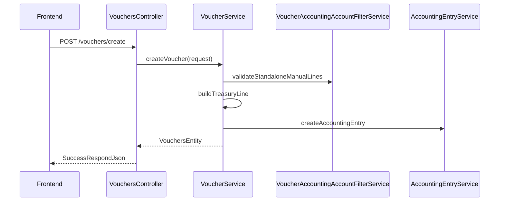

# Descripción de diseño de software (SDD) — SIGCON

| Campo | Valor |
|-------|--------|
| **Identificación del documento** | SIGCON-SDD-001 |
| **Título** | Manual de desarrollador / Descripción de diseño |
| **Producto** | SIGCON — Sistema de Gestión Contable y Financiera |
| **Versión del documento** | 1.1 |
| **Versión del producto** | 2026-1 (Proyecto Integrador USCO) |
| **Fecha** | 2026-05-28 |
| **Estándar de referencia** | IEEE Std 1016-2009, IEEE Std 26512-2018, IEEE Std 1012-2016 |

---

## Historial de revisiones

| Versión | Fecha | Descripción |
|---------|--------|-------------|
| 1.0 | 2026-05 | SDD inicial |
| 1.1 | 2026-05-28 | Estructura IEEE 1016; FV, inventario, comprobantes standalone, vistas de diseño |

---

## Tabla de contenidos

1. [Introducción](#1-introducción)
2. [Referencias](#2-referencias)
3. [Definiciones y abreviaturas](#3-definiciones-y-abreviaturas)
4. [Contexto y partes interesadas](#4-contexto-y-partes-interesadas)
5. [Puntos de vista del diseño](#5-puntos-de-vista-del-diseño)
6. [Decisiones de diseño](#6-decisiones-de-diseño)
7. [Descripción detallada por subsistema](#7-descripción-detallada-por-subsistema)
8. [Interfaces externas](#8-interfaces-externas)
9. [Persistencia y datos](#9-persistencia-y-datos)
10. [Seguridad](#10-seguridad)
11. [Frontend](#11-frontend)
12. [Verificación y validación](#12-verificación-y-validación)
13. [Despliegue y operación](#13-despliegue-y-operación)
14. [Mantenimiento y extensión](#14-mantenimiento-y-extensión)
15. [Trazabilidad](#15-trazabilidad)
- [Apéndice A — Mapa de paquetes backend](#apéndice-a--mapa-de-paquetes-backend)
- [Apéndice B — Endpoints principales](#apéndice-b--endpoints-principales)

---

## 1. Introducción

### 1.1 Propósito

Este documento describe el **diseño de implementación** de SIGCON para desarrolladores, integradores y mantenedores. Complementa el [Manual de usuario](MANUAL_USUARIO.md) y el [README](../README.md).

### 1.2 Alcance

Cubre el monorepo `dev/`:

- `backend/` — API REST Spring Boot 3.5, Java 17.
- `Frontend/` — SPA React 18 + Vite.
- `docs/` — documentación.
- Orquestación Docker (`docker-compose.local.yml`).

### 1.3 Convenciones del documento

- Rutas de API: prefijo `/api/v1` salvo módulos legacy (`/auth`, `/api/menus`).
- Permisos en BD: código `CREATE_X`; authority Spring: `PERM_CREATE_X`.
- Identificadores de requisitos de ejemplo: `REQ-xxx` (trazabilidad en sección 15).

---

## 2. Referencias

| ID | Referencia |
|----|------------|
| [R1] | IEEE Std 1016-2009 — Software Design Descriptions |
| [R2] | IEEE Std 26512-2018 — Developing information for users |
| [R3] | IEEE Std 1012-2016 — Verification and Validation |
| [R4] | IEEE Std 29148-2018 — Requirements Engineering |
| [R5] | SIGCON-MUD-001 — Manual de usuario |
| [R6] | Spring Boot 3.5 / Spring Security 6 — Documentación oficial |
| [R7] | React 18 / Vite — Documentación oficial |

---

## 3. Definiciones y abreviaturas

| Término | Definición |
|---------|------------|
| **Bounded context** | Paquete Java `com.sigcon.backend.{dominio}` |
| **DDD ligero** | Servicios de dominio + repositorios JPA |
| **SDD** | Software Design Description |
| **DataTable** | Contrato de paginación/filtrado usado en listados |
| **Standalone voucher** | Comprobante sin `invoiceId` (nómina, servicios) |

---

## 4. Contexto y partes interesadas

### 4.1 Diagrama de contexto (IEEE 1016 — vista de contexto)

```
                    ┌─────────────┐
                    │   Usuario   │
                    └──────┬──────┘
                           │ HTTPS
                    ┌──────▼──────┐
                    │  Frontend   │
                    │  React/Vite │
                    └──────┬──────┘
                           │ REST + JWT
                    ┌──────▼──────┐
                    │   Backend   │
                    │ Spring Boot │
                    └──────┬──────┘
           ┌───────────────┼───────────────┐
           │               │               │
    ┌──────▼──────┐ ┌──────▼──────┐ ┌─────▼─────┐
    │ PostgreSQL  │ │  OpenAI API │ │  (Email)  │
    │             │ │ (opcional)  │ │  reset pwd│
    └─────────────┘ └─────────────┘ └───────────┘
```

### 4.2 Partes interesadas

| Rol | Interés en el diseño |
|-----|---------------------|
| Desarrollador backend | Servicios, entidades, migraciones |
| Desarrollador frontend | Páginas, menú dinámico, componentes |
| Administrador BD | Seeds, Flyway, índices |
| Auditor / docente | Trazabilidad REQ ↔ módulo |

---

## 5. Puntos de vista del diseño

### 5.1 Vista lógica (composición)

```
┌─────────────────────────────────────────────────────────┐
│                    Capa de presentación                  │
│  Controllers (@RestController) + DTOs application        │
├─────────────────────────────────────────────────────────┤
│                    Capa de dominio                       │
│  Services (@Service) + Entities + Repository interfaces  │
├─────────────────────────────────────────────────────────┤
│                    Capa de infraestructura               │
│  JPA Repositories, adapters, clients (OpenAI)            │
└─────────────────────────────────────────────────────────┘
```

**Regla:** la lógica de negocio reside en `domain/service`, no en controllers.

### 5.2 Vista de despliegue (física)

| Nodo | Artefacto | Puerto típico |
|------|-----------|---------------|
| Cliente | Navegador | — |
| Servidor app | `backend` JAR / contenedor | 8080 |
| Servidor web | `Frontend` Nginx / Vite dev | 5173 |
| BD | PostgreSQL | 5432 |

### 5.3 Vista de procesos — flujo comprobante standalone



### 5.4 Vista de desarrollo (estructura repo)

Véase [Apéndice A](#apéndice-a--mapa-de-paquetes-backend) y README.

---

## 6. Decisiones de diseño

| ID | Decisión | Alternativa rechazada | Justificación |
|----|----------|----------------------|---------------|
| DD-01 | Arquitectura hexagonal en backend | Monolito en 3 capas anémico | Separación dominio / adaptadores |
| DD-02 | JWT stateless | Sesión servidor | Escalabilidad, SPA |
| DD-03 | Menú dinámico desde BD | Menú estático solo en FE | Permisos por rol sin redespliegue |
| DD-04 | Asiento automático en pagos de factura | Siempre manual | Reduce error operativo |
| DD-05 | Líneas manuales múltiples en standalone | Una sola línea fija D/C | Flexibilidad contable |
| DD-06 | Tesorería 11/12 solo vía método de pago en standalone | Captura manual banco | Coherencia con origen de fondos |
| DD-07 | Stock en `products.stock` | Kardex separado (fase 1) | Simplicidad PI; extensible |
| DD-08 | `InputSelectModal` (Select2) en formularios | `<select>` nativo | UX consistente en modales |

---

## 7. Descripción detallada por subsistema

### 7.1 Parametrización (`parametrization`)

- Usuarios, roles, permisos (`roles_permissions`).
- Empresas, módulos, menús (`menu_permissions`).
- Autenticación: `AuthController` → JWT.

### 7.2 Listas contables (`lists_accounting`)

- PUC: `ChartOfAccountController`.
- Cuentas auxiliares: `AccountingAccountController`.
- Impuestos, tasas, centros de costo, depreciación.

### 7.3 Terceros (`third_parties`)

- CRUD terceros con roles (`CLIENTE`, `PROVEEDOR`, `EMPLEADO`).
- Endpoint comprobantes: `GET /api/v1/vouchers/third-parties?role=EMPLEADO`.

### 7.4 Facturación (`invoices`)

| Controlador | Ruta base | Tipo |
|-------------|-----------|------|
| `InvoiceFCController` | `/api/v1/invoices/fc` | Compra |
| `InvoiceFVController` | `/api/v1/invoices/fv` | Venta |
| `InvoiceOCController` | `/api/v1/invoices/oc` | Orden |
| `InvoicesController` | `/api/v1/invoices/{id}` | Genérico + PDF |

**Servicios clave:**

- `InvoiceService` — creación por tipo (estado `BILLED` en FC/FV).
- `LineInvoiceService` — totales, `syncProductPrices` (FC→`price`, FV→`salePrice`).
- `ProductInventoryService` — `applyStockMovement` (FC suma, FV resta con validación ≥ 0).

**Migraciones relevantes:**

- `V15__products_sale_price_stock.sql` — columnas `sale_price`, `stock`.
- `V16__invoice_fv_menu.sql` — menú y permisos FV.

### 7.5 Comprobantes (`vouchers`)

**Clases principales:**

| Clase | Responsabilidad |
|-------|-----------------|
| `VoucherService` | CRUD, asiento, validación standalone |
| `VoucherAccountingAccountFilterService` | Filtro PUC por tipo y línea D/C |
| `VouchersController` | API REST |

**Tipos standalone:** `PAYROLL`, `SERVICE_PAYMENT`, `SERVICE_RECEIPT`.

**Validación líneas manuales (`validateStandaloneManualLines`):**

- Egreso: `Σ débitos − Σ créditos = monto`.
- Ingreso: `Σ créditos − Σ débitos = monto`.
- Prohibido cuentas 11/12 en líneas manuales.
- `buildTreasuryLine()` agrega línea banco/caja al persistir.

**Listado standalone:** `POST /api/v1/vouchers/search` con `standaloneOnly: true`.

### 7.6 Contabilidad (`accounting_entry`, `books`)

- Creación de `AccountingEntry` y líneas.
- Periodos contables abiertos/cerrados (`AccountingPeriod`).

### 7.7 Tesorería (`banks`, `cash`)

- Cuentas, chequeras, cheques, movimientos, conciliación.

### 7.8 Activos y productos (`assets`, `products`)

- Activos fijos, depreciación, NIIF.
- `ProductController` — CRUD con `price`, `salePrice`, `stock`.

### 7.9 Dashboard y asistente

- `DashboardService` — KPIs por empresa / global.
- `AssistantController` — OpenAI con contexto de sesión.

---

## 8. Interfaces externas

### 8.1 API REST

- Estilo: JSON sobre HTTP.
- Autenticación: header `Authorization: Bearer <token>`.
- Listados: `DataTableRequest` / `DataTableResponse`.
- Documentación interactiva: Swagger (`/swagger-ui.html`, perfil `dev`).

### 8.2 Contrato de línea contable (fragmento)

```json
{
  "accountingAccountCode": "5105",
  "type": "DEBIT",
  "amount": 1500000.00
}
```

Paquete: `accounting_entry.application` → `AccountingEntryLineRequest`.

### 8.3 Contrato de comprobante (fragmento)

Campos en `Transaction` / request de voucher:

- `voucherTypeId`, `valuePayment`, `methodPaymentId`, `paymentFormId`
- `bankAccount`, `cashAccount`, `check`, `thirdPartyId`
- `lines[]` — líneas manuales
- `invoiceId` — null en standalone

---

## 9. Persistencia y datos

### 9.1 Motor

PostgreSQL 14+; Hibernate `ddl-auto=update` en desarrollo.

### 9.2 Scripts

| Ubicación | Propósito |
|-----------|-----------|
| `db/seeds/*.sql` | Datos maestros |
| `db/migration/V*.sql` | Cambios incrementales |
| `db/indexes/*.sql` | Índices |

### 9.3 Entidades transversales

```
vouchers ──► accounting_entry ──► accounting_entry_line
                │
invoices ──► lines_invoice ──► products (price, sale_price, stock)
```

### 9.4 Modelo producto (extracto)

| Columna | Tipo | Notas |
|---------|------|-------|
| `price` | NUMERIC | Precio compra |
| `sale_price` | NUMERIC | Precio venta |
| `stock` | NUMERIC | Existencias |

---

## 10. Seguridad

### 10.1 Flujo JWT

1. `POST /auth/login` → token + usuario con permisos.
2. Filtro JWT en cadena Spring Security.
3. Blacklist opcional de tokens revocados.

### 10.2 Autorización

```java
@PreAuthorize("hasAuthority('PERM_CREATE_VOUCHER') or hasAuthority('ROLE_SUPERADMIN')")
```

### 10.3 Aislamiento multi-empresa

`UserUtil.getUser().getCompany()` en servicios de negocio.

---

## 11. Frontend

### 11.1 Estructura

```
Frontend/src/
├── pages/{modulo}/     # Pantallas
├── components/         # molecules: inputSelectModal, InputModal
├── utils/map_menu.jsx  # COMPONENT_MAP
└── routes/routes.jsx   # Rutas dinámicas + estáticas (vista factura)
```

### 11.2 Menú dinámico

1. `GET /api/modules/menu` tras login.
2. `COMPONENT_MAP` mapea `component` BD → componente React.
3. Rutas anidadas: `renderMenuRoutesFlat`.

### 11.3 Módulos de facturas (frontend)

| Componente BD | Ruta | Carpeta |
|---------------|------|---------|
| `INVOICE_BILL` | `invoice-bill` | `pages/invoices/FC/` |
| `INVOICE_SALE` | `invoice-sale` | `pages/invoices/FV/` |
| `PURCHASE_ORDERS` | `purchase-orders` | `pages/invoices/OC/` |

`FormInvoice` acepta `thirdPartyRoleId`, `loadAllProducts` (FV).

`LineInvoices` — columnas precio venta/stock; tope cantidad en FV.

### 11.4 Comprobantes (frontend)

| Archivo | Rol |
|---------|-----|
| `pages/vouchers/index.jsx` | Listado + modales |
| `VoucherFormModal.jsx` | Formulario principal |
| `AccountingLinesEditor.jsx` | Editor de líneas |
| `AccountingLineRow.jsx` | Fila con InputSelectModal |
| `voucherUtils.js` | Validación cliente |

### 11.5 Componente InputSelectModal

- Ubicación: `components/molecules/inputSelectModal.jsx`.
- Envuelve **Select2** (jQuery).
- Props: `id`, `options`, `value`, `onChange`, `disabled`, `url` (ajax opcional).
- En modales Bootstrap: `dropdownParent: $select.parent()`.

### 11.6 Consumo API

```javascript
import { fetchHelper } from '@/utils/fetch';
import { base_url } from '@/utils/functions';

await fetchHelper.post(
  base_url(['api', 'v1', 'vouchers', 'create']),
  payload,
  {},
  0,
  false
);
```

---

## 12. Verificación y validación

Alineado con IEEE 1012 (resumen aplicable al proyecto).

| Actividad | Método | Responsable |
|-----------|--------|-------------|
| Prueba unitaria backend | `mvn test` | Desarrollador |
| Prueba de integración API | Swagger / Postman | Desarrollador |
| Prueba UI | Casos del manual de usuario | QA / equipo |
| Validación contable | Cuadre D=C en asientos | Contador revisor |

**Casos críticos:**

| ID caso | Descripción |
|---------|-------------|
| TC-V-01 | Crear comprobante nómina con 2+ líneas D/C y neto = monto |
| TC-FV-01 | FV reduce stock; error si stock insuficiente |
| TC-FC-01 | FC incrementa stock y actualiza precio compra |
| TC-P-01 | Pago FC genera asiento sin líneas manuales |

---

## 13. Despliegue y operación

### 13.1 Desarrollo local

```powershell
# Docker (recomendado)
docker compose -f docker-compose.local.yml --env-file backend/.env up --build -d

# Backend
cd backend
$env:SPRING_PROFILES_ACTIVE = "dev"
.\mvnw.cmd spring-boot:run

# Frontend
cd Frontend
npm install && npm run dev
```

### 13.2 URLs locales

| Servicio | URL |
|----------|-----|
| API | http://localhost:8080 |
| Swagger | http://localhost:8080/swagger-ui.html |
| Frontend | http://localhost:5173 |

### 13.3 Producción

- `mvn -DskipTests package` → JAR.
- `npm run build` → `dist/` + Nginx.
- Variables: JWT, BD, CORS, `OPENAI_API_KEY` (opcional).
- Desactivar Swagger fuera de `dev`.

---

## 14. Mantenimiento y extensión

### 14.1 Checklist nuevo módulo backend

1. Paquete `com.sigcon.backend.{modulo}`.
2. Entity, Repository, Service, Controller.
3. `@PreAuthorize` + permisos en seed/migración.
4. `@Operation` Swagger.

### 14.2 Checklist nuevo módulo frontend

1. `pages/{modulo}/`.
2. Entrada en `COMPONENT_MAP`.
3. Menú en SQL (`menus`, `menu_permissions`).
4. Probar con usuario sin SUPERADMIN.

### 14.3 Agregar tipo de comprobante

1. Seed `voucher_types`.
2. Reglas en `VoucherAccountingAccountFilterService`.
3. Flag `requiresManualAccountingLines` si aplica.
4. Actualizar `voucherUtils.js` (`STANDALONE_VOUCHER_TYPES`).

---

## 15. Trazabilidad

Matriz simplificada requisito ↔ implementación (IEEE 29148 / 1016).

| ID requisito | Descripción | Módulo | Artefacto verificación |
|--------------|-------------|--------|------------------------|
| REQ-FAC-01 | Factura de compra | invoices/FC | TC-FC-01 |
| REQ-FAC-02 | Factura de venta | invoices/FV | TC-FV-01 |
| REQ-INV-01 | Control de stock | products, LineInvoiceService | TC-FV-01, TC-FC-01 |
| REQ-VCH-01 | Comprobantes standalone | vouchers | TC-V-01 |
| REQ-VCH-02 | Filtro cuentas por tipo | VoucherAccountingAccountFilterService | TC-V-01 |
| REQ-SEG-01 | Autenticación JWT | general/security | Login manual |
| REQ-RPT-01 | Reportes contables | books/reports | Manual §7.10 |

---

## Apéndice A — Mapa de paquetes backend

```
com.sigcon.backend/
├── parametrization/
├── lists_accounting/
├── third_parties/
├── invoices/
├── vouchers/
├── accounting_entry/
├── books/
├── banks/
├── assets/
├── products/
├── dashboard/
├── assistant/
├── general/          # Security, config
└── utils/            # UserUtil, DataTable, JSON responses
```

---

## Apéndice B — Endpoints principales

| Método | Ruta | Descripción |
|--------|------|-------------|
| POST | `/auth/login` | Autenticación |
| GET | `/api/modules/menu` | Menú por rol |
| POST | `/api/v1/vouchers/search` | Listado comprobantes |
| POST | `/api/v1/vouchers/create` | Crear comprobante |
| POST | `/api/v1/vouchers/accounting-accounts/filter` | Cuentas permitidas |
| POST | `/api/v1/invoices/fc/create` | Factura compra |
| POST | `/api/v1/invoices/fv/create` | Factura venta |
| GET | `/api/v1/invoices/{id}/pdf` | PDF factura |
| POST | `/api/v1/products/create` | Producto |
| GET | `/api/v1/dashboard/overview` | Dashboard |
| POST | `/api/v1/assistant/chat` | Asistente IA |

Listado completo: Swagger en entorno `dev`.

---

## Referencias cruzadas

| Documento | Enlace |
|-----------|--------|
| Documentación general | [DOCUMENTACION_GENERAL.md](DOCUMENTACION_GENERAL.md) |
| Manual de usuario | [MANUAL_USUARIO.md](MANUAL_USUARIO.md) |
| README | [../README.md](../README.md) |
| Backend readme | [../backend/readme.md](../backend/readme.md) |

---

*Fin del documento SIGCON-SDD-001.*
