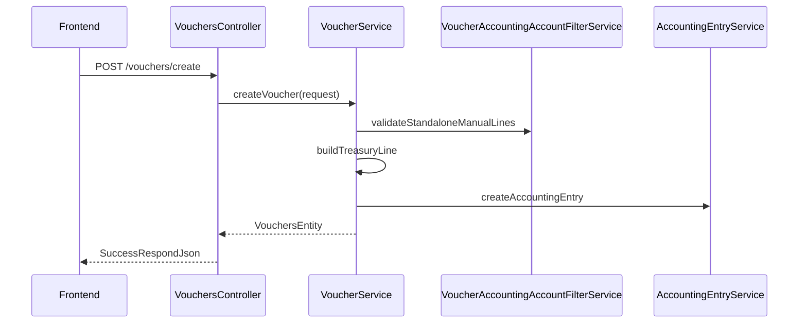
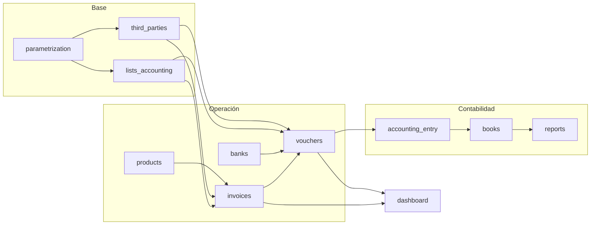
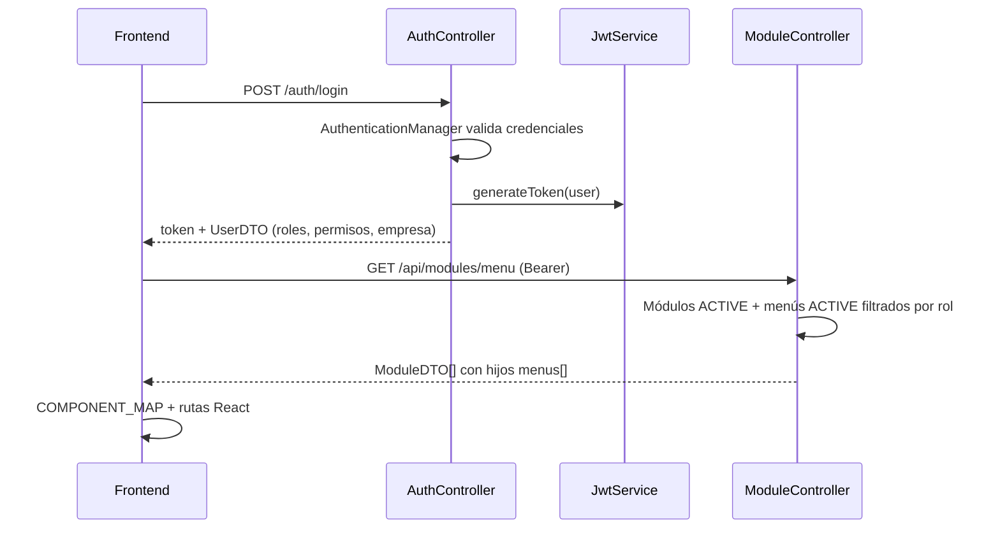
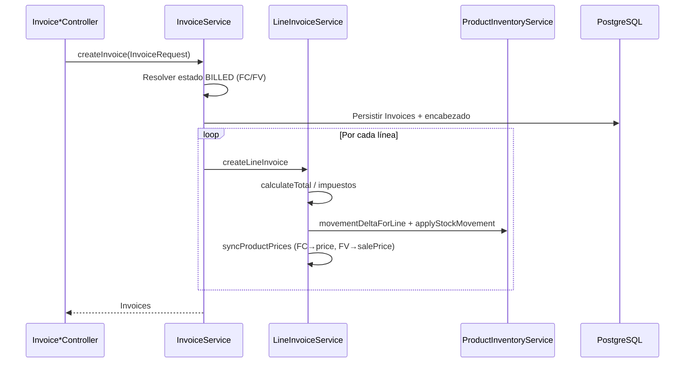
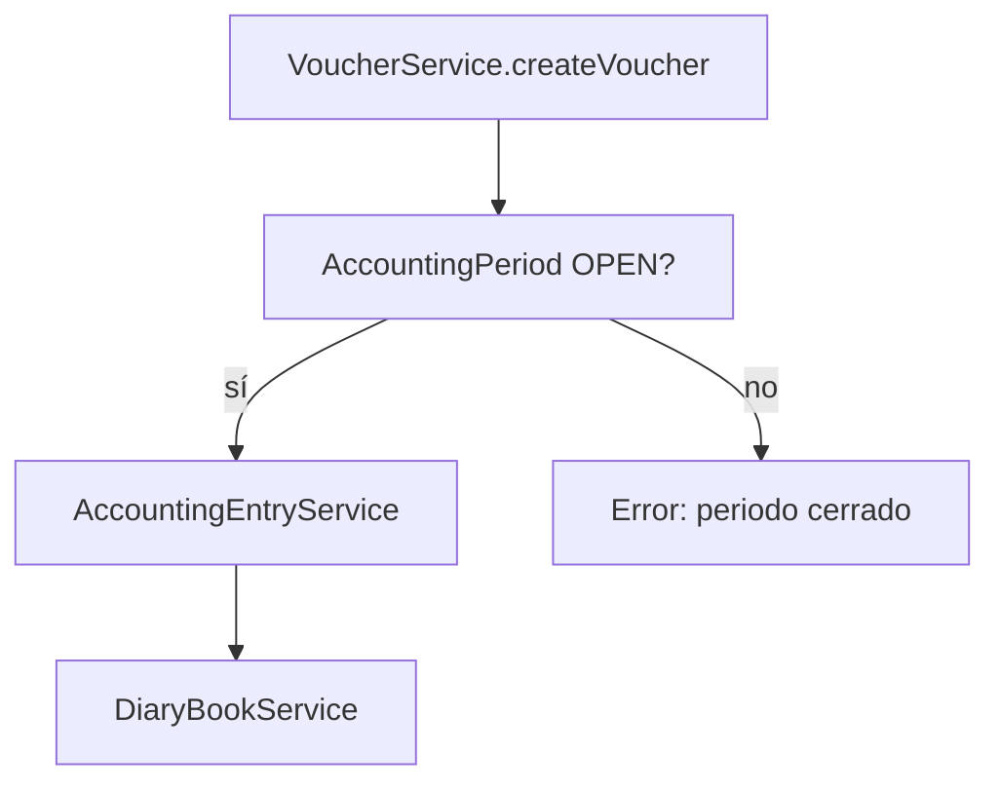

# Descripción de diseño de software (SDD) — SIGCON

| Campo | Valor |
|-------|--------|
| **Identificación del documento** | SIGCON-SDD-001 |
| **Título** | Manual de desarrollador / Descripción de diseño |
| **Producto** | SIGCON — Sistema de Gestión Contable y Financiera |
| **Versión del documento** | 1.3 |
| **Versión del producto** | 0.0.1-SNAPSHOT (Spring Boot 3.5.8) |
| **Fecha** | 2026-06-04 |
| **Estándar de referencia** | IEEE Std 1016-2009, IEEE Std 26512-2018, IEEE Std 1012-2016 |

---

## Historial de revisiones

| Versión | Fecha | Descripción |
|---------|--------|-------------|
| 1.0 | 2026-05 | SDD inicial |
| 1.1 | 2026-05-28 | Estructura IEEE 1016; FV, inventario, comprobantes standalone, vistas de diseño |
| 1.2 | 2026-06-04 | Verificación contra código: arquitectura hexagonal, tesorería, reportes, frontend vouchers TSX, apéndices API |
| 1.3 | 2026-06-04 | Ampliación §7: funcionamiento detallado de subsistemas, flujos e interacciones |

---

## Tabla de contenidos

1. [Introducción](#1-introducción)
2. [Referencias](#2-referencias)
3. [Definiciones y abreviaturas](#3-definiciones-y-abreviaturas)
4. [Contexto y partes interesadas](#4-contexto-y-partes-interesadas)
5. [Puntos de vista del diseño](#5-puntos-de-vista-del-diseño)
6. [Decisiones de diseño](#6-decisiones-de-diseño)
7. [Descripción detallada por subsistema](#7-descripción-detallada-por-subsistema)
8. [Interfaces externas](#8-interfaces-externas)
9. [Persistencia y datos](#9-persistencia-y-datos)
10. [Seguridad](#10-seguridad)
11. [Frontend](#11-frontend)
12. [Verificación y validación](#12-verificación-y-validación)
13. [Despliegue y operación](#13-despliegue-y-operación)
14. [Mantenimiento y extensión](#14-mantenimiento-y-extensión)
15. [Trazabilidad](#15-trazabilidad)
- [Apéndice A — Mapa de paquetes backend](#apéndice-a--mapa-de-paquetes-backend)
- [Apéndice B — Endpoints principales](#apéndice-b--endpoints-principales)

---

## 1. Introducción

### 1.1 Propósito

Este documento describe el **diseño de implementación** de SIGCON para desarrolladores, integradores y mantenedores. Complementa el [Manual técnico](MANUAL_TECNICO.md) (API, BD y despliegue), el [Manual de usuario](MANUAL_USUARIO.md) y el [README](../README.md).

### 1.2 Alcance

Cubre el monorepo `dev/`:

- `backend/` — API REST Spring Boot 3.5, Java 17.
- `Frontend/` — SPA React 18 + Vite.
- `docs/` — documentación.
- Orquestación Docker (`docker-compose.local.yml`).

> **Nota Docker:** el directorio del cliente en el repositorio es `Frontend/` (mayúscula). En `docker-compose.local.yml` el servicio `frontend-local` referencia `./frontend` en minúsculas; en Windows puede requerir alinear nombre de carpeta o el `context` del compose.

### 1.3 Convenciones del documento

- Rutas de API: prefijo `/api/v1` salvo rutas legacy (`/auth`, `/users`, `/roles`, `/api/menus`, `/api/modules`, `/api/parameters`).
- Permisos en BD: código `CREATE_X`; authority Spring: `PERM_CREATE_X`.
- Identificadores de requisitos de ejemplo: `REQ-xxx` (trazabilidad en sección 15).

---

## 2. Referencias

| ID | Referencia |
|----|------------|
| [R1] | IEEE Std 1016-2009 — Software Design Descriptions |
| [R2] | IEEE Std 26512-2018 — Developing information for users |
| [R3] | IEEE Std 1012-2016 — Verification and Validation |
| [R4] | IEEE Std 29148-2018 — Requirements Engineering |
| [R5] | SIGCON-MUD-001 — Manual de usuario |
| [R6] | Spring Boot 3.5 / Spring Security 6 — Documentación oficial |
| [R7] | React 18 / Vite — Documentación oficial |

---

## 3. Definiciones y abreviaturas

| Término | Definición |
|---------|------------|
| **Bounded context** | Paquete Java `com.sigcon.backend.{dominio}` |
| **DDD ligero** | Servicios de dominio + repositorios JPA |
| **SDD** | Software Design Description |
| **DataTable** | Contrato de paginación/filtrado usado en listados |
| **Standalone voucher** | Comprobante sin `invoiceId` (nómina, servicios) |

---

## 4. Contexto y partes interesadas

### 4.1 Diagrama de contexto (IEEE 1016 — vista de contexto)

```
                    ┌─────────────┐
                    │   Usuario   │
                    └──────┬──────┘
                           │ HTTPS
                    ┌──────▼──────┐
                    │  Frontend   │
                    │  React/Vite │
                    └──────┬──────┘
                           │ REST + JWT
                    ┌──────▼──────┐
                    │   Backend   │
                    │ Spring Boot │
                    └──────┬──────┘
           ┌───────────────┼───────────────┐
           │               │               │
    ┌──────▼──────┐ ┌──────▼──────┐ ┌─────▼─────┐
    │ PostgreSQL  │ │  OpenAI API │ │  (Email)  │
    │             │ │ (opcional)  │ │  reset pwd│
    └─────────────┘ └─────────────┘ └───────────┘
```

### 4.2 Partes interesadas

| Rol | Interés en el diseño |
|-----|---------------------|
| Desarrollador backend | Servicios, entidades, migraciones |
| Desarrollador frontend | Páginas, menú dinámico, componentes |
| Administrador BD | Seeds, Flyway, índices |
| Auditor / docente | Trazabilidad REQ ↔ módulo |

---

## 5. Puntos de vista del diseño

### 5.1 Vista lógica (arquitectura hexagonal por módulo)

Cada bounded context bajo `com.sigcon.backend.{modulo}` sigue, en general:

```
┌─────────────────────────────────────────────────────────┐
│  interfaces/     Controllers REST, filtros expuestos     │
├─────────────────────────────────────────────────────────┤
│  application/    DTOs, requests, responses             │
├─────────────────────────────────────────────────────────┤
│  domain/         @Service, entities, reglas de negocio  │
│                  (+ interfaces de repositorio)           │
├─────────────────────────────────────────────────────────┤
│  infrastructure/ Implementación JPA, clientes externos │
└─────────────────────────────────────────────────────────┘
```

**Regla:** la lógica de negocio reside en `domain/service`, no en controllers. El paquete `general/` concentra seguridad JWT, configuración y utilidades transversales.

### 5.2 Vista de despliegue (física)

| Nodo | Artefacto | Puerto típico |
|------|-----------|---------------|
| Cliente | Navegador | — |
| Servidor app | `backend` JAR / contenedor | 8080 |
| Servidor web | `Frontend/` Nginx / Vite dev | 5173 |
| BD | PostgreSQL | 5432 |
| Adminer (dev) | Contenedor compose | `${backend_port_adminer}` (p. ej. 8081) |

### 5.3 Vista de procesos — flujo comprobante standalone



### 5.4 Vista de desarrollo (estructura repo)

Véase [Apéndice A](#apéndice-a--mapa-de-paquetes-backend) y README.

---

## 6. Decisiones de diseño

| ID | Decisión | Alternativa rechazada | Justificación |
|----|----------|----------------------|---------------|
| DD-01 | Arquitectura hexagonal en backend | Monolito en 3 capas anémico | Separación dominio / adaptadores |
| DD-02 | JWT stateless | Sesión servidor | Escalabilidad, SPA |
| DD-03 | Menú dinámico desde BD | Menú estático solo en FE | Permisos por rol sin redespliegue |
| DD-04 | Asiento automático en pagos de factura | Siempre manual | Reduce error operativo |
| DD-05 | Líneas manuales múltiples en standalone | Una sola línea fija D/C | Flexibilidad contable |
| DD-06 | Tesorería 11/12 solo vía método de pago en standalone | Captura manual banco | Coherencia con origen de fondos |
| DD-07 | Stock en `products.stock` | Kardex separado (fase 1) | Simplicidad PI; extensible |
| DD-08 | `InputSelectModal` (Select2) en formularios | `<select>` nativo | UX consistente en modales |

---

## 7. Descripción detallada por subsistema

Esta sección describe **qué hace cada módulo**, **con qué datos opera**, **qué servicios coordinan el flujo** y **de qué otros subsistemas depende**. La numeración sigue el orden lógico de parametrización → maestros → operación → contabilidad → analítica.

### Mapa de dependencias entre subsistemas



---

### 7.1 Parametrización (`parametrization`)

#### Propósito

Gobernar **quién** accede al sistema, **a qué empresa** pertenece, **qué pantallas** ve y **qué operaciones** puede ejecutar. Es prerequisito de todos los demás módulos.

#### Entidades y tablas principales

| Concepto | Tablas / entidades | Uso |
|----------|-------------------|-----|
| Empresa | `companies` | Aislamiento multi-tenant |
| Usuario | `users` | Credenciales, empresa, roles |
| Rol / permiso | `roles`, `permissions`, `roles_permissions` | Autorización Spring (`PERM_*`) |
| Módulo / menú | `modules`, `menus`, `menu_permissions` | Navegación dinámica en frontend |
| Recursos transversales | `payment_methods`, `payment_forms` | Facturas y comprobantes |
| Parámetros globales | `parameters` | Configuración de sistema |

#### Servicios y controladores

| Componente | Función |
|------------|---------|
| `AuthService` / `AuthController` (`/auth`) | Login JWT, registro, logout con blacklist, recuperación de contraseña (email + `PasswordResetToken`) |
| `UserService` / `UserController` (`/users`) | CRUD usuarios, asignación de roles |
| `RoleService` / `RoleController` (`/roles`) | Roles y permisos |
| `CompanyService` / `CompanyController` | Empresas activas |
| `ModuleService` / `ModuleController` (`/api/modules`) | CRUD módulos; **`GET /menu`** arma árbol módulo → menús visibles |
| `MenuService` / `MenuController` (`/api/menus`) | CRUD menús (ruta, icono, `component` para React) |
| `MenuPermissionsService` | Relación rol ↔ menú |
| `ResourceService` / `ResourcesController` | Catálogos de métodos y formas de pago |
| `ParameterService` | Parámetros de aplicación |

#### Flujo de autenticación y menú



**Reglas relevantes:**

- Permiso en BD `CREATE_VOUCHER` se expone a Spring como `PERM_CREATE_VOUCHER`.
- `SUPERADMIN` omite restricción de empresa en dashboard; el resto usa `UserUtil.getUser().getCompany()`.
- Menú: solo entradas con permiso; el campo `component` debe existir en `map_menu.jsx`.

---

### 7.2 Listas contables (`lists_accounting`)

#### Propósito

Mantener el **catálogo contable** (PUC nacional y cuentas auxiliares por empresa), reglas tributarias, monedas, tasas y centros de costo que alimentan facturas, comprobantes y reportes.

#### Submódulos

| Submódulo | Servicio | API (prefijo) |
|-----------|----------|---------------|
| PUC | `ChartOfAccountService` | `/api/v1/chart-of-accounts` |
| Cuentas auxiliares | `AccountingAccountService` | `/api/v1/accounting-accounts` |
| Centros de costo | `CostCenterService` | `/api/v1/cost-centers` |
| Reglas tributarias | `RuleTaxService` | `/api/v1/ruler-tax` |
| Monedas / tipos | `CurrencyTypeService` | `/api/v1/accounting-lists/currency-types` |
| Tasas de cambio | (controlador dedicado) | `/api/v1/exchange-rates` |
| Depreciación (reglas) | `DepretationRuleService` | `/api/v1/depreciation-rules` |

#### Funcionamiento

1. **PUC (`chart_of_accounts`):** estructura jerárquica de cuentas (clase, grupo, cuenta). Es la referencia para validar códigos en asientos.
2. **Cuenta auxiliar (`accounting_accounts`):** instancia por **empresa**, vinculada a una cuenta PUC; es la que se usa en líneas de `accounting_entry_line`.
3. **Filtro en comprobantes:** `VoucherAccountingAccountFilterService` consulta cuentas permitidas según tipo de comprobante y si la línea es débito o crédito (clases PUC 11/12 solo vía tesorería en tipos manuales).

**Dependencias:** parametrización (empresa del usuario). **Consumido por:** vouchers, invoices (implícito en totales), assets, reports.

---

### 7.3 Terceros (`third_parties`)

#### Propósito

Registrar personas naturales/jurídicas con **roles de negocio** (cliente, proveedor, empleado) y datos comerciales asociados.

#### Submódulos

| Submódulo | Servicio | Uso |
|-----------|----------|-----|
| `third_parties` | `ThirdPartyService` | CRUD, carga masiva (`bulkStore`), catálogos de roles/estados |
| `commercial_data` | `CommercialDataService` | Datos comerciales del tercero |
| `ecl_segmentation` | `EclSegmentationService` | Segmentación (NIIF / provisiones) |

#### API principal

- Base: `/api/v1/third-parties` (DataTable, detalle, actualización de roles).
- Comprobantes: `GET /api/v1/vouchers/third-parties?role=EMPLEADO|PROVEEDOR|CLIENTE` — lista reducida para formularios.

#### Reglas de negocio

| Tipo comprobante | Rol obligatorio en tercero |
|------------------|----------------------------|
| `PAYROLL` | `EMPLEADO` |
| `SERVICE_PAYMENT` | `PROVEEDOR` |
| `SERVICE_RECEIPT` | `CLIENTE` |

`validateStandaloneThirdParty` en `VoucherService` aplica estas reglas antes de persistir.

**Dependencias:** empresa del usuario. **Consumido por:** invoices (proveedor/cliente en FC/FV), vouchers standalone.

---

### 7.4 Facturación (`invoices`)

#### Propósito

Registrar documentos **FC** (compra), **FV** (venta) y **OC** (orden de compra), calcular totales por línea, actualizar inventario y habilitar pagos vía comprobantes.

#### Controladores por tipo

| Controlador | Ruta base | Operación típica |
|-------------|-----------|------------------|
| `InvoiceFCController` | `/api/v1/invoices/fc` | Alta FC |
| `InvoiceFVController` | `/api/v1/invoices/fv` | Alta FV |
| `InvoiceOCController` | `/api/v1/invoices/oc` | Alta OC |
| `InvoicesController` | `/api/v1/invoices` | Consulta, actualización, **PDF** |
| `StatesInvoicesController` | `/api/v1/invoices/states` | Estados por bloque (FC/FV/OC) |

#### Servicios y responsabilidades

| Servicio | Responsabilidad |
|----------|-----------------|
| `InvoiceService` | `createInvoice`, `updateInvoice`, listado DataTable, cambio de estado, mapeo a DTO |
| `LineInvoiceService` | Líneas, `calculateTotal`, tipo de cambio, sincronización de precios en producto |
| `ProductInventoryService` | Movimiento de stock (solo FC/FV) |
| `InvoicePdfService` | Generación de PDF |
| `StateInvoiceService` | Catálogo de estados (`BILLED`, etc.) |

#### Flujo de creación de factura (FC / FV)



#### Inventario (`ProductInventoryService`)

| Tipo | Delta stock | Validación |
|------|-------------|------------|
| FC | `+ cantidad` | — |
| FV | `− cantidad` | Error si stock &lt; 0 |
| OC | Sin movimiento | — |

#### Estados de factura

- Enum transversal `StatusesInvoices`: `PENDING`, `PAID`.
- Bloques por tipo en tabla de estados (`invoiceStateRepository.findByBlockAndCode("FC", "BILLED")`).
- Un comprobante de pago **no** se crea si la factura ya está `PAID`; se valida que la suma de comprobantes no supere `total_payment`.

#### Migraciones relevantes

- `V15__products_sale_price_stock.sql` — `sale_price`, `stock` en productos.
- `V16__invoice_fv_menu.sql` — menú y permisos FV.

---

### 7.5 Comprobantes (`vouchers`)

#### Propósito

Registrar **movimientos de tesorería** (egreso/ingreso) con numeración por tipo, origen de fondos (banco, caja, cheque), vínculo opcional a factura y **asiento contable** en el periodo abierto.

#### Entidades

| Entidad | Descripción |
|---------|-------------|
| `VoucherTypesEntity` | Catálogo (`PAYMENT`, `RECEIPT`, `PAYROLL`, `SERVICE_PAYMENT`, `SERVICE_RECEIPT`, …) con `code` y naturaleza OUTPUT/INPUT |
| `VouchersEntity` | Comprobante: monto, fechas, origen de pago, `invoiceId` opcional, `thirdPartyId`, adjunto |
| Relación | `vouchers` → `accounting_entry` → líneas; enlace a `diary_book` / periodo |

#### Servicios

| Servicio | Métodos clave |
|----------|---------------|
| `VoucherService` | `createVoucher`, `updateVoucher`, `deleteVoucher`, `createAccountingEntry`, `resolveVoucherTypeId`, `generateVoucherNumber` |
| `VoucherTypeService` | Tipos paginados |
| `VoucherAccountingAccountFilterService` | `filterForVoucherLine`, `isAccountAllowed`, reglas 11/12 y prefijos 51/41 |

#### Flujo `createVoucher` (resumen)

1. Resolver tipo (`resolveVoucherTypeId`): si hay `invoiceId`, infiere `PAYMENT` (FC) o `RECEIPT` (OC/OF/FV según reglas).
2. Validar periodo contable **OPEN** (`AccountingPeriodService` vía `DiaryBook`).
3. Validar monto &gt; 0, origen de pago (banco, caja y/o cheque), factura no `PAID`, tope de pagos.
4. Si es standalone (`invoiceId == null`): `validateStandaloneThirdParty` + `validateStandaloneManualLines`.
5. Persistir comprobante, adjunto en `uploads/vouchers/`, actualizar cheque (EMITIDO → COBRADO si aplica).
6. `createAccountingEntry`: plantilla por `switch` del código de tipo + líneas manuales + **`buildTreasuryLine()`** (cuentas 11/12).
7. Actualizar saldos: `bankAccountService.updateBalance`, `cashService.updateBalance`.
8. Registrar en libro diario: `diaryBookService`.

#### Tipos de comprobante y contabilización automática

| Código | Requiere factura | Tercero | Contrapartida automática (ejemplo) |
|--------|------------------|---------|-------------------------------------|
| `PAYMENT` | Sí (FC) | — | 2205/2210 + tesorería CRÉDITO |
| `RECEIPT` | Sí (FV/OC) | — | 130505/130510 + tesorería DÉBITO |
| `PAYROLL` | No | EMPLEADO | 2505 + tesorería |
| `SERVICE_PAYMENT` | No | PROVEEDOR | Líneas manuales 51* + tesorería |
| `SERVICE_RECEIPT` | No | CLIENTE | Líneas manuales 41* + tesorería |

#### Validación de líneas manuales (standalone)

- Cuentas con prefijo **11** o **12** prohibidas en líneas manuales (`isTreasuryAccountCode`).
- Egreso (`SERVICE_PAYMENT`, `PAYROLL`): Σ débitos − Σ créditos = monto del comprobante.
- Ingreso (`SERVICE_RECEIPT`): Σ créditos − Σ débitos = monto.
- Al menos una línea con prefijo **51** (pago servicios) o **41** (cobro servicios), según tipo.

#### Listado

`POST /api/v1/vouchers/search` con `DataTableRequest`; flag **`standaloneOnly: true`** excluye comprobantes con `invoiceId` no nulo.

---

### 7.6 Contabilidad (`accounting_entry`, `books`)

#### Propósito

Materializar la **partida doble** de cada operación y controlar **periodos contables** y el **libro diario**.

#### `accounting_entry`

| Componente | Función |
|------------|---------|
| `AccountingEntryService` | `createAccountingEntry(AccountingEntryRequest)` — valida cuentas, suma débitos/créditos, persiste cabecera y líneas |
| `AccountingEntryLineService` | Mantenimiento de líneas |
| Entidades | `AccountingEntry`, `AccountingEntryLine`, enum `DEBIT` / `CREDIT` |

**Regla central:** total débitos = total créditos; si no cuadra, no se persiste el asiento.

#### `books`

| Servicio | Función |
|----------|---------|
| `AccountingPeriodService` | `ensurePeriodContainingDate`, periodo OPEN/CLOSED, cierre manual o por job |
| `DiaryBookService` | `createDiaryBook`, `getDiaryBook`, `updateValuesDiaryBook` — enlace comprobante ↔ libro |
| `GeneralLedgerService` | Mayor general (consultas internas) |

**Restricción transversal:** si `AccountingPeriod.status == CLOSED`, `VoucherService` bloquea crear, editar y eliminar comprobantes (y regeneración de asiento).



---

### 7.7 Tesorería (`banks`)

#### Propósito

Definir **origen y destino de fondos** usados en comprobantes: bancos, cuentas, cajas, cheques y herramientas de conciliación / flujo de caja.

#### Submódulos y servicios

| Submódulo | Servicio | API | Interacción con comprobantes |
|-----------|----------|-----|------------------------------|
| `banks` / `bankaccounts` | `BankService`, `BankAccountService` | `/api/v1/banks`, `/bank-accounts` | Selección de cuenta; `updateBalance` tras CRUD comprobante |
| `cash_management` | `CashService` | `/api/v1/cash` | Cajas activas; actualización de saldo |
| `checks` / `checkbooks` | `CheckService`, `CheckbookService` | `/api/v1/banks/checks`, `/checkbooks` | Cheque existente o nuevo; valor = monto comprobante |
| `bnk_cash_flow` | `CashFlowProjectionService` | `/api/v1/bnk/projections` | Proyecciones (planificación) |
| `financialmovements` | `FinancialMovementService` | Interno | Movimientos derivados de operaciones |
| `reconciliation` | `BankReconciliationSessionService` | Interno / futuras APIs | Conciliación extracto vs sistema |

#### Flujo de origen de pago en comprobante

1. El frontend envía en `Transaction` uno de: `bankAccount`, `cashAccount`, `check` (existente o datos para crear).
2. `VoucherService` resuelve entidades por id o número de cuenta.
3. Tras guardar el comprobante, invoca actualización de saldo en banco/caja.
4. El asiento incluye la línea de tesorería generada automáticamente (no capturada como línea manual 11/12).

> **Nota implementación:** `CashController` declara `@RequestMapping("api/v1/cash")` sin `/` inicial; conviene unificar a `/api/v1/cash` para consistencia con el resto de la API.

---

### 7.8 Activos y productos (`assets`, `products`)

#### Activos fijos (`assets`)

| Servicio | Función |
|----------|---------|
| `AssetsService` | Registro de activos, estados, vinculación contable |
| `DepreciationCalculationService` | Cálculo de depreciación periódica |
| `AssetDepreciationHistoryService` | Histórico de depreciaciones |
| `NiifAlertsService` | Alertas NIIF |

API bajo `/api/v1/assets` y subrutas `/depreciation`. El frontend concentra pantallas en `pages/assets/` e informes en `asset-report-generation`.

#### Productos (`products`)

| Servicio | Función |
|----------|---------|
| `ProductService` | CRUD producto por empresa |
| `ProductInventoryService` | Stock (ver §7.4) |
| `ProductAccountingService` | Cuentas contables por defecto del producto |

Campos operativos: `price` (compra), `salePrice` (venta), `stock`. API: `/api/v1/products`.

**Dependencias:** listas contables (cuentas), parametrización (empresa). **Consumido por:** invoices (líneas), opcionalmente vouchers si se vinculan activos.

---

### 7.9 Reportes (`reports`)

#### Propósito

Generar **salidas PDF** y plantillas para reportes contables; las consultas de datos suelen apoyarse en servicios de `books` y cuentas ya registradas.

| Componente | Función |
|------------|---------|
| `ReportPdfService` | `generateTemplateReport`, `generateReport(título, párrafos)` con iText/OpenPDF |
| `ReportController` | `GET /api/v1/reports/template` — descarga de plantilla |

#### Frontend

No existe carpeta `pages/reports/`; los componentes viven en:

- `pages/list_accounts/rep-balance-comprobacion/`
- `pages/list_accounts/rep-libro-diario/`
- `pages/list_accounts/rep-libro-mayor/`
- `pages/list_accounts/rep-auxiliares-cuenta/`
- `pages/list_accounts/rep-estados-financieros/`

IDs en `COMPONENT_MAP`: `REP_BALANCE_COMPROBACION`, `REP_LIBRO_DIARIO`, etc.

---

### 7.10 Dashboard y asistente

#### Dashboard (`dashboard`)

`DashboardService.getOverview()`:

| Ámbito | Condición | Datos |
|--------|-----------|-------|
| Empresa | Usuario normal | KPIs filtrados por `companyId` |
| Global | Rol `SUPERADMIN` | Conteos y montos de todas las empresas + ranking top 5 |

Indicadores: empresas, usuarios, facturas, comprobantes, activos, cuentas bancarias, montos totales, saldo bancario. Series últimos 6 meses: comprobantes y facturas por mes.

#### Asistente IA (`assistant`)

| Paso | Componente |
|------|------------|
| 1 | `AssistantContextService.buildSystemPrompt()` — usuario, empresa, KPIs resumidos |
| 2 | `AssistantService.chat()` — valida `OPENAI_API_KEY` y flag habilitado |
| 3 | `OpenAiChatClient` — envía historial sanitizado + mensaje usuario |
| 4 | Respuesta con `reply` + `sessionSummary` |

Sin API key configurada, el endpoint responde error controlado (no llama al proveedor externo).

---

### 7.11 Auditoría (`audits`)

Módulo **transversal** (paquetes `aop`, `application`, `domain`, `interfaces`) para interceptar operaciones sensibles y dejar trazabilidad. No sustituye el soft delete (`deletedAt`) ni los campos `createdAt` / `user` en comprobantes; complementa escenarios de cumplimiento.

---

### 7.12 Resumen operativo por caso de uso

| Caso de uso | Subsistemas involucrados | Artefacto principal |
|-------------|-------------------------|---------------------|
| Login y menú | parametrization | `AuthService`, `ModuleService.getModulesMenu` |
| Crear FC con stock | invoices, products, lists_accounting, third_parties | `InvoiceService`, `ProductInventoryService` |
| Pagar factura FC | vouchers, banks, accounting_entry, books | `VoucherService`, `AccountingEntryService` |
| Nómina standalone | vouchers, third_parties, banks | `VoucherService` + tipo `PAYROLL` |
| Cerrar mes | books | `AccountingPeriodService.closeAccountingPeriodManual` |
| Ver KPIs | dashboard | `DashboardService.getOverview` |
| Reporte PDF | reports, books (datos) | `ReportPdfService` + pantallas `rep-*` |

---

## 8. Interfaces externas

### 8.1 API REST

- Estilo: JSON sobre HTTP.
- Autenticación: header `Authorization: Bearer <token>`.
- Listados: `DataTableRequest` / `DataTableResponse`.
- Documentación interactiva: Swagger (`/swagger-ui.html`, perfil `dev`).

### 8.2 Contrato de línea contable (fragmento)

```json
{
  "accountingAccountCode": "5105",
  "type": "DEBIT",
  "amount": 1500000.00
}
```

Paquete: `accounting_entry.application` → `AccountingEntryLineRequest`.

### 8.3 Contrato de comprobante (fragmento)

Campos en `Transaction` / request de voucher:

- `voucherTypeId`, `valuePayment`, `methodPaymentId`, `paymentFormId`
- `bankAccount`, `cashAccount`, `check`, `thirdPartyId`
- `lines[]` — líneas manuales
- `invoiceId` — null en standalone

---

## 9. Persistencia y datos

### 9.1 Motor

PostgreSQL 14+; Hibernate `ddl-auto=update` en desarrollo.

### 9.2 Scripts

| Ubicación | Propósito |
|-----------|-----------|
| `db/seeds/*.sql` | Datos maestros |
| `db/migration/V*.sql` | Cambios incrementales (hasta `V16__invoice_fv_menu.sql` en la rama actual) |
| `db/indexes/*.sql` | Índices |

Flyway y Hibernate pueden coexistir en desarrollo (`ddl-auto=update` en compose); en producción priorizar migraciones versionadas.

### 9.3 Entidades transversales

```
vouchers ──► accounting_entry ──► accounting_entry_line
                │
invoices ──► lines_invoice ──► products (price, sale_price, stock)
```

### 9.4 Modelo producto (extracto)

| Columna | Tipo | Notas |
|---------|------|-------|
| `price` | NUMERIC | Precio compra |
| `sale_price` | NUMERIC | Precio venta |
| `stock` | NUMERIC | Existencias |

---

## 10. Seguridad

### 10.1 Flujo JWT

1. `POST /auth/login` → token + usuario con permisos.
2. Filtro JWT en cadena Spring Security.
3. Blacklist opcional de tokens revocados.

### 10.2 Autorización

```java
@PreAuthorize("hasAuthority('PERM_CREATE_VOUCHER') or hasAuthority('ROLE_SUPERADMIN')")
```

### 10.3 Aislamiento multi-empresa

`UserUtil.getUser().getCompany()` en servicios de negocio.

---

## 11. Frontend

### 11.1 Estructura

```
Frontend/src/
├── pages/
│   ├── parametrizacion/   # usuarios, roles, menús, empresas
│   ├── list_accounts/     # PUC, reportes (rep-*), centros de costo
│   ├── invoices/FC|FV|OC/ # facturación por tipo
│   ├── vouchers/          # comprobantes (TSX + componentes JSX)
│   ├── cash-and-banks/    # tesorería
│   └── assets/            # activos fijos
├── components/molecules/   # inputSelectModal, InputModal, …
├── utils/map_menu.jsx     # COMPONENT_MAP (id menú BD → componente)
└── routes/routes.jsx      # Rutas dinámicas + estáticas (vista factura)
```

Facturación y comprobantes usan **TypeScript** (`.tsx`) en pantallas principales; componentes compartidos de líneas contables pueden permanecer en `.jsx`.

### 11.2 Menú dinámico

1. `GET /api/modules/menu` tras login.
2. `COMPONENT_MAP` mapea `component` BD → componente React.
3. Rutas anidadas: `renderMenuRoutesFlat`.

### 11.3 Módulos de facturas (frontend)

La **ruta URL** de cada pantalla proviene del campo `path` en la tabla `menus` (BD). El **componente** se resuelve por `component` → `COMPONENT_MAP`:

| ID `component` (BD) | Carpeta código | Pantalla principal |
|---------------------|----------------|-------------------|
| `INVOICE_BILL` | `pages/invoices/FC/` | `index` (listado FC) |
| `INVOICE_SALE` | `pages/invoices/FV/` | `index` (listado FV) |
| `PURCHASE_ORDERS` | `pages/invoices/OC/` | `index` (órdenes de compra) |
| `INVOICE_BILL_PAYMENTS` | `pages/invoices/vouchers/` | Pagos vinculados a FC |

Formularios FC/FV/OC: `create`, `edit`, `view` por tipo. En FV aplican validaciones de stock y precio venta en líneas de factura.

### 11.4 Comprobantes (frontend)

| Archivo | Rol |
|---------|-----|
| `pages/vouchers/index.tsx` | Listado + modales crear/editar |
| `pages/vouchers/form.tsx` | Formulario y líneas contables |
| `pages/vouchers/view.tsx` | Detalle |
| `pages/vouchers/voucherPdf.tsx` | Impresión / PDF |
| `VoucherFormModal.jsx` | Modal de formulario (legacy compartido) |
| `AccountingLinesEditor.jsx` / `AccountingLineRow.jsx` | Editor de líneas con `InputSelectModal` |
| `voucherUtils.js` | Validación cliente (`STANDALONE_VOUCHER_TYPES`) |

### 11.5 Componente InputSelectModal

- Ubicación: `components/molecules/inputSelectModal.jsx`.
- Envuelve **Select2** (jQuery).
- Props: `id`, `options`, `value`, `onChange`, `disabled`, `url` (ajax opcional).
- En modales Bootstrap: `dropdownParent: $select.parent()`.

### 11.6 Consumo API

```javascript
import { fetchHelper } from '@/utils/fetch';
import { base_url } from '@/utils/functions';

await fetchHelper.post(
  base_url(['api', 'v1', 'vouchers', 'create']),
  payload,
  {},
  0,
  false
);
```

---

## 12. Verificación y validación

Alineado con IEEE 1012 (resumen aplicable al proyecto).

| Actividad | Método | Responsable |
|-----------|--------|-------------|
| Prueba unitaria backend | `mvn test` | Desarrollador |
| Prueba de integración API | Swagger / Postman | Desarrollador |
| Prueba UI | Casos del manual de usuario | QA / equipo |
| Validación contable | Cuadre D=C en asientos | Contador revisor |

**Casos críticos:**

| ID caso | Descripción |
|---------|-------------|
| TC-V-01 | Crear comprobante nómina con 2+ líneas D/C y neto = monto |
| TC-FV-01 | FV reduce stock; error si stock insuficiente |
| TC-FC-01 | FC incrementa stock y actualiza precio compra |
| TC-P-01 | Pago FC genera asiento sin líneas manuales |

---

## 13. Despliegue y operación

### 13.1 Desarrollo local

```powershell
# Docker (API + BD + Adminer + frontend)
docker compose -f docker-compose.local.yml --env-file backend/.env up --build -d

# Backend (sin contenedor)
cd backend
$env:SPRING_PROFILES_ACTIVE = "dev"
.\mvnw.cmd spring-boot:run

# Frontend (sin contenedor)
cd Frontend
npm install && npm run dev
```

Variables de puerto en `.env` / `backend/.env`: `backend_port_api`, `backend_port_db_dev`, `backend_port_adminer`.

### 13.2 URLs locales

| Servicio | URL |
|----------|-----|
| API | http://localhost:8080 |
| Swagger | http://localhost:8080/swagger-ui.html |
| Frontend | http://localhost:5173 |
| Adminer | http://localhost:8081 (según `backend_port_adminer`) |

### 13.3 Producción

- `mvn -DskipTests package` → JAR.
- `npm run build` → `dist/` + Nginx.
- Variables: JWT, BD, CORS, `OPENAI_API_KEY` (opcional).
- Desactivar Swagger fuera de `dev`.

---

## 14. Mantenimiento y extensión

### 14.1 Checklist nuevo módulo backend

1. Paquete `com.sigcon.backend.{modulo}`.
2. Entity, Repository, Service, Controller.
3. `@PreAuthorize` + permisos en seed/migración.
4. `@Operation` Swagger.

### 14.2 Checklist nuevo módulo frontend

1. `pages/{modulo}/`.
2. Entrada en `COMPONENT_MAP`.
3. Menú en SQL (`menus`, `menu_permissions`).
4. Probar con usuario sin SUPERADMIN.

### 14.3 Agregar tipo de comprobante

1. Seed `voucher_types`.
2. Reglas en `VoucherAccountingAccountFilterService`.
3. Flag `requiresManualAccountingLines` si aplica.
4. Actualizar `voucherUtils.js` (`STANDALONE_VOUCHER_TYPES`).

---

## 15. Trazabilidad

Matriz simplificada requisito ↔ implementación (IEEE 29148 / 1016).

| ID requisito | Descripción | Módulo | Artefacto verificación |
|--------------|-------------|--------|------------------------|
| REQ-FAC-01 | Factura de compra | invoices/FC | TC-FC-01 |
| REQ-FAC-02 | Factura de venta | invoices/FV | TC-FV-01 |
| REQ-INV-01 | Control de stock | products, LineInvoiceService | TC-FV-01, TC-FC-01 |
| REQ-VCH-01 | Comprobantes standalone | vouchers | TC-V-01 |
| REQ-VCH-02 | Filtro cuentas por tipo | VoucherAccountingAccountFilterService | TC-V-01 |
| REQ-SEG-01 | Autenticación JWT | general/security | Login manual |
| REQ-RPT-01 | Reportes contables | `reports`, `list_accounts/rep-*` | Swagger `/api/v1/reports` |

---

## Apéndice A — Mapa de paquetes backend

```
com.sigcon.backend/
├── parametrization/    # auth, users, roles, modules, menus
├── lists_accounting/
├── third_parties/
├── invoices/
├── vouchers/
├── accounting_entry/
├── books/
├── banks/              # incluye cash_management, checks, reconciliation
├── assets/
├── products/
├── reports/
├── dashboard/
├── assistant/
├── audits/             # AOP / trazabilidad transversal
├── general/            # Security, config
└── utils/              # UserUtil, DataTable, JSON responses
```

---

## Apéndice B — Endpoints principales

| Método | Ruta | Descripción |
|--------|------|-------------|
| POST | `/auth/login` | Autenticación |
| GET | `/api/modules/menu` | Menú por rol (`ModuleController`) |
| POST | `/api/v1/vouchers/search` | Listado comprobantes |
| POST | `/api/v1/vouchers/create` | Crear comprobante |
| PUT | `/api/v1/vouchers/update/{id}` | Actualizar comprobante |
| DELETE | `/api/v1/vouchers/delete/{id}` | Eliminar comprobante |
| GET | `/api/v1/vouchers/{id}` | Detalle comprobante |
| GET | `/api/v1/vouchers/third-parties?role=` | Terceros por rol |
| POST | `/api/v1/vouchers/accounting-accounts/filter` | Cuentas permitidas |
| POST | `/api/v1/invoices/fc/create` | Factura compra |
| POST | `/api/v1/invoices/fv/create` | Factura venta |
| POST | `/api/v1/invoices/oc/create` | Orden de compra |
| GET | `/api/v1/invoices/{id}/pdf` | PDF factura |
| POST | `/api/v1/products/create` | Producto |
| GET | `/api/v1/dashboard/overview` | Dashboard |
| GET | `/api/v1/reports/template` | Plantilla reportes |
| POST | `/api/v1/assistant/chat` | Asistente IA |

Listado completo: Swagger en entorno `dev` (`SPRING_PROFILES_ACTIVE=dev`).

---

## Referencias cruzadas

| Documento | Enlace |
|-----------|--------|
| Documentación general | [DOCUMENTACION_GENERAL.md](DOCUMENTACION_GENERAL.md) |
| Manual técnico (API, BD, despliegue) | [MANUAL_TECNICO.md](MANUAL_TECNICO.md) |
| Manual de usuario | [MANUAL_USUARIO.md](MANUAL_USUARIO.md) |
| README | [../README.md](../README.md) |
| Backend readme | [../backend/readme.md](../backend/readme.md) |

---

*Fin del documento SIGCON-SDD-001.*
