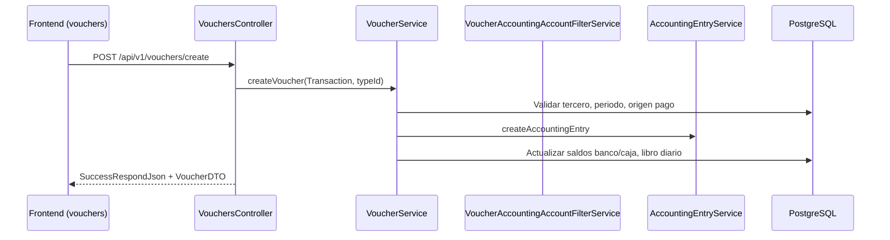

# Manual técnico — SIGCON

| Campo | Valor |
|-------|--------|
| **Identificación** | SIGCON-MT-001 |
| **Título** | Manual técnico del sistema |
| **Producto** | SIGCON — Sistema de Gestión Contable y Financiera |
| **Institución** | Universidad Surcolombiana (USCO) — Ingeniería de Sistemas |
| **Curso / periodo** | Proyecto Integrador 4 — 2026-1 |
| **Versión del documento** | 1.0 |
| **Versión del producto** | 0.0.1-SNAPSHOT |
| **Fecha** | 2026-06-04 |
| **Estándares de referencia** | IEEE Std 1016-2009, IEEE Std 29148-2018 |

---

## Historial de revisiones

| Versión | Fecha | Descripción |
|---------|--------|-------------|
| 1.0 | 2026-06-04 | Manual técnico inicial del sistema (arquitectura, BD, API, despliegue) |

---

## Tabla de contenidos

1. [Descripción del módulo / sistema](#1-descripción-del-módulo--sistema)
2. [Arquitectura](#2-arquitectura)
3. [Modelo de base de datos](#3-modelo-de-base-de-datos)
4. [Documentación de API](#4-documentación-de-api)
5. [Lógica de negocio](#5-lógica-de-negocio)
6. [Despliegue](#6-despliegue)
7. [Consideraciones de mantenimiento](#7-consideraciones-de-mantenimiento)

**Documentos relacionados:** [DOCUMENTACION_GENERAL.md](DOCUMENTACION_GENERAL.md) · [MANUAL_DESARROLLADOR.md](MANUAL_DESARROLLADOR.md) · [MANUAL_USUARIO.md](MANUAL_USUARIO.md)

---

# 1. Descripción del módulo / sistema

## Propósito

**SIGCON** es una aplicación web de gestión contable, financiera y operativa para empresas. Centraliza parametrización multi-empresa, catálogo PUC, terceros, facturación (compras/ventas/órdenes), comprobantes de tesorería con asiento contable, bancos y caja, activos fijos, inventario, reportes, dashboard y asistente con IA opcional.

El sistema se desarrolla en arquitectura **hexagonal (Ports & Adapters)** en backend y SPA React en frontend, con persistencia en **PostgreSQL 14**.

## Responsabilidades

| Capa | Responsabilidad |
|------|-----------------|
| **Frontend** | UI operativa, menú dinámico por permisos, validaciones de formulario, consumo REST con JWT |
| **Backend** | Reglas de negocio, transacciones, asientos contables, aislamiento por empresa, API REST |
| **Base de datos** | Persistencia relacional, seeds, migraciones Flyway, índices |
| **Integraciones** | OpenAI (asistente), SMTP opcional (recuperación de contraseña) |

## Dependencias

### Backend (Spring Boot 3.5, Java 17)

- Spring Web, Spring Data JPA, Spring Security + JWT
- PostgreSQL Driver, Lombok, Springdoc OpenAPI
- Cliente HTTP para OpenAI (módulo `assistant`)

### Frontend (React 18, Vite)

- React Router, Redux, Bootstrap (plantilla Sneat)
- DataTables, Select2, jQuery (componentes legacy)
- `fetchHelper` para llamadas autenticadas al API

### Infraestructura

- Docker / Docker Compose
- PostgreSQL 14, Adminer (desarrollo)

### Módulos de negocio (bounded contexts)

| # | Módulo | Paquete backend | Frontend |
|---|--------|-----------------|----------|
| 1 | Parametrización | `parametrization` | `parametrizacion/` |
| 2 | Listas contables | `lists_accounting` | `list_accounts/` |
| 3 | Terceros | `third_parties` | `third-party/` |
| 4 | Facturación | `invoices` | `invoices/FC`, `FV`, `OC` |
| 5 | Comprobantes | `vouchers` | `vouchers/` |
| 6 | Tesorería | `banks`, `cash_management` | `cash-and-banks/` |
| 7 | Activos / productos | `assets`, `products` | `assets/` |
| 8 | Contabilidad | `accounting_entry`, `books` | — |
| 9 | Reportes | `reports` | `reports/` |
| 10 | Dashboard | `dashboard` | `home/` |
| 11 | Asistente IA | `assistant` | `AssistantChat` |

---

# 2. Arquitectura

## Componentes

```
┌─────────────────────────────────────────────────────────────────┐
│                         CLIENTE (Navegador)                      │
└───────────────────────────────┬─────────────────────────────────┘
                                │ HTTPS
┌───────────────────────────────▼─────────────────────────────────┐
│  FRONTEND — React 18 + Vite + Redux                              │
│  · pages/{modulo}          · components/ (DataTable, modales)    │
│  · utils/fetch, map_menu   · routes dinámicas por menú BD        │
└───────────────────────────────┬─────────────────────────────────┘
                                │ REST JSON + JWT (Bearer)
┌───────────────────────────────▼─────────────────────────────────┐
│  BACKEND — Spring Boot 3.5 (com.sigcon.backend)                  │
│  ┌─────────────────────────────────────────────────────────────┐ │
│  │ interfaces/     @RestController, filtros seguridad          │ │
│  ├─────────────────────────────────────────────────────────────┤ │
│  │ application/    DTOs, requests (Transaction, DataTable…)    │ │
│  ├─────────────────────────────────────────────────────────────┤ │
│  │ domain/         @Service, entities, reglas de negocio       │ │
│  ├─────────────────────────────────────────────────────────────┤ │
│  │ infrastructure/ JPA repositories, clients externos          │ │
│  └─────────────────────────────────────────────────────────────┘ │
└───────────────────────────────┬─────────────────────────────────┘
                                │ JDBC
┌───────────────────────────────▼─────────────────────────────────┐
│  PostgreSQL 14                                                   │
└─────────────────────────────────────────────────────────────────┘

Integraciones opcionales: OpenAI API · SMTP
```

## Interacciones

| Origen | Destino | Protocolo | Uso |
|--------|---------|-----------|-----|
| Frontend | Backend | HTTP/REST | CRUD operaciones, listados DataTable |
| Backend | PostgreSQL | JDBC/JPA | Persistencia transaccional |
| Backend | OpenAI | HTTPS | Chat asistente (si `OPENAI_API_KEY`) |
| Backend | Sistema de archivos | I/O local | Adjuntos comprobantes (`uploads/vouchers/`) |
| Usuario | Adminer | HTTP | Administración BD en desarrollo |

### Flujo representativo: comprobante standalone



### Flujo representativo: factura de compra + pago

```
FC (InvoiceFC) → stock ↑, precio compra
    → Comprobante PAYMENT (opcional) → asiento 22xx / tesorería
    → Periodo contable OPEN requerido para modificar
```

## Flujo de datos

1. **Autenticación:** `POST /auth/login` → JWT almacenado en `localStorage` (frontend).
2. **Menú:** `GET /api/modules/menu` → rutas React según `COMPONENT_MAP`.
3. **Operación:** Request JSON → Controller → Service (dominio) → Repository → BD.
4. **Respuesta:** DTO o `DataTableResponse` / `SuccessRespondJson` con mensaje y datos.
5. **Multi-empresa:** `UserUtil.getUser().getCompany()` filtra consultas y valida permisos de lectura.

---

# 3. Modelo de base de datos

## Motor y estrategia

- **Motor:** PostgreSQL 14+
- **ORM:** Hibernate / Spring Data JPA
- **Desarrollo:** `SPRING_JPA_HIBERNATE_DDL_AUTO=update` (compose local)
- **Scripts:** `backend/src/main/resources/db/seeds/`, `db/migration/V*.sql`, `db/indexes/*.sql`

## Entidades principales

| Entidad / tabla | Dominio | Descripción |
|-----------------|---------|-------------|
| `companies`, `users`, `roles`, `permissions` | Parametrización | Multi-empresa y seguridad |
| `chart_of_accounts`, `accounting_accounts` | Listas contables | PUC y cuentas auxiliares por empresa |
| `third_parties`, `third_party_roles` | Terceros | Clientes, proveedores, empleados |
| `invoices`, `lines_invoice` | Facturación | FC, FV, OC con totales e impuestos |
| `products` | Inventario | `price`, `sale_price`, `stock` |
| `vouchers`, `voucher_types` | Comprobantes | Egresos/ingresos, numeración por tipo |
| `accounting_entry`, `accounting_entry_line` | Contabilidad | Partida doble vinculada a comprobante |
| `diary_book`, `accounting_period` | Libros | Periodos OPEN/CLOSED |
| `bank_accounts`, `cash`, `checks`, `checkbooks` | Tesorería | Origen de fondos y estados de cheque |
| `assets` | Activos fijos | Depreciación, bajas |

## Relaciones (extracto)

```
companies ──< users
companies ──< accounting_accounts ──< accounting_entry_line
companies ──< vouchers ──< voucher_types
vouchers ──► invoices (opcional, null en standalone)
vouchers ──► third_parties (nómina, servicios)
vouchers ──1─1─► accounting_entry ──< accounting_entry_line
vouchers ──► bank_accounts | cash | checks
invoices ──< vouchers (pagos parciales)
invoices ──< lines_invoice ──► products
checks ──► checkbooks ──► bank_accounts
```

## Restricciones de negocio en datos

| Restricción | Implementación |
|-------------|----------------|
| Partida doble | Σ débitos = Σ créditos en `AccountingEntryService` |
| Periodo cerrado | No CRUD comprobante/asiento si `AccountingPeriodStatus.CLOSED` |
| Numeración comprobante | Único consecutivo por `(voucher_type_id, company_id)` |
| Soft delete | `deletedAt` nulo en listados DataTable |
| Pago factura | Suma de `vouchers.amount` ≤ `invoice.total_payment`; factura no `PAID` al crear |
| Cheque | Valor cheque = monto comprobante; estados `EMITIDO` / `COBRADO` |

---

# 4. Documentación de API

## Convenciones

| Aspecto | Valor |
|---------|--------|
| Estilo | REST, JSON |
| Prefijo principal | `/api/v1` |
| Autenticación | Header `Authorization: Bearer <JWT>` |
| Listados | `POST` con cuerpo `DataTableRequest` → `DataTableResponse` |
| Documentación interactiva | Swagger `/swagger-ui.html` (solo perfil `dev`) |
| Autorización | `@PreAuthorize("hasAuthority('PERM_...')")` |

## Autenticación y menú

### Endpoint: Login

| Campo | Valor |
|-------|--------|
| **Endpoint** | `/auth/login` |
| **Method** | `POST` |
| **Request** | `{ "email", "password" }` |
| **Response** | Token JWT, usuario, permisos, empresa |
| **Business Rules** | Credenciales válidas; token firmado con `SPRING_SECURITY_JWT_SECRET` |

### Endpoint: Menú dinámico

| Campo | Valor |
|-------|--------|
| **Endpoint** | `/api/modules/menu` |
| **Method** | `GET` |
| **Request** | JWT |
| **Response** | Árbol de módulos/menús según rol |
| **Business Rules** | Solo entradas con permiso asignado al usuario |

---

## Módulo: Comprobantes (`vouchers`)

### Endpoint: Listar comprobantes

| Campo | Valor |
|-------|--------|
| **Endpoint** | `/api/v1/vouchers/search` |
| **Method** | `POST` |
| **Request** | `DataTableRequest` (`start`, `length`, `columns`, `standaloneOnly` opcional) |
| **Response** | `DataTableResponse<VoucherDTO>` |
| **Business Rules** | Solo empresa del usuario; `deletedAt` nulo; `standaloneOnly=true` excluye comprobantes con factura |

### Endpoint: Crear comprobante

| Campo | Valor |
|-------|--------|
| **Endpoint** | `/api/v1/vouchers/create` |
| **Method** | `POST` |
| **Request** | `Transaction`: `voucherTypeId`, `valuePayment`, `methodPaymentId`, `paymentDate`, `bankAccount` \| `cashAccount` \| `check`, `thirdPartyId`, `invoiceId`, `lines[]`, `exchangeRate`, `file`, `description`, `reference` |
| **Response** | Comprobante creado + mensaje éxito |
| **Business Rules** | Ver [§5.2 Comprobantes](#52-comprobantes-voucherservice) |

### Endpoint: Actualizar comprobante

| Campo | Valor |
|-------|--------|
| **Endpoint** | `/api/v1/vouchers/update/{id}` |
| **Method** | `PUT` |
| **Request** | Igual que creación |
| **Response** | Comprobante actualizado |
| **Business Rules** | Periodo OPEN; validación montos factura excluyendo id actual |

### Endpoint: Eliminar comprobante

| Campo | Valor |
|-------|--------|
| **Endpoint** | `/api/v1/vouchers/delete/{id}` *(según controller)* |
| **Method** | `DELETE` |
| **Business Rules** | Periodo OPEN; revierte cheque a EMITIDO; actualiza saldos |

### Endpoint: Detalle comprobante

| Campo | Valor |
|-------|--------|
| **Endpoint** | `/api/v1/vouchers/{id}` *(o ruta detail documentada en Swagger)* |
| **Method** | `GET` |
| **Response** | `VoucherDTO` con asiento y líneas |
| **Business Rules** | Solo si `company` del comprobante = empresa del usuario |

### Endpoint: Tipos de comprobante

| Campo | Valor |
|-------|--------|
| **Endpoint** | `/api/v1/vouchers/types` |
| **Method** | `POST` |
| **Request** | `DataTableRequest` |
| **Response** | Lista `VoucherTypeDTO` |

### Endpoint: Terceros por rol

| Campo | Valor |
|-------|--------|
| **Endpoint** | `/api/v1/vouchers/third-parties?role={EMPLEADO\|PROVEEDOR\|CLIENTE}` |
| **Method** | `GET` |
| **Response** | `List<VoucherThirdPartyOptionDTO>` |
| **Business Rules** | `role` obligatorio; solo terceros activos |

### Endpoint: Filtrar cuentas contables permitidas

| Campo | Valor |
|-------|--------|
| **Endpoint** | `/api/v1/vouchers/accounting-accounts/filter` |
| **Method** | `POST` |
| **Response** | Cuentas PUC válidas por tipo de comprobante y tipo de línea (D/C) |
| **Business Rules** | Delegado en `VoucherAccountingAccountFilterService` |

---

## Módulo: Facturación (`invoices`)

| Endpoint | Method | Descripción |
|----------|--------|-------------|
| `/api/v1/invoices/fc/create` | POST | Factura de compra |
| `/api/v1/invoices/fv/create` | POST | Factura de venta |
| `/api/v1/invoices/oc/create` | POST | Orden de compra |
| `/api/v1/invoices/{id}` | GET/PUT | Consulta/actualización genérica |
| `/api/v1/invoices/{id}/pdf` | GET | PDF factura |

**Business Rules (resumen):** FC incrementa stock y precio compra; FV decrementa stock con validación ≥ 0; pagos generan comprobante/asiento según tipo de factura.

---

## Otros endpoints principales

| Endpoint | Method | Descripción |
|----------|--------|-------------|
| `/api/v1/resources/payment-methods` | POST | Métodos de pago (DataTable) |
| `/api/v1/bank-accounts/search` | POST | Cuentas bancarias activas |
| `/api/v1/cash/search` | POST | Cajas activas |
| `/api/v1/banks/checks/search` | POST | Cheques emitidos |
| `/api/v1/accounting-accounts` | POST | Cuentas auxiliares (filtro PUC) |
| `/api/v1/products/create` | POST | Producto |
| `/api/v1/dashboard/overview` | GET | KPIs dashboard |
| `/api/v1/assistant/chat` | POST | Asistente IA |

> **Listado completo:** ejecutar API con `SPRING_PROFILES_ACTIVE=dev` y consultar Swagger en `http://localhost:8080/swagger-ui.html`.

---

# 5. Lógica de negocio

## Reglas transversales

| ID | Regla |
|----|--------|
| BR-01 | Toda operación contable requiere periodo contable **OPEN** |
| BR-02 | Datos operativos filtrados por **empresa** del usuario autenticado |
| BR-03 | Asientos: **débito = crédito** |
| BR-04 | Permisos: código BD `CREATE_VOUCHER` → authority `PERM_CREATE_VOUCHER` |
| BR-05 | Swagger y logs DEBUG solo en perfil **dev** |

## Validaciones globales (comprobantes)

| Validación | Mensaje / comportamiento |
|------------|--------------------------|
| Tipo inexistente | "El tipo de comprobante no existe" |
| Monto ≤ 0 | "El valor de pago debe ser mayor a cero" |
| Sin origen de pago | "Debe existir al menos un origen de pago" |
| Tasa de cambio | Valor requerido y > 0 si se envía `exchangeRate` |
| Factura pagada | No crear comprobante si estado `PAID` |
| Exceso de pago | Suma comprobantes > total factura → error |
| Periodo cerrado | "El periodo contable no está abierto" |

## 5.1 Tipos de comprobante y roles

| Código | Requisito | Rol tercero | Cuentas contrapartida (automáticas) |
|--------|-----------|-------------|-----------------------------------|
| `PAYMENT` | `invoiceId` (FC) | — | 2205/2210 + tesorería CREDIT |
| `RECEIPT` | `invoiceId` (FV/OC/OF) | — | 130505/130510 + tesorería DEBIT |
| `PAYROLL` | `thirdPartyId` | EMPLEADO | 2505 + tesorería |
| `SERVICE_PAYMENT` | `thirdPartyId` | PROVEEDOR | Líneas manuales 51* + tesorería |
| `SERVICE_RECEIPT` | `thirdPartyId` | CLIENTE | Líneas manuales 41* + tesorería |

**Inferencia de tipo:** factura FC → PAYMENT; OC/OF → RECEIPT (`resolveVoucherTypeId`).

## 5.2 Comprobantes (`VoucherService`)

**Clase:** `com.sigcon.backend.vouchers.domain.service.VoucherService`

| Método | Responsabilidad |
|--------|-----------------|
| `createVoucher` | Alta, numeración, adjunto, cheque, asiento, saldos |
| `updateVoucher` | Modificación en periodo abierto, regenera asiento |
| `deleteVoucher` | Baja física, revierte cheque, saldos |
| `createAccountingEntry` | Plantilla asiento por tipo + líneas manuales |
| `getVouchers` | Listado DataTable multi-empresa |
| `getVoucherDetail` | DTO con control de empresa |
| `listThirdPartiesByRole` | Catálogo para formularios |
| `generateVoucherNumber` | Consecutivo por tipo y empresa |

### Tesorería en comprobante

- **Banco:** resolución por id o número de cuenta.
- **Caja:** por id.
- **Cheque existente:** valor = monto comprobante → estado `COBRADO`.
- **Cheque nuevo:** creación en chequera con valor del comprobante.
- Tras CRUD: `bankAccountService.updateBalance` y `cashService.updateBalance`.

### Líneas manuales (standalone / servicios)

- Cuentas **11/12** prohibidas en líneas manuales (van por método de pago).
- `SERVICE_PAYMENT`: al menos una línea con código PUC `51*`.
- `SERVICE_RECEIPT`: al menos una línea con código `41*`.
- Validación de cuentas permitidas: `VoucherAccountingAccountFilterService`.

### Adjuntos

- Ruta: `uploads/vouchers/{uuid}-{nombre}`
- Base64 con prefijo `data:*;base64,` soportado (se elimina prefijo antes de decodificar).

## 5.3 Asientos contables (`AccountingEntryService`)

- Creación desde `AccountingEntryRequest` con líneas débito/crédito.
- Vinculación opcional a `voucherId`.
- Validación de balance y cuentas existentes por empresa.

## 5.4 Facturación e inventario

| Operación | Efecto stock | Precio |
|-----------|--------------|--------|
| FC | Incrementa | Actualiza precio compra |
| FV | Decrementa (≥ 0) | Actualiza precio venta |

## Restricciones

| Restricción | Ámbito |
|-------------|--------|
| Periodo CLOSED | No crear/editar/eliminar comprobantes ni asientos |
| Factura PAID | No nuevos pagos |
| Cheque COBRADO | Valor fijo respecto al comprobante |
| Paginación API | Máximo 100 registros por página en DataTable |
| IA | Sin `OPENAI_API_KEY` el chat no invoca proveedor externo |
| FE DIAN | Fuera de alcance fase actual |

---

# 6. Despliegue

## Docker

### Compose local (raíz del monorepo)

Archivo: `docker-compose.local.yml`

| Servicio | Imagen / build | Puerto (variable) |
|----------|----------------|-------------------|
| `backend` | `./backend` | `${backend_port_api}` (8080) |
| `db` | `postgres:14` | `${backend_port_db_dev}` |
| `adminer` | `adminer` | `${backend_port_adminer}` (8081) |
| `frontend-local` | `./frontend` | 5173 |

```bash
docker compose -f docker-compose.local.yml --env-file backend/.env up --build -d
```

> Verificar que la ruta del frontend en compose coincida con `Frontend/` o `frontend/` según el SO.

### Backend aislado

Ver `backend/docker-compose.yml` y `backend/readme.md`.

### Producción (resumen)

1. `mvn -DskipTests package` → JAR Spring Boot.
2. `npm run build` en Frontend → `dist/` servido por Nginx.
3. Perfil distinto de `dev`; Swagger deshabilitado.
4. `ddl-auto` no debe ser `update` en producción (usar migraciones Flyway).

## Environment Variables

| Variable | Descripción |
|----------|-------------|
| `SPRING_PROFILES_ACTIVE` | `dev` habilita Swagger |
| `SPRING_DATASOURCE_URL` | JDBC PostgreSQL |
| `SPRING_DATASOURCE_USERNAME` / `PASSWORD` | Credenciales BD |
| `SPRING_JPA_HIBERNATE_DDL_AUTO` | `update` (solo dev) |
| `backend_port_api` | Puerto API |
| `backend_host`, `backend_port_db_dev`, `backend_database` | Conexión BD |
| `FRONTEND_URL` | URL frontend (CORS, correos) |
| `CORS_ALLOWED_ORIGINS` | Orígenes permitidos |
| `SPRING_SECURITY_JWT_SECRET` | Firma JWT |
| `OPENAI_API_KEY`, `OPENAI_MODEL` | Asistente (opcional) |
| `VITE_API_URL` | URL API en frontend |

## Ports

| Servicio | Puerto típico |
|----------|---------------|
| API Backend | 8080 |
| PostgreSQL | 5432 |
| Adminer | 8081 |
| Frontend (Vite dev) | 5173 |

## Dependencies (runtime)

- PostgreSQL 14+ (obligatorio)
- Java 17 (backend sin contenedor)
- Node.js 18+ (frontend sin contenedor)
- OpenAI API (opcional)
- SMTP (opcional, recuperación contraseña)

---

# 7. Consideraciones de mantenimiento

## Logging

| Nivel | Configuración (dev compose) |
|-------|------------------------------|
| Spring Web | `LOGGING_LEVEL_ORG_SPRINGFRAMEWORK_WEB=DEBUG` |
| Paquete SIGCON | `LOGGING_LEVEL_COM_SIGCON_BACKEND=DEBUG` |

**Recomendación producción:** nivel INFO/WARN; no registrar cuerpos con datos sensibles ni tokens JWT.

## Auditing

| Mecanismo | Uso |
|-----------|-----|
| `createdAt` / `updatedAt` en entidades JPA | Trazabilidad temporal |
| `user` en `VouchersEntity` | Usuario que registró el comprobante |
| Soft delete `deletedAt` | Listados sin registros eliminados |
| Numeración consecutiva | Auditoría de secuencia por tipo/empresa |

**Mejora sugerida:** tabla de auditoría explícita para cambios en comprobantes y asientos en producción.

## Error Handling

| Tipo | Patrón actual |
|------|----------------|
| Validación negocio | `IllegalArgumentException`, `RuntimeException` con mensaje en español |
| No encontrado | `RuntimeException` ("no existe") |
| API | `SuccessRespondJson` / manejadores globales Spring (según `general`) |
| Frontend | `fetchHelper` + `AlertPage` / `messageForm` en modales |

**Recomendación:** unificar excepciones de dominio (`VoucherNotFoundException`, `ClosedPeriodException`) y códigos HTTP consistentes (400, 404, 403, 409).

## Security

| Control | Implementación |
|---------|----------------|
| Autenticación | JWT stateless |
| Autorización | `@PreAuthorize` por permiso |
| Multi-empresa | Filtro en servicios y `getVoucherDetail` |
| CORS | `CORS_ALLOWED_ORIGINS` |
| Swagger | Solo perfil `dev` |
| Secretos | `.env` fuera del repositorio |
| Archivos | Validar tamaño/tipo de adjuntos en endurecimiento |

### Permisos comprobantes (frontend)

El módulo filtra permisos con código que contiene `VOUCHER`; operaciones de creación/edición requieren authorities equivalentes en backend.

## Frontend — archivos clave (comprobantes)

| Archivo | Rol |
|---------|-----|
| `pages/vouchers/index.tsx` | Listado, modales crear/editar/ver |
| `pages/vouchers/form.tsx` | Formulario y líneas contables |
| `pages/vouchers/view.tsx` | Vista detalle |
| `pages/vouchers/voucherPdf.tsx` | Plantilla impresión/PDF |

## Checklist de extensión

1. **Nuevo tipo de comprobante:** seed `voucher_types`, reglas en `VoucherAccountingAccountFilterService`, switch en `VoucherService.createAccountingEntry`, frontend `voucherTypes` y validaciones.
2. **Nuevo endpoint:** Controller + `@PreAuthorize` + permiso en seed/migración + Swagger `@Operation`.
3. **Nueva pantalla:** `pages/{modulo}/`, entrada en `COMPONENT_MAP`, menú en BD.

## Trazabilidad documental

| Documento | ID | Audiencia |
|-----------|-----|-----------|
| Manual técnico (este) | SIGCON-MT-001 | Arquitectos, DevOps, integradores |
| Manual desarrollador | SIGCON-SDD-001 | Desarrolladores |
| Manual usuario | SIGCON-MUD-001 | Operadores |
| Documentación general | SIGCON-DOC-000 | Visión y alcance |

| Requisito | Artefacto principal |
|-----------|---------------------|
| REQ-VCH-01 | `VoucherService` |
| REQ-VCH-02 | `VoucherAccountingAccountFilterService` |
| REQ-FAC-01/02 | `InvoiceService`, controladores FC/FV |
| REQ-SEG-01 | `general/security`, `AuthController` |

---

*Fin del documento SIGCON-MT-001.*
