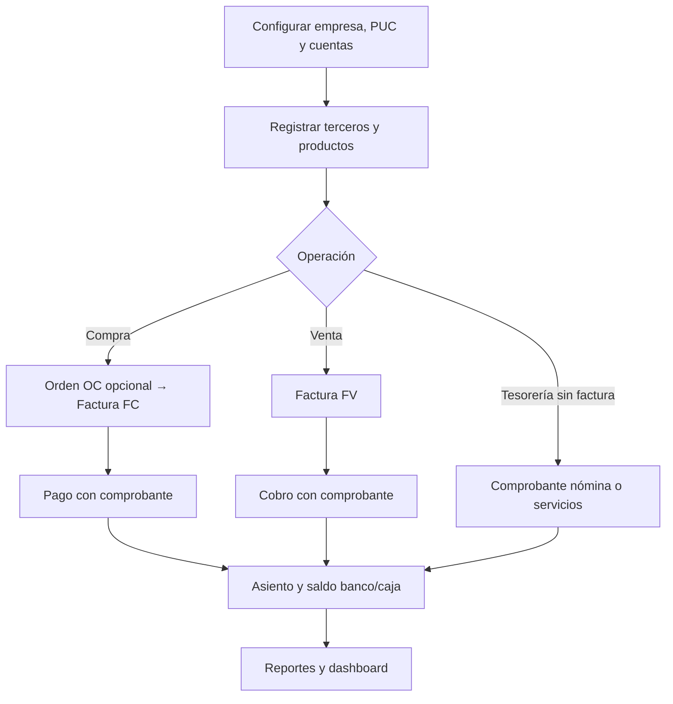
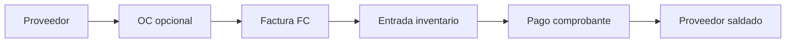
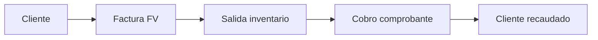

# Manual de usuario del software SIGCON

| Campo | Valor |
|-------|--------|
| **Identificación del documento** | SIGCON-MUD-001 |
| **Título** | Manual de usuario |
| **Producto** | SIGCON — Sistema de Gestión Contable y Financiera |
| **Versión del documento** | 1.2 |
| **Versión del producto** | 2026-1 — SIGCON 0.0.1-SNAPSHOT |
| **Fecha** | 2026-06-04 |
| **Clasificación** | Uso operativo |
| **Estándar de referencia** | IEEE Std 1063-2001, IEEE Std 26515-2018 |

---

## Historial de revisiones

| Versión | Fecha | Autor / equipo | Descripción |
|---------|--------|----------------|-------------|
| 1.0 | 2026-05 | Equipo SIGCON | Versión inicial operativa |
| 1.1 | 2026-05-28 | Equipo SIGCON | Estructura IEEE; FV, comprobantes standalone, inventario |
| 1.2 | 2026-06-04 | Equipo SIGCON | Procedimientos ampliados, flujos de negocio, nombres de menú verificados |

---

## Tabla de contenidos

1. [Alcance y aplicabilidad](#1-alcance-y-aplicabilidad)
2. [Referencias normativas e informativas](#2-referencias-normativas-e-informativas)
3. [Definiciones, acrónimos y abreviaturas](#3-definiciones-acrónimos-y-abreviaturas)
4. [Descripción general del sistema](#4-descripción-general-del-sistema)
5. [Requisitos del entorno de uso](#5-requisitos-del-entorno-de-uso)
6. [Inicio de sesión y navegación](#6-inicio-de-sesión-y-navegación)
7. [Procedimientos por módulo](#7-procedimientos-por-módulo)
8. [Mensajes, errores y recuperación](#8-mensajes-errores-y-recuperación)
9. [Seguridad, permisos y buenas prácticas](#9-seguridad-permisos-y-buenas-prácticas)
10. [Soporte](#10-soporte)
- [Apéndice A — Matriz de permisos frecuentes](#apéndice-a--matriz-de-permisos-frecuentes)
- [Apéndice B — Tipos de comprobante y cuentas](#apéndice-b--tipos-de-comprobante-y-cuentas)
- [Apéndice C — Flujos de trabajo recomendados](#apéndice-c--flujos-de-trabajo-recomendados)

---

## 1. Alcance y aplicabilidad

### 1.1 Propósito

Este documento describe, para el **usuario final** y el **usuario administrador**, cómo utilizar SIGCON para registrar y consultar operaciones contables y financieras de una empresa.

### 1.2 Alcance del producto

SIGCON cubre, entre otros:

- Parametrización (usuarios, roles, empresas, menús).
- Listas contables (PUC, cuentas auxiliares, impuestos, tasas de cambio).
- Terceros (clientes, proveedores, empleados).
- Tesorería (cajas, bancos, cheques, conciliación).
- Facturación: órdenes de compra (OC), facturas de compra (FC), **facturas de venta (FV)**.
- Comprobantes contables (con y sin factura).
- Activos fijos, productos e inventario (stock).
- Reportes contables y dashboard.
- Asistente con IA (opcional).

### 1.3 Audiencia prevista

| Perfil | Uso de este manual |
|--------|-------------------|
| Contador / auxiliar contable | Facturas, comprobantes, reportes |
| Tesorero | Cajas, bancos, cheques, pagos |
| Administrador de activos | Activos, depreciación, productos |
| Administrador del sistema | Parametrización, roles, permisos |

### 1.4 Organización del documento

Los capítulos 6–7 siguen un enfoque **orientado a tareas** (recomendado en IEEE 1063): cada sección indica objetivo, precondiciones, pasos y resultado esperado.

---

## 2. Referencias normativas e informativas

| ID | Documento | Relación |
|----|-----------|----------|
| [R1] | IEEE Std 1063-2001 | Estructura de documentación de usuario de software |
| [R2] | IEEE Std 26515-2018 | Elaboración de documentación para usuarios en entornos ágiles |
| [R3] | Manual de desarrollador (`MANUAL_DESARROLLADOR.md`) | Diseño técnico (administradores TI) |
| [R4] | Manual técnico (`MANUAL_TECNICO.md`) | Arquitectura e instalación |
| [R5] | README del proyecto (`../README.md`) | Inicio rápido |
| [R6] | Documentación general (`DOCUMENTACION_GENERAL.md`) | Visión y alcance del proyecto |
| [R7] | Decreto 2420 de 2015 (PUC Colombia) | Marco del catálogo contable (referencia de negocio) |

---

## 3. Definiciones, acrónimos y abreviaturas

| Término | Definición |
|---------|------------|
| **Asiento contable** | Registro de débitos y créditos que debe cuadrar (partida doble). |
| **Comprobante** | Documento que registra un movimiento de tesorería y su contrapartida contable. |
| **FC** | Factura de compra (obligación con proveedor). |
| **FV** | Factura de venta (ingreso con cliente). |
| **OC** | Orden de compra (documento previo en flujo comercial). |
| **PUC** | Plan Único de Cuentas. |
| **Tercero** | Persona natural o jurídica (cliente, proveedor, empleado, etc.). |
| **Periodo contable** | Intervalo (mes/año) en el que se permiten movimientos. |
| **Stock** | Cantidad disponible de un producto en inventario. |
| **Precio de compra / venta** | Valor unitario de referencia en catálogo; puede actualizarse al facturar. |

| Acrónimo | Significado |
|----------|-------------|
| COP | Peso colombiano |
| JWT | Token de sesión (uso interno; el usuario solo inicia sesión) |
| KPI | Indicador clave en dashboard |
| NIIF | Normas Internacionales de Información Financiera |

---

## 4. Descripción general del sistema

### 4.1 Arquitectura desde la perspectiva del usuario

El usuario accede mediante un **navegador web** a la aplicación React. Todas las operaciones se validan en un servidor central; los datos pertenecen a la **empresa** asignada al usuario (salvo perfiles globales).

```
  Usuario → Navegador (SIGCON Web) → Servidor → Base de datos empresarial
```

### 4.2 Módulos funcionales

| Módulo | Función principal |
|--------|-------------------|
| Dashboard | Resumen de indicadores |
| Parametrización | Usuarios, roles, empresas, menús |
| Listas contables | PUC, cuentas, impuestos, depreciación |
| Terceros | Clientes, proveedores, empleados |
| Tesorería | Cajas, bancos, cheques |
| Facturas | OC, FC, FV, pagos |
| Comprobantes | Nómina, servicios, ajustes |
| Activos / productos | Activos fijos e inventario |
| Reportes | Libros y estados |

### 4.3 Convenciones de la interfaz

| Elemento | Descripción |
|----------|-------------|
| Menú lateral | Módulos autorizados por rol |
| Tablas | Búsqueda, paginación, exportación (según pantalla) |
| Botón crear | Alta de registros |
| Iconos por fila | Ver, editar, eliminar (según permiso) |
| Listas desplegables | Componente con búsqueda (Select2) |
| Chat flotante | Asistente IA (si está habilitado) |
| Estados en tablas | Etiquetas como *Pendiente de pago*, *Pagado* en facturas |
| Modales | Formularios de creación/edición en ventana emergente |

### 4.4 Cómo leer los procedimientos (capítulo 7)

Cada tarea operativa incluye, cuando aplica:

| Bloque | Significado |
|--------|-------------|
| **Objetivo** | Qué logra el usuario al terminar |
| **Precondiciones** | Qué debe existir antes (maestros, periodo abierto, permisos) |
| **Dónde está en el menú** | Nombre visible en el menú lateral (puede variar levemente según configuración) |
| **Pasos** | Secuencia recomendada en pantalla |
| **Resultado esperado** | Qué cambia en el sistema (stock, saldo, asiento, estado) |
| **Consejos** | Buenas prácticas para evitar errores |

### 4.5 Flujos de negocio integrados (visión del usuario)

SIGCON encadena operaciones que **siempre afectan la misma empresa** y, en lo contable, un **periodo abierto**:



**Idea clave:** una **factura** documenta la obligación comercial; un **comprobante** mueve el dinero y genera el **asiento contable**. No son lo mismo: puede haber factura pendiente sin pago, o pagos parciales con varios comprobantes.

### 4.6 Periodo contable (concepto operativo)

Antes de crear o modificar comprobantes y ciertos movimientos, el sistema verifica que la **fecha del movimiento** pertenezca a un **periodo contable abierto** (normalmente el mes en curso).

| Situación | Qué ocurre |
|-----------|------------|
| Periodo **abierto** | Puede registrar y editar comprobantes |
| Periodo **cerrado** | Mensaje de error; debe usar fechas del periodo activo o solicitar reapertura al administrador |

---

## 5. Requisitos del entorno de uso

### 5.1 Hardware y software cliente

- PC o portátil con navegador actualizado (Chrome, Edge o Firefox).
- JavaScript habilitado.
- Resolución mínima recomendada: 1366×768.

### 5.2 Conectividad

- Acceso a la URL provista por el administrador (red local o VPN según despliegue).

### 5.3 Cuentas y credenciales

- Correo o usuario y contraseña asignados por el administrador.
- No compartir credenciales entre personas.

---

## 6. Inicio de sesión y navegación

### 6.1 Procedimiento: iniciar sesión

| Paso | Acción | Resultado esperado |
|------|--------|------------------|
| 1 | Abrir la URL del sistema | Pantalla de login |
| 2 | Ingresar correo y contraseña | Campos validados |
| 3 | Pulsar **Iniciar sesión** | Redirección al Dashboard |

**Precondiciones:** usuario activo y permisos asignados.

### 6.2 Procedimiento: recuperar contraseña

1. En login, seleccione **¿Olvidó su contraseña?**
2. Ingrese el correo registrado.
3. Siga el enlace recibido por correo.

### 6.3 Procedimiento: cerrar sesión

Use la opción de cierre de sesión en el menú de usuario (barra superior).

### 6.4 Navegación por módulos

1. Tras el login, el menú lateral muestra **solo los módulos** que su rol tiene autorizados.
2. Cada módulo se despliega en submenús (por ejemplo: *Facturas de Compra*, *Comprobantes*, *Lista de Cajas*).
3. La pantalla **Home** (inicio) muestra el **Dashboard** con indicadores de su empresa.
4. Si no ve una opción que necesita, no es un fallo del sistema: debe solicitar el permiso o la asignación de menú al administrador (capítulo 9).

### 6.5 Perfil de usuario

En el menú superior puede acceder a **Perfil** para consultar sus datos. Los cambios de contraseña o empresa los realiza el administrador, salvo recuperación por correo (§6.2).

### 6.6 Vista global (superadministrador)

Si su rol es **superadministrador**, el Dashboard muestra indicadores de **todas las empresas** y rankings comparativos. El resto de operaciones (facturas, comprobantes, etc.) sigue asociado a la empresa configurada en su usuario, salvo pantallas específicas de administración.

---

## 7. Procedimientos por módulo

> Los nombres de menú corresponden a los configurados en SIGCON (componentes `HOME`, `INVOICE_BILL`, `VOUCHERS`, etc.). Si su empresa personalizó etiquetas, busque el equivalente en la misma sección del menú.

### 7.1 Home / Dashboard

**Objetivo:** tener una vista rápida del estado de la empresa (o global si es superadministrador).

**Menú:** **Home** (pantalla de inicio tras el login).

**Precondiciones:** sesión iniciada.

| Paso | Acción |
|------|--------|
| 1 | Ingrese al sistema; se carga el Dashboard automáticamente |
| 2 | Revise las tarjetas: cantidad de facturas, comprobantes, activos, cuentas bancarias |
| 3 | Consulte montos: total facturado, total en comprobantes, saldo bancario consolidado |
| 4 | Observe los gráficos de los últimos meses (tendencia de facturas y comprobantes) |

**Resultado esperado:** panorama para priorizar conciliaciones, cobros pendientes o revisión de movimientos.

**Consejos:** si aparece el mensaje *No fue posible cargar el dashboard*, verifique conexión o avise a soporte; los datos operativos en otros módulos pueden seguir disponibles.

---

### 7.2 Parametrización (administradores del sistema)

**Objetivo:** dejar listos usuarios, permisos, empresa y menús antes de que el equipo operativo trabaje.

**Menú (según permisos):** módulo de parametrización — **Usuarios**, **Roles**, **Permisos**, **Empresas**, **Módulos**, **Menus**, **Permisos de Menú**, **Parámetros**.

#### 7.2.1 Crear usuario operativo

| Paso | Acción |
|------|--------|
| 1 | **Usuarios** → botón crear |
| 2 | Complete correo, nombre, contraseña temporal |
| 3 | Asigne **empresa** y **rol** (contador, tesorero, etc.) |
| 4 | Guarde y comunique credenciales al usuario |

**Resultado:** el usuario verá solo los menús ligados a su rol.

#### 7.2.2 Configurar visibilidad del menú

| Paso | Acción |
|------|--------|
| 1 | **Roles** → edite el rol → asocie **permisos** (crear factura, ver comprobantes, etc.) |
| 2 | **Permisos de Menú** → vincule entradas de menú al rol |
| 3 | Pida al usuario cerrar sesión y volver a entrar para refrescar el menú |

#### 7.2.3 Datos de empresa

En **Empresas** registre NIT, representante legal, moneda (por ejemplo COP) y parámetros fiscales. Sin empresa correcta, los reportes y totales no corresponderán a la realidad jurídica.

---

### 7.3 Listas contables

**Objetivo:** disponer del **PUC** y las **cuentas auxiliares** que usarán facturas, comprobantes y reportes.

**Menú habitual:** **Catálogo PUC**, **Cuentas Contables**, **Centros de Costo**, **Reglas Tributarias**, **Tasas de Cambio**, **Tipos de Monedas**, **Reglas de Depreciación**.

#### 7.3.1 Configurar PUC y cuentas auxiliares

| Paso | Acción |
|------|--------|
| 1 | Revise o importe el **Catálogo PUC** (estructura de códigos) |
| 2 | En **Cuentas Contables**, cree cuentas de movimiento para su empresa (ej. proveedores, clientes, ingresos, gastos) |
| 3 | Verifique **naturaleza** débito/crédito de cada cuenta |

**Precondiciones:** empresa creada; conocimiento del plan de cuentas adoptado.

**Resultado:** al crear comprobantes, las listas desplegables de cuentas mostrarán solo opciones válidas según el tipo de movimiento.

**Consejos:** haga esta configuración **antes** de operar comprobantes manuales; un error aquí se replica en todos los asientos.

---

### 7.4 Terceros

**Objetivo:** tener clientes, proveedores y empleados listos para facturar y pagar.

**Menú:** **Lista de Terceros** (y opcionalmente **Segmentacion Terceros**).

| Rol en el formulario | Cuándo lo necesita |
|----------------------|-------------------|
| **Proveedor** | Facturas de compra (FC) |
| **Cliente** | Facturas de venta (FV) |
| **Empleado** | Comprobantes de nómina |

#### Procedimiento: registrar tercero

| Paso | Acción |
|------|--------|
| 1 | Abra **Lista de Terceros** |
| 2 | Pulse crear / nuevo |
| 3 | Complete identificación (tipo documento, número), razón social, municipio, correo |
| 4 | Marque uno o más **roles** (proveedor, cliente, empleado) |
| 5 | Guarde |

**Resultado esperado:** el tercero aparece en los listados de facturas y, si aplica, en comprobantes de nómina.

**Consejos:** un mismo tercero puede tener varios roles (por ejemplo proveedor y cliente). Revise el NIT antes de facturar para evitar duplicados.

---

### 7.5 Tesorería (cajas, bancos y cheques)

**Objetivo:** definir **de dónde sale o entra el dinero** al registrar comprobantes y pagos.

**Menú:** módulo de cajas y bancos — **Catálogo de Bancos**, **Sucursales Bancarias**, **Cuentas Bancarias**, **Lista de Cajas**, **Chequeras**, **Cheques**, **Conciliación bancaria** (si está habilitada).

#### 7.5.1 Registrar caja

| Paso | Acción |
|------|--------|
| 1 | **Lista de Cajas** → crear |
| 2 | Indique nombre, tipo y **cuenta contable** de caja (clase activo) |
| 3 | Guarde |

#### 7.5.2 Registrar cuenta bancaria

| Paso | Acción |
|------|--------|
| 1 | Cree banco y sucursal si no existen |
| 2 | En **Cuentas Bancarias**, asocie número de cuenta, banco y cuenta contable |
| 3 | Verifique saldo inicial si la pantalla lo solicita |

#### 7.5.3 Cheques

| Paso | Acción |
|------|--------|
| 1 | **Chequeras** → asocie a cuenta bancaria y rango de numeración |
| 2 | **Cheques** → emita cheque con beneficiario y valor |
| 3 | Al **pagar una factura o comprobante** con cheque, el sistema puede marcar el cheque como cobrado según el monto |

#### 7.5.4 Conciliación bancaria

**Objetivo:** comparar el extracto del banco con los movimientos registrados en SIGCON.

| Paso | Acción |
|------|--------|
| 1 | Abra **Conciliación bancaria** para la cuenta |
| 2 | Cargue o registre movimientos del periodo |
| 3 | Empareje partidas conciliadas y deje nota de diferencias |

**Resultado:** mayor confiabilidad entre saldo contable y saldo bancario mostrado en Dashboard.

---

### 7.6 Facturación (órdenes, compras, ventas y pagos)

**Objetivo:** documentar operaciones comerciales y, cuando corresponda, vincular **pagos o cobros** que generan comprobante automático.

**Menú principal:**

| Pantalla en menú | Documento |
|------------------|-----------|
| **Ordenes de Compra** | OC |
| **Facturas de Compra** | FC |
| **Facturas de Venta** | FV |
| **Pagos de Facturas de Compra** | Pagos asociados a FC |

#### 7.6.1 Orden de compra (OC)

**Objetivo:** dejar constancia previa del pedido (proveedor, cantidades, valores).

| Paso | Acción |
|------|--------|
| 1 | **Ordenes de Compra** → **Crear Orden de Compra** |
| 2 | Seleccione proveedor y líneas de producto o concepto |
| 3 | Revise totales e impuestos → Guarde |

**Resultado:** orden registrada; puede consultarla con **Ver Orden de Compra**. La OC no mueve inventario por sí sola hasta que se facture (FC), según el flujo de su empresa.

#### 7.6.2 Factura de compra (FC)

**Objetivo:** registrar la compra real al proveedor y **aumentar inventario**.

**Precondiciones:** proveedor creado; productos en **Lista de Productos** (si factura mercancía); periodo contable abierto para pagos posteriores.

| Paso | Acción |
|------|--------|
| 1 | **Facturas de Compra** → **Crear Factura de Compra** |
| 2 | Elija **proveedor**, fecha, forma y método de pago (si aplica) |
| 3 | Agregue líneas: producto, cantidad, precio unitario |
| 4 | Revise subtotal, impuestos y total |
| 5 | Guarde |

**Resultado esperado:**

| Efecto | Descripción |
|--------|-------------|
| Inventario | **Stock aumenta** por cada línea con producto |
| Precio compra | Puede actualizarse el precio de compra del producto |
| Estado | Factura en estado pendiente de pago hasta registrar comprobantes de pago |

En el listado verá columnas como **Pendiente de pago** / **Pagado** y el **valor pendiente**.

#### 7.6.3 Factura de venta (FV)

**Objetivo:** registrar ingreso por venta y **disminuir inventario**.

**Precondiciones:** cliente creado; stock suficiente si vende productos almacenables.

| Paso | Acción |
|------|--------|
| 1 | **Facturas de Venta** → **Crear Factura de Venta** |
| 2 | Elija **cliente** y fecha |
| 3 | Agregue productos; el sistema muestra **stock** y sugiere **precio de venta** |
| 4 | No ingrese cantidad mayor al stock disponible |
| 5 | Guarde |

**Resultado esperado:** stock disminuye; precio de venta del producto puede actualizarse; factura queda pendiente de cobro hasta registrar el recaudo.

Si el sistema muestra *Stock insuficiente*, reduzca cantidades o registre primero una FC de abastecimiento.

#### 7.6.4 Pagar una factura de compra (FC)

**Objetivo:** registrar el desembolso al proveedor y el **asiento contable automático**.

**Menú:** desde el listado **Facturas de Compra** (acción **Ver pagos**) o módulo **Pagos de Facturas de Compra**.

| Paso | Acción |
|------|--------|
| 1 | Localice la factura con saldo pendiente |
| 2 | Abra pagos / registrar pago |
| 3 | Indique **monto** (no mayor al pendiente), **fecha de pago** |
| 4 | Elija **método de pago** y origen: **caja**, **cuenta bancaria** o **cheque** |
| 5 | Adjunte soporte (PDF/imagen) si su proceso lo exige |
| 6 | Guarde |

**Resultado esperado:**

| Elemento | Qué ocurre |
|----------|------------|
| Comprobante | Se crea comprobante tipo **pago** vinculado a la factura |
| Contabilidad | Asiento automático: disminuye obligación con proveedor, sale dinero de banco/caja |
| Factura | Si el pago cubre el total, estado **Pagado**; si es parcial, sigue pendiente con saldo menor |
| Tesorería | Actualiza saldo de la caja o cuenta usada |

**Importante:** en este flujo **no** digite líneas contables manuales de banco (11/12); el sistema las genera según el origen de fondos elegido.

#### 7.6.5 Cobrar una factura de venta (FV)

**Objetivo:** registrar el ingreso del cliente (recaudo).

| Paso | Acción |
|------|--------|
| 1 | **Facturas de Venta** → localice la factura pendiente |
| 2 | Desde detalle o edición, registre el cobro (monto, método, banco/caja/cheque) |
| 3 | Guarde |

**Resultado:** comprobante tipo **recibo** vinculado a la FV; asiento automático de cartera y entrada de fondos; puede quedar pagada total o parcialmente.

#### 7.6.6 Consultar, editar e imprimir

| Acción | Cómo |
|--------|------|
| Ver detalle | Icono ver en listado → **Ver Factura de Compra/Venta** |
| Editar | Solo si tiene permiso y la factura no está bloqueada por pagos registrados |
| PDF | Botón de descarga en vista de detalle (permiso de visualización) |

---

### 7.7 Comprobantes (tesorería y contabilidad)

**Objetivo:** registrar movimientos de dinero con soporte contable. Hay dos grandes casos:

| Caso | Cuándo usarlo | ¿Líneas manuales? |
|------|---------------|-------------------|
| **Con factura** | Al pagar FC o cobrar FV (§7.6.4–7.6.5) | No |
| **Sin factura (standalone)** | Nómina, honorarios, servicios, ajustes | Sí |

**Menú:** **Comprobantes**.

#### 7.7.1 Consultar comprobantes

| Paso | Acción |
|------|--------|
| 1 | Abra **Comprobantes** |
| 2 | Use búsqueda y paginación de la tabla |
| 3 | Filtre por tipo, fecha o tercero si la pantalla lo permite |

Columnas habituales: número, tipo, fecha, valor, tercero, estado.

#### 7.7.2 Crear comprobante de nómina

**Precondiciones:** empleados registrados como terceros con rol **Empleado**; caja o banco configurado; periodo abierto.

| Paso | Acción |
|------|--------|
| 1 | **Comprobantes** → nuevo |
| 2 | **Tipo de comprobante:** nómina |
| 3 | Seleccione **empleado**, **monto**, **fecha**, **método de pago** y origen (caja/banco/cheque) |
| 4 | En **líneas contables**, agregue una o más líneas de contrapartida (cuentas de gasto o pasivo distintas de 11/12) |
| 5 | En cada línea: **Tipo de línea** (Débito o Crédito), **Cuenta**, **Monto** |
| 6 | Confirme que el **neto** de líneas manuales coincide con el monto del comprobante (véase tabla abajo) |
| 7 | Guarde |

**Cuadre para egresos (nómina y pago de servicios):**

> Total **débitos** − total **créditos** = **monto del comprobante**

El sistema agrega automáticamente la línea de **banco o caja** al guardar.

#### 7.7.3 Crear pago o ingreso por servicios

| Tipo en pantalla | Uso | Cuentas típicas en líneas manuales |
|------------------|-----|-----------------------------------|
| Pago de servicio | Paga a proveedor sin factura FC | Gastos (cuentas que empiezan por 51…) |
| Ingreso por servicios | Cobro a cliente sin factura FV | Ingresos (cuentas que empiezan por 41…) |

**Cuadre para ingreso por servicios:**

> Total **créditos** − total **débitos** = **monto del comprobante**

#### 7.7.4 Editar, ver o eliminar

| Acción | Condición |
|--------|-----------|
| **Ver** | Siempre que tenga permiso de consulta; datos en solo lectura |
| **Editar** | Periodo abierto y permiso de actualización |
| **Eliminar** | Periodo abierto; revierte efectos en saldos y cheques según configuración |

Puede imprimir o exportar PDF del comprobante si la pantalla lo ofrece (**voucher PDF**).

#### 7.7.5 Errores frecuentes al crear comprobantes

| Problema | Qué hacer |
|----------|-----------|
| No aparecen cuentas en la lista | Cambie tipo de comprobante o tipo de línea (D/C); solo se listan cuentas permitidas |
| Intentó usar cuenta de banco en líneas manuales | Quite la línea 11/12; indique banco/caja solo en la sección de pago |
| Neto distinto al monto | Ajuste montos débito/crédito hasta cumplir la fórmula del §7.7.2 |

---

### 7.8 Productos e inventario

**Objetivo:** mantener el catálogo de ítems que se compran y venden, con existencias.

**Menú:** **Lista de Productos** (módulo de activos/inventario).

| Campo en pantalla | Significado para el usuario |
|-------------------|----------------------------|
| Precio de compra | Referencia al comprar (FC) |
| Precio de venta | Referencia al vender (FV) |
| Stock | Unidades disponibles; lo actualizan FC (+) y FV (−) |

#### Procedimiento: crear producto

| Paso | Acción |
|------|--------|
| 1 | **Lista de Productos** → nuevo |
| 2 | Nombre, código, unidad de medida, precios y stock inicial |
| 3 | Asocie cuentas contables si el formulario lo solicita |
| 4 | Guarde |

**Consejos:** defina stock inicial antes de la primera FV; tras cada FC verifique que el stock refleje la recepción física.

---

### 7.9 Activos fijos

**Objetivo:** controlar bienes de larga vida útil (vehículos, equipos, muebles) distintos del inventario de mercancía.

**Menú (ejemplos):** **Registro de Activos**, **Crear Activo**, **Cálculo de Depreciación**, **Control de Bajas y Transferencias**, **Kardex**, **Verificación NIIF**, **Corrección NIIF**, **Activos Generación de Informes**.

| Tarea | Resumen de pasos |
|-------|------------------|
| Alta de activo | Registro de Activos → placa, valor, vida útil, cuenta contable |
| Depreciación del periodo | Cálculo de Depreciación → ejecutar para el mes |
| Baja o traslado | Control de Bajas y Transferencias |
| Consulta histórica | Kardex del activo |
| Cumplimiento NIIF | Verificación / corrección según checklist del módulo |

**Precondiciones:** reglas de depreciación configuradas en listas contables.

---

### 7.10 Reportes contables

**Objetivo:** obtener informes oficiales internos por fechas y cuentas.

**Menú:** reportes bajo listas contables — **Reporte Balance de Comprobación**, **Reporte Libro Diario**, **Reporte Libro Mayor**, **Reporte Auxiliares de cuentas**, **Reporte Estados Financieros**.

#### Procedimiento general

| Paso | Acción |
|------|--------|
| 1 | Abra el reporte deseado |
| 2 | Seleccione **rango de fechas** (dentro de periodos con movimientos) |
| 3 | Aplique filtros opcionales (cuenta, centro de costo) |
| 4 | Genere la vista o exporte (PDF/Excel según pantalla) |

| Reporte | Para qué sirve |
|---------|----------------|
| Balance de comprobación | Verificar que cuentas cuadren antes del cierre |
| Libro diario | Secuencia cronológica de asientos |
| Libro mayor | Movimiento acumulado por cuenta |
| Auxiliares | Detalle por tercero o subcuenta |
| Estados financieros | Vista resumida tipo balance / resultados |

**Consejos:** cierre operativamente los comprobantes del mes antes de sacar el balance; si falta un movimiento, revise que el comprobante esté en periodo abierto y no eliminado.

---

### 7.11 Asistente con IA

**Objetivo:** obtener ayuda contextual (indicadores de su sesión, rutas del sistema, conceptos básicos).

| Paso | Acción |
|------|--------|
| 1 | Pulse el ícono de **chat** (esquina inferior derecha) |
| 2 | Escriba su pregunta en español claro |
| 3 | Lea la respuesta; puede hacer preguntas de seguimiento |

**Precondiciones:** el administrador debe haber configurado el servicio de IA en el servidor.

**Limitaciones importantes:**

- No reemplaza el criterio del contador ni la normativa vigente.
- Puede no estar disponible si falta configuración; en ese caso use este manual o consulte al administrador.
- No ejecuta operaciones por usted (no crea facturas ni comprobantes automáticamente).

---


## 8. Mensajes, errores y recuperación

### 8.1 Tabla de mensajes frecuentes

| Mensaje / situación | Causa probable | Acción del usuario |
|---------------------|----------------|-------------------|
| Sesión expirada / no autorizado | Inactividad o token vencido | Cierre sesión, vuelva a iniciar sesión |
| Permiso denegado / 403 | Rol sin permiso para la acción | Solicite permiso al administrador (Apéndice A) |
| Periodo contable no está abierto | Mes cerrado contablemente | Use fecha del periodo activo o pida reapertura |
| La factura ya está pagada | Intento de pago sobre factura PAID | No registrar más pagos; verifique comprobantes existentes |
| El comprobante excede el total a pagar | Suma de pagos &gt; total factura | Reduzca el monto del pago actual |
| Neto de líneas debe igualar el monto | Líneas manuales descuadradas | Recalcule débitos y créditos (§7.7.2) |
| Cuenta no válida / no encontrada en filtro | Cuenta no permitida para el tipo | Elija solo cuentas de la lista desplegable |
| Stock insuficiente | Cantidad FV mayor que existencias | Baje cantidad o registre FC de entrada |
| El valor de pago debe ser mayor a cero | Monto vacío o 0 | Corrija el monto del comprobante |
| Debe existir al menos un origen de pago | Falta banco, caja o cheque | Complete método de pago y origen |
| El asistente no está configurado | Sin API de IA en servidor | Use soporte humano; ignore el chat |
| No fue posible cargar el dashboard | Error temporal de red o servidor | Reintente; si persiste, avise a soporte |
| Sin conexión | Servidor caído o red local | Verifique internet/VPN y URL |

### 8.2 Qué información dar a soporte

Indique siempre: **empresa**, **usuario**, **fecha y hora**, **pantalla/menú**, **acción que intentaba** (crear FC, pago, comprobante nómina) y el **texto exacto del mensaje**. Si es posible, adjunte captura del formulario antes de guardar.

---

## 9. Seguridad, permisos y buenas prácticas

### 9.1 Permisos

- La visibilidad del menú depende de **rol** y **permisos de menú**.
- Las acciones (crear, editar, eliminar) dependen de códigos como `CREATE_VOUCHER`, `VIEW_INVOICE_FV`, etc.

### 9.2 Buenas prácticas operativas

1. **Orden sugerido del día:** maestros (terceros, productos) → operaciones (facturas) → tesorería (pagos/comprobantes) → reportes.
2. No registrar movimientos en **periodos cerrados**.
3. Adjunte **soportes** (factura proveedor, comprobante de transferencia) en pagos y comprobantes.
4. **Concilie bancos** al menos una vez por mes.
5. Mantenga **NIT y correos** de terceros actualizados.
6. Tras cada **FC**, verifique stock; tras cada **FV**, verifique que el stock no quede negativo.
7. No comparta usuario ni deje la sesión abierta en equipos públicos.
8. Antes del cierre de mes, liste comprobantes pendientes y facturas en estado *Pendiente de pago*.

### 9.3 Separación de responsabilidades

| Perfil | Responsabilidad principal |
|--------|-------------------------|
| Administrador sistema | Usuarios, roles, menús, empresas |
| Contador | PUC, cuentas, comprobantes, reportes, cierre de periodo |
| Tesorero | Cajas, bancos, cheques, pagos y cobros |
| Auxiliar | Facturas, terceros, productos, digitación de soportes |

---

## 10. Soporte

| Tipo de solicitud | Contacto sugerido |
|-------------------|-------------------|
| Permisos o menú faltante | Administrador del sistema en su organización |
| Errores de negocio (mensajes del §8) | Contador líder o tesorero según el módulo |
| Caída del sistema / URL | Equipo TI o desarrollo (Proyecto Integrador USCO) |

**Documentación complementaria:**

- [Documentación general](DOCUMENTACION_GENERAL.md) — visión del proyecto
- [Manual de desarrollador](MANUAL_DESARROLLADOR.md) — detalle técnico (personal TI)
- [README del monorepo](../README.md) — instalación

---

## Apéndice A — Matriz de permisos frecuentes

Si una acción no aparece en pantalla, el administrador debe asignar el permiso y el ítem de menú al rol.

| Código (visible en administración) | Acción en pantalla |
|-----------------------------------|-------------------|
| `CREATE_VOUCHER` | Crear comprobante |
| `UPDATE_VOUCHER` | Editar comprobante |
| `VIEW_VOUCHER` | Ver comprobantes |
| `CREATE_INVOICE_BILL` | Crear factura de compra |
| `VIEW_INVOICE_BILL` | Ver facturas de compra |
| `CREATE_INVOICE_SALE` | Crear factura de venta |
| `UPDATE_INVOICE_SALE` | Editar factura de venta |
| `VIEW_INVOICE_SALE` | Ver facturas de venta |
| `CREATE_PRODUCT` | Crear producto |
| `VIEW_BANK_ACCOUNT` | Ver cuentas bancarias |
| `VIEW_MODULES_MENU` | Cargar menú lateral (todos los usuarios operativos) |

*Nota técnica (solo TI): en el servidor el permiso se expone como `PERM_` + código.*

---

## Apéndice B — Tipos de comprobante y cuentas

| Tipo (código interno) | Nombre habitual | ¿Lo crea el usuario con líneas manuales? | Vinculado a factura |
|----------------------|-----------------|------------------------------------------|---------------------|
| `PAYMENT` | Pago a proveedor | No | Sí (FC) |
| `RECEIPT` | Recibo / cobro | No | Sí (FV u otros) |
| `PAYROLL` | Nómina | Sí | No |
| `SERVICE_PAYMENT` | Pago de servicios | Sí | No |
| `SERVICE_RECEIPT` | Ingreso por servicios | Sí | No |

**Cuentas que no debe digitar en líneas manuales:** las de **banco y caja** (códigos que empiezan por **11** o **12**). Indíquelas solo en la sección **método de pago / origen de fondos**.

**Prefijos sugeridos en líneas manuales:**

| Tipo | Prefijo PUC orientativo |
|------|-------------------------|
| Pago de servicios | 51 (gastos) |
| Ingreso por servicios | 41 (ingresos operacionales) |
| Nómina | 25 (pasivos laborales) en contrapartida automática del sistema |

---

## Apéndice C — Flujos de trabajo recomendados

### C.1 Puesta en marcha de una empresa nueva

1. Administrador: **Empresas**, **Usuarios**, **Roles**, **Permisos de Menú**.
2. Contador: **Catálogo PUC**, **Cuentas Contables**, **Centros de Costo**.
3. Operativo: **Lista de Terceros**, **Lista de Productos**.
4. Tesorero: **Lista de Cajas**, **Cuentas Bancarias**, **Chequeras**.
5. Verificar **periodo contable abierto** para el mes actual.
6. Prueba: una **FC** de bajo valor, un **pago**, revisión en **Comprobantes** y **Reporte Libro Diario**.

### C.2 Ciclo de compra



### C.3 Ciclo de venta



### C.4 Cierre de mes (operativo)

| # | Tarea |
|---|--------|
| 1 | Listar facturas **Pendiente de pago** y gestionar cobros/pagos |
| 2 | Revisar **Comprobantes** del mes |
| 3 | **Conciliación bancaria** |
| 4 | Ejecutar **depreciación** de activos si aplica |
| 5 | Generar **Balance de comprobación** y **Libro diario** |
| 6 | Solicitar al contador **cierre de periodo** (administración) |

---

*Fin del documento SIGCON-MUD-001.*
